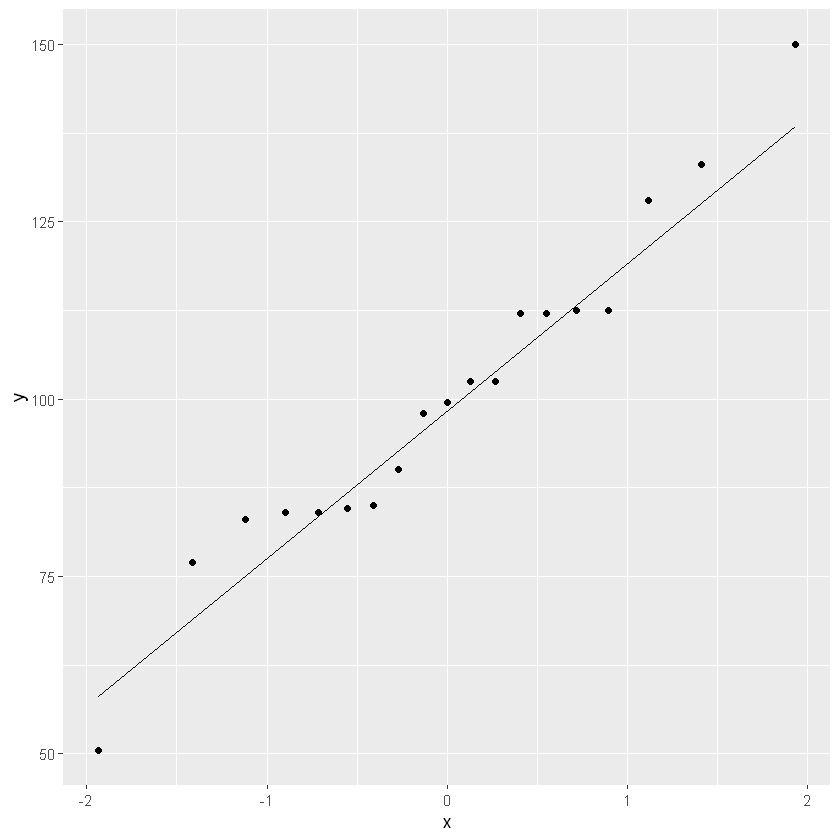

# Working sheet 
## 01 - Simple linear regression with R
V01.01.00 - 2024-02-17

## Load data

Change the path and the file name in the following box.


```R
library(readr)
df <- read_csv("data/class.csv")

```

    Rows: 19 Columns: 5
    ── Column specification ────────────────────────────────────────────────────────────────────────────────────────────────
    Delimiter: ","
    chr (2): Name, Sex
    dbl (3): Age, Height, Weight
    
    ℹ Use `spec()` to retrieve the full column specification for this data.
    ℹ Specify the column types or set `show_col_types = FALSE` to quiet this message.
    

Look at the structure and the head of the dataset.


```R
str(df)
```

    spc_tbl_ [19 × 5] (S3: spec_tbl_df/tbl_df/tbl/data.frame)
     $ Name  : chr [1:19] "Alfred" "Alice" "Barbara" "Carol" ...
     $ Sex   : chr [1:19] "M" "F" "F" "F" ...
     $ Age   : num [1:19] 14 13 13 14 14 12 12 15 13 12 ...
     $ Height: num [1:19] 69 56.5 65.3 62.8 63.5 57.3 59.8 62.5 62.5 59 ...
     $ Weight: num [1:19] 112 84 98 102 102 ...
     - attr(*, "spec")=
      .. cols(
      ..   Name = col_character(),
      ..   Sex = col_character(),
      ..   Age = col_double(),
      ..   Height = col_double(),
      ..   Weight = col_double()
      .. )
     - attr(*, "problems")=<externalptr> 
    


```R
head(df)
```


<table class="dataframe">
<caption>A tibble: 6 × 5</caption>
<thead>
	<tr><th scope=col>Name</th><th scope=col>Sex</th><th scope=col>Age</th><th scope=col>Height</th><th scope=col>Weight</th></tr>
	<tr><th scope=col>&lt;chr&gt;</th><th scope=col>&lt;chr&gt;</th><th scope=col>&lt;dbl&gt;</th><th scope=col>&lt;dbl&gt;</th><th scope=col>&lt;dbl&gt;</th></tr>
</thead>
<tbody>
	<tr><td>Alfred </td><td>M</td><td>14</td><td>69.0</td><td>112.5</td></tr>
	<tr><td>Alice  </td><td>F</td><td>13</td><td>56.5</td><td> 84.0</td></tr>
	<tr><td>Barbara</td><td>F</td><td>13</td><td>65.3</td><td> 98.0</td></tr>
	<tr><td>Carol  </td><td>F</td><td>14</td><td>62.8</td><td>102.5</td></tr>
	<tr><td>Henry  </td><td>M</td><td>14</td><td>63.5</td><td>102.5</td></tr>
	<tr><td>James  </td><td>M</td><td>12</td><td>57.3</td><td> 83.0</td></tr>
</tbody>
</table>


Look at frequencies and descriptive statistics.

The summary() function is the first approach.

describe() from the Hmisc package is an alternative.


```R
summary(df)
```


         Name               Sex                 Age            Height     
     Length:19          Length:19          Min.   :11.00   Min.   :51.30  
     Class :character   Class :character   1st Qu.:12.00   1st Qu.:58.25  
     Mode  :character   Mode  :character   Median :13.00   Median :62.80  
                                           Mean   :13.32   Mean   :62.34  
                                           3rd Qu.:14.50   3rd Qu.:65.90  
                                           Max.   :16.00   Max.   :72.00  
         Weight      
     Min.   : 50.50  
     1st Qu.: 84.25  
     Median : 99.50  
     Mean   :100.03  
     3rd Qu.:112.25  
     Max.   :150.00  


```R
library(Hmisc)
describe(df)
```

    
    Attache Paket: 'Hmisc'
    
    
    Die folgenden Objekte sind maskiert von 'package:base':
    
        format.pval, units
    
    
    


    df 
    
     5  Variables      19  Observations
    --------------------------------------------------------------------------------
    Name 
           n  missing distinct 
          19        0       19 
    
    Alfred (1, 0.053), Alice (1, 0.053), Barbara (1, 0.053), Carol (1, 0.053),
    Henry (1, 0.053), James (1, 0.053), Jane (1, 0.053), Janet (1, 0.053), Jeffrey
    (1, 0.053), John (1, 0.053), Joyce (1, 0.053), Judy (1, 0.053), Louise (1,
    0.053), Mary (1, 0.053), Philip (1, 0.053), Robert (1, 0.053), Ronald (1,
    0.053), Thomas (1, 0.053), William (1, 0.053)
    --------------------------------------------------------------------------------
    Sex 
           n  missing distinct 
          19        0        2 
                          
    Value          F     M
    Frequency      9    10
    Proportion 0.474 0.526
    --------------------------------------------------------------------------------
    Age 
           n  missing distinct     Info     Mean      Gmd 
          19        0        6    0.961    13.32    1.731 
                                                  
    Value         11    12    13    14    15    16
    Frequency      2     5     3     4     4     1
    Proportion 0.105 0.263 0.158 0.211 0.211 0.053
    
    For the frequency table, variable is rounded to the nearest 0.05
    --------------------------------------------------------------------------------
    Height 
           n  missing distinct     Info     Mean      Gmd      .05      .10 
          19        0       17    0.998    62.34    5.923    55.80    56.46 
         .25      .50      .75      .90      .95 
       58.25    62.80    65.90    67.40    69.30 
                                                                             
    Value      51.300 56.268 56.475 57.096 57.303 58.959 59.787 62.478 62.685
    Frequency       1      1      1      1      1      1      1      2      1
    Proportion  0.053  0.053  0.053  0.053  0.053  0.053  0.053  0.105  0.053
                                                                      
    Value      63.306 64.134 64.755 65.169 66.411 66.825 68.895 72.000
    Frequency       1      1      1      1      2      1      1      1
    Proportion  0.053  0.053  0.053  0.053  0.105  0.053  0.053  0.053
    
    For the frequency table, variable is rounded to the nearest 0.207
    --------------------------------------------------------------------------------
    Weight 
           n  missing distinct     Info     Mean      Gmd      .05      .10 
          19        0       15    0.996      100    25.64    74.35    81.80 
         .25      .50      .75      .90      .95 
       84.25    99.50   112.25   129.00   134.70 
                                                                              
    Value       50.500  76.370  82.340  83.335  84.330  89.305  97.265  99.255
    Frequency        1       1       1       2       2       1       1       1
    Proportion   0.053   0.053   0.053   0.105   0.105   0.053   0.053   0.053
                                                              
    Value      102.240 111.195 112.190 127.115 132.090 150.000
    Frequency        2       2       2       1       1       1
    Proportion   0.105   0.105   0.105   0.053   0.053   0.053
    
    For the frequency table, variable is rounded to the nearest 0.995
    --------------------------------------------------------------------------------


Plot the variables of interest with a scatter plot.


```R
library(ggplot2)
ggplot(df, aes(x = Height, y = Weight)) +
  geom_point()

```


    

    


Look at the distribution with a QQ-plot.


```R
ggplot(df, aes(sample = Weight)) + 
  geom_qq() +
  geom_qq_line()
```


    

    


```R
ggplot(df, aes(sample = Height)) + 
  geom_qq() +
  geom_qq_line()
```


    

    


## Assumptions of linear regression

- Linearity: There must be a linear relationship between the dependent and independent variables.
- Homoscedasticity: The residuals must have a constant variance.
- Normality: Normally distributed error.
- No auto correlation: The error component should have no auto correlation.
- No multicollinearity: No high correlation between the independent variables (for multiple linear regression).
- Independence of the observations: Result of the data generating mechanism


The linearity can be assessed by inspection of the scatter plot above.

For the next assumption the model has to be fitted to calculate the residuals. The residuals are the differences between the observed and the fitted values.


```R
library(broom)
my_lm <- lm(Weight ~ Height, data = df)
df <- augment(my_lm)
head(df)

```


<table class="dataframe">
<caption>A tibble: 6 × 8</caption>
<thead>
	<tr><th scope=col>Weight</th><th scope=col>Height</th><th scope=col>.fitted</th><th scope=col>.resid</th><th scope=col>.hat</th><th scope=col>.sigma</th><th scope=col>.cooksd</th><th scope=col>.std.resid</th></tr>
	<tr><th scope=col>&lt;dbl&gt;</th><th scope=col>&lt;dbl&gt;</th><th scope=col>&lt;dbl&gt;</th><th scope=col>&lt;dbl&gt;</th><th scope=col>&lt;dbl&gt;</th><th scope=col>&lt;dbl&gt;</th><th scope=col>&lt;dbl&gt;</th><th scope=col>&lt;dbl&gt;</th></tr>
</thead>
<tbody>
	<tr><td>112.5</td><td>69.0</td><td>126.00617</td><td>-13.5061701</td><td>0.14646301</td><td>10.97944</td><td>0.1454950639</td><td>-1.30222590</td></tr>
	<tr><td> 84.0</td><td>56.5</td><td> 77.26829</td><td>  6.7317083</td><td>0.12463349</td><td>11.43110</td><td>0.0292419306</td><td> 0.64090788</td></tr>
	<tr><td> 98.0</td><td>65.3</td><td>111.57976</td><td>-13.5797581</td><td>0.07118815</td><td>11.02254</td><td>0.0603721796</td><td>-1.25514370</td></tr>
	<tr><td>102.5</td><td>62.8</td><td>101.83218</td><td>  0.6678176</td><td>0.05308494</td><td>11.57048</td><td>0.0001047528</td><td> 0.06113186</td></tr>
	<tr><td>102.5</td><td>63.5</td><td>104.56150</td><td> -2.0615036</td><td>0.05549092</td><td>11.55960</td><td>0.0010487655</td><td>-0.18894975</td></tr>
	<tr><td> 83.0</td><td>57.3</td><td> 80.38752</td><td>  2.6124840</td><td>0.10624886</td><td>11.55111</td><td>0.0036016287</td><td> 0.24615612</td></tr>
</tbody>
</table>


Plot the residuals on the y-axis against the dependent variable on the x-axis to look for homoscedasticity.


```R
# Homoscedasticity
ggplot(df, aes(x = Weight, y = .resid)) +
  geom_point()
```


    

    


Look for the normal distribution of the residuals with a QQ-plot.


```R
# Normal distribution of the error
ggplot(df, aes(sample = .resid)) +
  geom_qq() + 
  geom_qq_line()
```


    

    


Durbin-Watson-Test for auto correlation


```R
# Autocorrelation
library(car)
durbinWatsonTest(my_lm, max.lag = 2)
```

    Lade nötiges Paket: carData
    
    


     lag Autocorrelation D-W Statistic p-value
       1     -0.08248143      2.071356    0.83
       2      0.27009200      1.338201    0.21
     Alternative hypothesis: rho[lag] != 0


## Summary of model


```R
summary(my_lm)
```


    
    Call:
    lm(formula = Weight ~ Height, data = df)
    
    Residuals:
         Min       1Q   Median       3Q      Max 
    -17.6807  -6.0642   0.5115   9.2846  18.3698 
    
    Coefficients:
                 Estimate Std. Error t value Pr(>|t|)    
    (Intercept) -143.0269    32.2746  -4.432 0.000366 ***
    Height         3.8990     0.5161   7.555 7.89e-07 ***
    ---
    Signif. codes:  0 '***' 0.001 '**' 0.01 '*' 0.05 '.' 0.1 ' ' 1
    
    Residual standard error: 11.23 on 17 degrees of freedom
    Multiple R-squared:  0.7705,	Adjusted R-squared:  0.757 
    F-statistic: 57.08 on 1 and 17 DF,  p-value: 7.887e-07
    


```R
glance(my_lm)
```


<table class="dataframe">
<caption>A tibble: 1 × 12</caption>
<thead>
	<tr><th scope=col>r.squared</th><th scope=col>adj.r.squared</th><th scope=col>sigma</th><th scope=col>statistic</th><th scope=col>p.value</th><th scope=col>df</th><th scope=col>logLik</th><th scope=col>AIC</th><th scope=col>BIC</th><th scope=col>deviance</th><th scope=col>df.residual</th><th scope=col>nobs</th></tr>
	<tr><th scope=col>&lt;dbl&gt;</th><th scope=col>&lt;dbl&gt;</th><th scope=col>&lt;dbl&gt;</th><th scope=col>&lt;dbl&gt;</th><th scope=col>&lt;dbl&gt;</th><th scope=col>&lt;dbl&gt;</th><th scope=col>&lt;dbl&gt;</th><th scope=col>&lt;dbl&gt;</th><th scope=col>&lt;dbl&gt;</th><th scope=col>&lt;dbl&gt;</th><th scope=col>&lt;int&gt;</th><th scope=col>&lt;int&gt;</th></tr>
</thead>
<tbody>
	<tr><td>0.7705068</td><td>0.7570072</td><td>11.22625</td><td>57.07628</td><td>7.886816e-07</td><td>1</td><td>-71.85003</td><td>149.7001</td><td>152.5334</td><td>2142.488</td><td>17</td><td>19</td></tr>
</tbody>
</table>


```R
tidy(my_lm)
```


<table class="dataframe">
<caption>A tibble: 2 × 5</caption>
<thead>
	<tr><th scope=col>term</th><th scope=col>estimate</th><th scope=col>std.error</th><th scope=col>statistic</th><th scope=col>p.value</th></tr>
	<tr><th scope=col>&lt;chr&gt;</th><th scope=col>&lt;dbl&gt;</th><th scope=col>&lt;dbl&gt;</th><th scope=col>&lt;dbl&gt;</th><th scope=col>&lt;dbl&gt;</th></tr>
</thead>
<tbody>
	<tr><td>(Intercept)</td><td>-143.02692</td><td>32.2745913</td><td>-4.431564</td><td>3.655789e-04</td></tr>
	<tr><td>Height     </td><td>   3.89903</td><td> 0.5160939</td><td> 7.554885</td><td>7.886816e-07</td></tr>
</tbody>
</table>


```R

```
