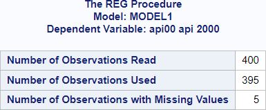
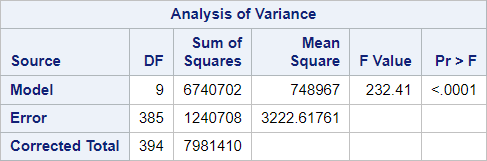
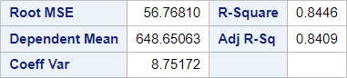
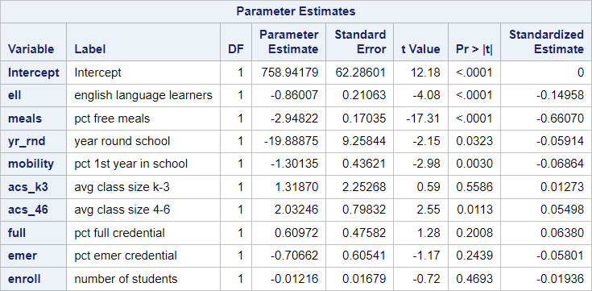

# 02 - Simple linear regression

## Data

Source of data: UCLA

Introduction to regression in R. UCLA: Statistical Consulting Group. 
fromhttps://stats.oarc.ucla.edu/r/seminars/introduction-to-regression-in-r/.

elementary school academic performance index
https://stats.idre.ucla.edu/wp-content/uploads/2019/02/elemapi2v2.csv

Data set elemapi2.csv


```R
library(readr)
elemapi2 <- read_csv("data/elemapi2.csv",
                 show_col_types = FALSE)
head(elemapi2)

```


<table class="dataframe">
<caption>A tibble: 6 × 22</caption>
<thead>
	<tr><th scope=col>snum</th><th scope=col>dnum</th><th scope=col>api00</th><th scope=col>api99</th><th scope=col>growth</th><th scope=col>meals</th><th scope=col>ell</th><th scope=col>yr_rnd</th><th scope=col>mobility</th><th scope=col>acs_k3</th><th scope=col>⋯</th><th scope=col>hsg</th><th scope=col>some_col</th><th scope=col>col_grad</th><th scope=col>grad_sch</th><th scope=col>avg_ed</th><th scope=col>full</th><th scope=col>emer</th><th scope=col>enroll</th><th scope=col>mealcat</th><th scope=col>collcat</th></tr>
	<tr><th scope=col>&lt;dbl&gt;</th><th scope=col>&lt;dbl&gt;</th><th scope=col>&lt;dbl&gt;</th><th scope=col>&lt;dbl&gt;</th><th scope=col>&lt;dbl&gt;</th><th scope=col>&lt;dbl&gt;</th><th scope=col>&lt;dbl&gt;</th><th scope=col>&lt;dbl&gt;</th><th scope=col>&lt;dbl&gt;</th><th scope=col>&lt;dbl&gt;</th><th scope=col>⋯</th><th scope=col>&lt;dbl&gt;</th><th scope=col>&lt;dbl&gt;</th><th scope=col>&lt;dbl&gt;</th><th scope=col>&lt;dbl&gt;</th><th scope=col>&lt;dbl&gt;</th><th scope=col>&lt;dbl&gt;</th><th scope=col>&lt;dbl&gt;</th><th scope=col>&lt;dbl&gt;</th><th scope=col>&lt;dbl&gt;</th><th scope=col>&lt;dbl&gt;</th></tr>
</thead>
<tbody>
	<tr><td> 906</td><td>41</td><td>693</td><td>600</td><td>93</td><td>67</td><td> 9</td><td>0</td><td>11</td><td>16</td><td>⋯</td><td> 0</td><td> 0</td><td> 0</td><td> 0</td><td>  NA</td><td> 76</td><td>24</td><td>247</td><td>2</td><td>1</td></tr>
	<tr><td> 889</td><td>41</td><td>570</td><td>501</td><td>69</td><td>92</td><td>21</td><td>0</td><td>33</td><td>15</td><td>⋯</td><td> 0</td><td> 0</td><td> 0</td><td> 0</td><td>  NA</td><td> 79</td><td>19</td><td>463</td><td>3</td><td>1</td></tr>
	<tr><td> 887</td><td>41</td><td>546</td><td>472</td><td>74</td><td>97</td><td>29</td><td>0</td><td>36</td><td>17</td><td>⋯</td><td> 0</td><td> 0</td><td> 0</td><td> 0</td><td>  NA</td><td> 68</td><td>29</td><td>395</td><td>3</td><td>1</td></tr>
	<tr><td> 876</td><td>41</td><td>571</td><td>487</td><td>84</td><td>90</td><td>27</td><td>0</td><td>27</td><td>20</td><td>⋯</td><td>45</td><td> 9</td><td> 9</td><td> 0</td><td>1.91</td><td> 87</td><td>11</td><td>418</td><td>3</td><td>1</td></tr>
	<tr><td> 888</td><td>41</td><td>478</td><td>425</td><td>53</td><td>89</td><td>30</td><td>0</td><td>44</td><td>18</td><td>⋯</td><td>50</td><td> 0</td><td> 0</td><td> 0</td><td>1.50</td><td> 87</td><td>13</td><td>520</td><td>3</td><td>1</td></tr>
	<tr><td>4284</td><td>98</td><td>858</td><td>844</td><td>14</td><td>10</td><td> 3</td><td>0</td><td>10</td><td>20</td><td>⋯</td><td> 8</td><td>24</td><td>36</td><td>31</td><td>3.89</td><td>100</td><td> 0</td><td>343</td><td>1</td><td>2</td></tr>
</tbody>
</table>


## SAS program snippet

The following SAS code will be executed.
proc reg data = dat.elemapi2;
  model api00 = ell meals yr_rnd mobility acs_k3 acs_46 full emer enroll / stb;
run;

The option /stb provides standardized estimates.

## Results

The output is divided into blocks to explain it and to reproduce it afterwards in the different languages.

### Block 1


Number of observations read is the number of observations in the dataset.

Number of observation used is the number of complete cases regarding the variables used for the SAS program snippet.

Number of observations with missing values in the model variables.

### Block 2


An analysis of variance was performed for the data.

#### Source
The column source in this table presents the sources of variance. They are divided into

-  Model,
-  Residual, and
-  Total.

Model stands for the variance which is explained by the independent variables.

Total stands for the total variance which can be divided into the variance explained from the model and the variance not explained from the model called residual or error.

Sum of squares of model plus sum of squares of error is equal to the total sum of squares.

#### DF

The degrees of freedom are calculated as follows:

The df for total is the number of used observations minus one.

The df for the total is the number of variables in the model minus one. The intercept is counting as one variable if not explicitely omitted.

The for for the error is the difference of $df_{total} - df_{model}$.

#### Sum of squares

Calculation of sum squares might be added here later.

It can be found in several other tutorials.

#### Mean square

The mean square is the sum of squares divided by the degrees of freedom.

#### F-Value

The F-value is the mean square model divided by the mean square error. The degrees of freedom are $df_{model}$ and $df_{error}$.

#### Pr > F

The null hypothesis tested is that there is no linear relationship between the independent and the dependent variables.

The alternative hypothesis states that there is a linear relationship.


### Block 3


### Root MSE

Root MSE is the standard deviation of the error term.

It is the square root of the mean square error (or residual).

### Dependent mean

The dependent mean is the mean of the dependent variable of those observations which were used and not omitted.

### Coeff Var

The coefficient of variation is the root MSE divided by the dependent mean. It is a measure of variation in the data.

### R-square

R-square is the proportion of the explained variance based on the total variance. Sum of square model divided by sum of square total.

### Adj R-Sq

Adjusted R-square adjusts for the relation between the number of variables (k) in the model and the number of observations (N) in the dataset.

$R_{adj} = 1 – ((1 – Rsq)((N – 1) / (N – k – 1))$


### Block 4


#### Variable

This column refers to the name of the variable in the model.

#### DF

The degrees of freedom are one for continous and binary variable. For categorial variables they are equal to the number of levels minus.

#### Parameter estimate

This columns containts the values which are the $b_i$ in the model.

$\hat{y} = b_0 + b_1 * x_1 + b_2 * x_2 + ... + b_n * x_n$

$api00 = 758.94 - 0.86 * ell - 2.95 * meals ...$

#### Standard error

The standard errors are provided for each variable.

They can be used for calculating the t-value: Parameter estimate divided by standard error.   

#### t value

The null hypothesis tested is that the coefficient is zero.

The alternative hypothesis is that the coefficient is unequal to zero.

#### Pr > |t|

p is provided for a two-sided test. It can be divided by two for a one-sided test.

#### Standardized estimate

This estimates results after standardizing all continous variables before including them into the model.


```R


```
