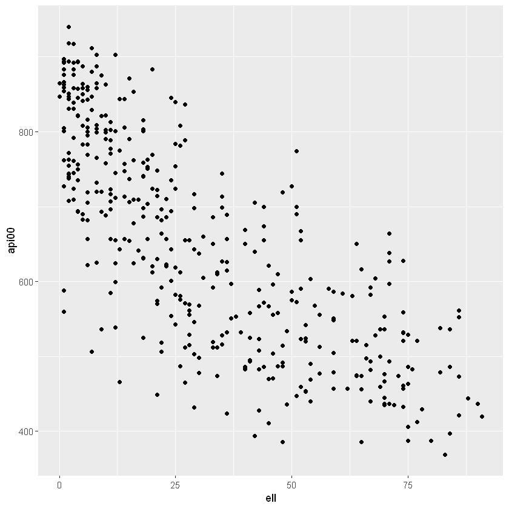
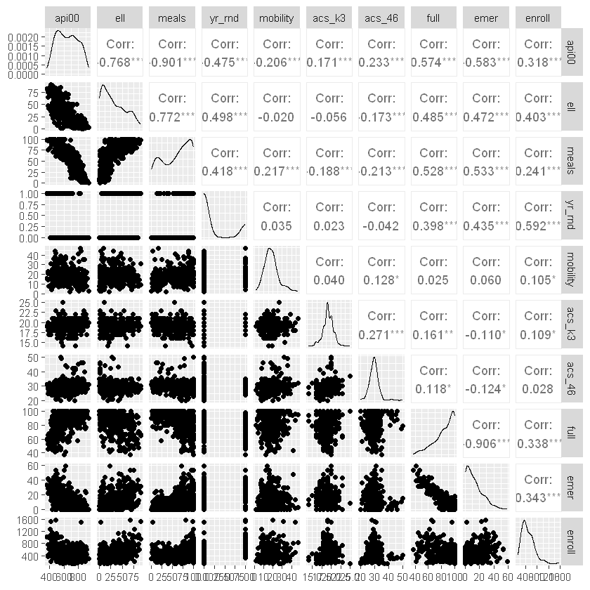
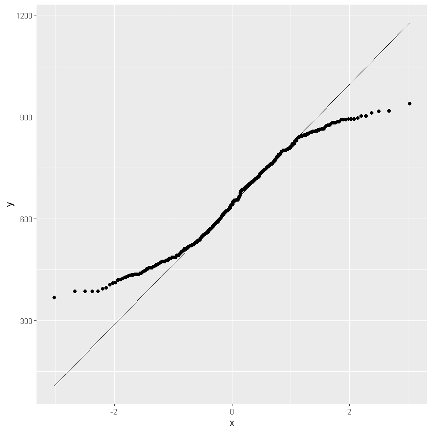
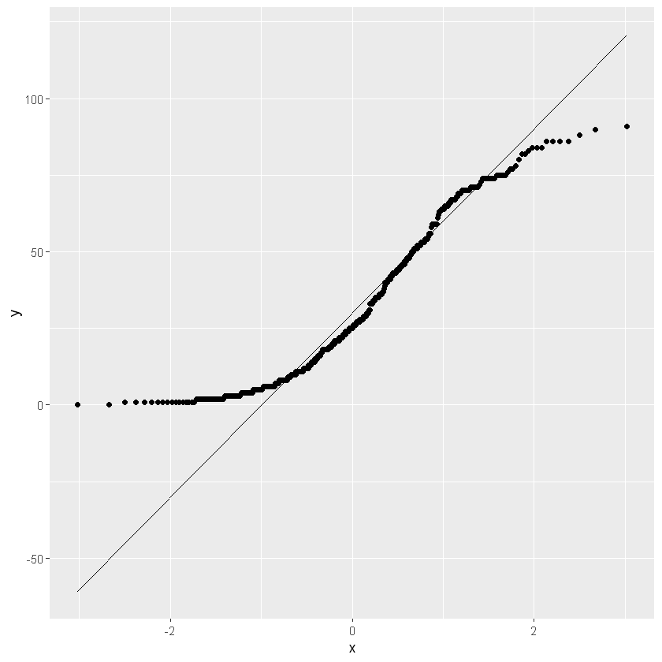
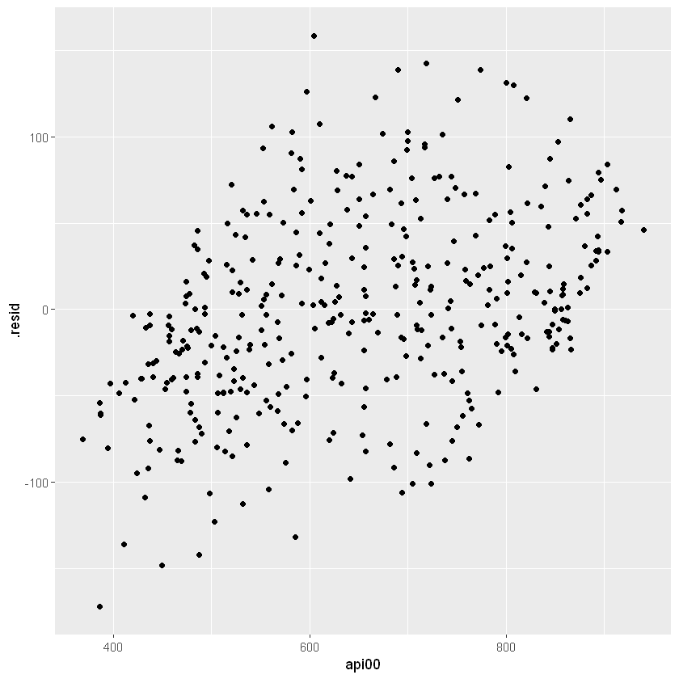
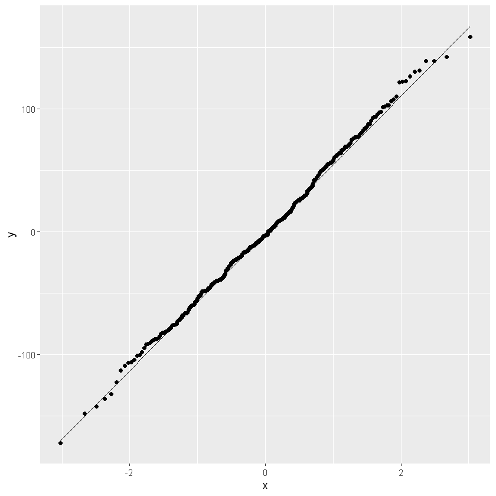

# Working sheet 
## 02 - Multiple linear regression with R
V02.01.00 - 2024-02-17

## Load data

Change the path and the file name in the following box.


```R
library(readr)
df <- read_csv("data/elemapi2.csv",
                 show_col_types = FALSE)

```

Look at the structure and the head of the dataset.


```R
str(df)
```

    spc_tbl_ [400 × 22] (S3: spec_tbl_df/tbl_df/tbl/data.frame)
     $ snum    : num [1:400] 906 889 887 876 888 ...
     $ dnum    : num [1:400] 41 41 41 41 41 98 98 108 108 108 ...
     $ api00   : num [1:400] 693 570 546 571 478 858 918 831 860 737 ...
     $ api99   : num [1:400] 600 501 472 487 425 844 864 791 838 703 ...
     $ growth  : num [1:400] 93 69 74 84 53 14 54 40 22 34 ...
     $ meals   : num [1:400] 67 92 97 90 89 10 5 2 5 29 ...
     $ ell     : num [1:400] 9 21 29 27 30 3 2 3 6 15 ...
     $ yr_rnd  : num [1:400] 0 0 0 0 0 0 0 0 0 0 ...
     $ mobility: num [1:400] 11 33 36 27 44 10 16 44 10 17 ...
     $ acs_k3  : num [1:400] 16 15 17 20 18 20 19 20 20 21 ...
     $ acs_46  : num [1:400] 22 32 25 30 31 33 28 31 30 29 ...
     $ not_hsg : num [1:400] 0 0 0 36 50 1 1 0 2 8 ...
     $ hsg     : num [1:400] 0 0 0 45 50 8 4 4 9 25 ...
     $ some_col: num [1:400] 0 0 0 9 0 24 18 16 15 34 ...
     $ col_grad: num [1:400] 0 0 0 9 0 36 34 50 42 27 ...
     $ grad_sch: num [1:400] 0 0 0 0 0 31 43 30 33 7 ...
     $ avg_ed  : num [1:400] NA NA NA 1.91 1.5 ...
     $ full    : num [1:400] 76 79 68 87 87 100 100 96 100 96 ...
     $ emer    : num [1:400] 24 19 29 11 13 0 0 2 0 7 ...
     $ enroll  : num [1:400] 247 463 395 418 520 ...
     $ mealcat : num [1:400] 2 3 3 3 3 1 1 1 1 1 ...
     $ collcat : num [1:400] 1 1 1 1 1 2 2 2 2 3 ...
     - attr(*, "spec")=
      .. cols(
      ..   snum = col_double(),
      ..   dnum = col_double(),
      ..   api00 = col_double(),
      ..   api99 = col_double(),
      ..   growth = col_double(),
      ..   meals = col_double(),
      ..   ell = col_double(),
      ..   yr_rnd = col_double(),
      ..   mobility = col_double(),
      ..   acs_k3 = col_double(),
      ..   acs_46 = col_double(),
      ..   not_hsg = col_double(),
      ..   hsg = col_double(),
      ..   some_col = col_double(),
      ..   col_grad = col_double(),
      ..   grad_sch = col_double(),
      ..   avg_ed = col_double(),
      ..   full = col_double(),
      ..   emer = col_double(),
      ..   enroll = col_double(),
      ..   mealcat = col_double(),
      ..   collcat = col_double()
      .. )
     - attr(*, "problems")=<externalptr> 
    


```R
head(df)
```


<table class="dataframe">
<caption>A tibble: 6 × 22</caption>
<thead>
	<tr><th scope=col>snum</th><th scope=col>dnum</th><th scope=col>api00</th><th scope=col>api99</th><th scope=col>growth</th><th scope=col>meals</th><th scope=col>ell</th><th scope=col>yr_rnd</th><th scope=col>mobility</th><th scope=col>acs_k3</th><th scope=col>⋯</th><th scope=col>hsg</th><th scope=col>some_col</th><th scope=col>col_grad</th><th scope=col>grad_sch</th><th scope=col>avg_ed</th><th scope=col>full</th><th scope=col>emer</th><th scope=col>enroll</th><th scope=col>mealcat</th><th scope=col>collcat</th></tr>
	<tr><th scope=col>&lt;dbl&gt;</th><th scope=col>&lt;dbl&gt;</th><th scope=col>&lt;dbl&gt;</th><th scope=col>&lt;dbl&gt;</th><th scope=col>&lt;dbl&gt;</th><th scope=col>&lt;dbl&gt;</th><th scope=col>&lt;dbl&gt;</th><th scope=col>&lt;dbl&gt;</th><th scope=col>&lt;dbl&gt;</th><th scope=col>&lt;dbl&gt;</th><th scope=col>⋯</th><th scope=col>&lt;dbl&gt;</th><th scope=col>&lt;dbl&gt;</th><th scope=col>&lt;dbl&gt;</th><th scope=col>&lt;dbl&gt;</th><th scope=col>&lt;dbl&gt;</th><th scope=col>&lt;dbl&gt;</th><th scope=col>&lt;dbl&gt;</th><th scope=col>&lt;dbl&gt;</th><th scope=col>&lt;dbl&gt;</th><th scope=col>&lt;dbl&gt;</th></tr>
</thead>
<tbody>
	<tr><td> 906</td><td>41</td><td>693</td><td>600</td><td>93</td><td>67</td><td> 9</td><td>0</td><td>11</td><td>16</td><td>⋯</td><td> 0</td><td> 0</td><td> 0</td><td> 0</td><td>  NA</td><td> 76</td><td>24</td><td>247</td><td>2</td><td>1</td></tr>
	<tr><td> 889</td><td>41</td><td>570</td><td>501</td><td>69</td><td>92</td><td>21</td><td>0</td><td>33</td><td>15</td><td>⋯</td><td> 0</td><td> 0</td><td> 0</td><td> 0</td><td>  NA</td><td> 79</td><td>19</td><td>463</td><td>3</td><td>1</td></tr>
	<tr><td> 887</td><td>41</td><td>546</td><td>472</td><td>74</td><td>97</td><td>29</td><td>0</td><td>36</td><td>17</td><td>⋯</td><td> 0</td><td> 0</td><td> 0</td><td> 0</td><td>  NA</td><td> 68</td><td>29</td><td>395</td><td>3</td><td>1</td></tr>
	<tr><td> 876</td><td>41</td><td>571</td><td>487</td><td>84</td><td>90</td><td>27</td><td>0</td><td>27</td><td>20</td><td>⋯</td><td>45</td><td> 9</td><td> 9</td><td> 0</td><td>1.91</td><td> 87</td><td>11</td><td>418</td><td>3</td><td>1</td></tr>
	<tr><td> 888</td><td>41</td><td>478</td><td>425</td><td>53</td><td>89</td><td>30</td><td>0</td><td>44</td><td>18</td><td>⋯</td><td>50</td><td> 0</td><td> 0</td><td> 0</td><td>1.50</td><td> 87</td><td>13</td><td>520</td><td>3</td><td>1</td></tr>
	<tr><td>4284</td><td>98</td><td>858</td><td>844</td><td>14</td><td>10</td><td> 3</td><td>0</td><td>10</td><td>20</td><td>⋯</td><td> 8</td><td>24</td><td>36</td><td>31</td><td>3.89</td><td>100</td><td> 0</td><td>343</td><td>1</td><td>2</td></tr>
</tbody>
</table>


Look at frequencies and descriptive statistics.

The summary() function is the first approach.

describe() from the Hmisc package is an alternative.


```R
summary(df)
```


          snum           dnum           api00           api99      
     Min.   :  58   Min.   : 41.0   Min.   :369.0   Min.   :333.0  
     1st Qu.:1720   1st Qu.:395.0   1st Qu.:523.8   1st Qu.:484.8  
     Median :3008   Median :401.0   Median :643.0   Median :602.0  
     Mean   :2867   Mean   :457.7   Mean   :647.6   Mean   :610.2  
     3rd Qu.:4198   3rd Qu.:630.0   3rd Qu.:762.2   3rd Qu.:731.2  
     Max.   :6072   Max.   :796.0   Max.   :940.0   Max.   :917.0  
                                                                   
         growth           meals             ell            yr_rnd    
     Min.   :-69.00   Min.   :  0.00   Min.   : 0.00   Min.   :0.00  
     1st Qu.: 19.00   1st Qu.: 31.00   1st Qu.: 9.75   1st Qu.:0.00  
     Median : 36.00   Median : 67.50   Median :25.00   Median :0.00  
     Mean   : 37.41   Mean   : 60.31   Mean   :31.45   Mean   :0.23  
     3rd Qu.: 53.25   3rd Qu.: 90.00   3rd Qu.:50.25   3rd Qu.:0.00  
     Max.   :134.00   Max.   :100.00   Max.   :91.00   Max.   :1.00  
                                                                     
        mobility         acs_k3          acs_46         not_hsg      
     Min.   : 2.00   Min.   :14.00   Min.   :20.00   Min.   :  0.00  
     1st Qu.:13.00   1st Qu.:18.00   1st Qu.:27.00   1st Qu.:  4.00  
     Median :17.00   Median :19.00   Median :29.00   Median : 14.00  
     Mean   :18.25   Mean   :19.16   Mean   :29.69   Mean   : 21.25  
     3rd Qu.:22.00   3rd Qu.:20.00   3rd Qu.:31.00   3rd Qu.: 34.00  
     Max.   :47.00   Max.   :25.00   Max.   :50.00   Max.   :100.00  
     NA's   :1       NA's   :2       NA's   :3                       
          hsg            some_col        col_grad        grad_sch     
     Min.   :  0.00   Min.   : 0.00   Min.   :  0.0   Min.   : 0.000  
     1st Qu.: 17.00   1st Qu.:12.00   1st Qu.:  7.0   1st Qu.: 1.000  
     Median : 26.00   Median :19.00   Median : 16.0   Median : 4.000  
     Mean   : 26.02   Mean   :19.71   Mean   : 19.7   Mean   : 8.637  
     3rd Qu.: 34.00   3rd Qu.:28.00   3rd Qu.: 30.0   3rd Qu.:10.000  
     Max.   :100.00   Max.   :67.00   Max.   :100.0   Max.   :67.000  
                                                                      
         avg_ed           full             emer           enroll      
     Min.   :1.000   Min.   : 37.00   Min.   : 0.00   Min.   : 130.0  
     1st Qu.:2.070   1st Qu.: 76.00   1st Qu.: 3.00   1st Qu.: 320.0  
     Median :2.600   Median : 88.00   Median :10.00   Median : 435.0  
     Mean   :2.668   Mean   : 84.55   Mean   :12.66   Mean   : 483.5  
     3rd Qu.:3.220   3rd Qu.: 97.00   3rd Qu.:19.00   3rd Qu.: 608.0  
     Max.   :4.620   Max.   :100.00   Max.   :59.00   Max.   :1570.0  
     NA's   :19                                                       
        mealcat         collcat    
     Min.   :1.000   Min.   :1.00  
     1st Qu.:1.000   1st Qu.:1.00  
     Median :2.000   Median :2.00  
     Mean   :2.015   Mean   :2.02  
     3rd Qu.:3.000   3rd Qu.:3.00  
     Max.   :3.000   Max.   :3.00  
                                   


```R
library(Hmisc)
describe(df)
```


    df 
    
     22  Variables      400  Observations
    --------------------------------------------------------------------------------
    snum 
           n  missing distinct     Info     Mean      Gmd      .05      .10 
         400        0      400        1     2867     1766    405.8    627.2 
         .25      .50      .75      .90      .95 
      1719.5   3007.5   4197.5   4744.3   5217.2 
    
    lowest :   58   65   70   93   94, highest: 6060 6062 6065 6068 6072
    --------------------------------------------------------------------------------
    dnum 
           n  missing distinct     Info     Mean      Gmd      .05      .10 
         400        0       37    0.981    457.7    206.7      131      140 
         .25      .50      .75      .90      .95 
         395      401      630      636      716 
    
    lowest :  41  98 108 131 135, highest: 653 689 716 779 796
    --------------------------------------------------------------------------------
    api00 
           n  missing distinct     Info     Mean      Gmd      .05      .10 
         400        0      271        1    647.6    164.2    436.9    465.9 
         .25      .50      .75      .90      .95 
       523.8    643.0    762.2    850.0    876.0 
    
    lowest : 369 386 387 394 397, highest: 903 912 917 918 940
    --------------------------------------------------------------------------------
    api99 
           n  missing distinct     Info     Mean      Gmd      .05      .10 
         400        0      284        1    610.2    169.4    409.0    427.0 
         .25      .50      .75      .90      .95 
       484.8    602.0    731.2    826.1    848.1 
    
    lowest : 333 338 343 354 358, highest: 888 889 900 902 917
    --------------------------------------------------------------------------------
    growth 
           n  missing distinct     Info     Mean      Gmd      .05      .10 
         400        0      106        1    37.41    28.16     0.00     7.00 
         .25      .50      .75      .90      .95 
       19.00    36.00    53.25    70.00    82.00 
    
    lowest : -69 -47 -18 -14 -13, highest:  93 102 103 115 134
    --------------------------------------------------------------------------------
    meals 
           n  missing distinct     Info     Mean      Gmd      .05      .10 
         400        0       97    0.999    60.31     36.3      6.0     11.0 
         .25      .50      .75      .90      .95 
        31.0     67.5     90.0     99.0    100.0 
    
    lowest :   0   1   2   3   4, highest:  96  97  98  99 100
    --------------------------------------------------------------------------------
    ell 
           n  missing distinct     Info     Mean      Gmd      .05      .10 
         400        0       84        1    31.45    28.03     2.00     3.00 
         .25      .50      .75      .90      .95 
        9.75    25.00    50.25    70.00    75.00 
    
    lowest :  0  1  2  3  4, highest: 84 86 88 90 91
    --------------------------------------------------------------------------------
    yr_rnd 
           n  missing distinct     Info      Sum     Mean      Gmd 
         400        0        2    0.531       92     0.23   0.3551 
    
    --------------------------------------------------------------------------------
    mobility 
           n  missing distinct     Info     Mean      Gmd      .05      .10 
         399        1       40    0.998    18.25    8.166        8       10 
         .25      .50      .75      .90      .95 
          13       17       22       27       33 
    
    lowest :  2  3  4  5  6, highest: 39 41 42 44 47
    --------------------------------------------------------------------------------
    acs_k3 
           n  missing distinct     Info     Mean      Gmd      .05      .10 
         398        2       11    0.932    19.16    1.449       17       18 
         .25      .50      .75      .90      .95 
          18       19       20       21       21 
                                                                                
    Value      14.00 14.99 15.98 16.97 17.96 18.95 19.94 20.93 21.92 22.91 25.00
    Frequency      2     1    14    20    64   144    99    43     7     3     1
    Proportion 0.005 0.003 0.035 0.050 0.161 0.362 0.249 0.108 0.018 0.008 0.003
    
    For the frequency table, variable is rounded to the nearest 0.11
    --------------------------------------------------------------------------------
    acs_46 
           n  missing distinct     Info     Mean      Gmd      .05      .10 
         397        3       28    0.988    29.69    3.856     24.8     26.0 
         .25      .50      .75      .90      .95 
        27.0     29.0     31.0     33.0     35.0 
    
    lowest : 20 21 22 23 24, highest: 44 45 46 49 50
    --------------------------------------------------------------------------------
    not_hsg 
           n  missing distinct     Info     Mean      Gmd      .05      .10 
         400        0       70    0.997    21.25    22.51     0.00     0.00 
         .25      .50      .75      .90      .95 
        4.00    14.00    34.00    50.00    60.05 
    
    lowest :   0   1   2   3   4, highest:  79  83  89  98 100
    --------------------------------------------------------------------------------
    hsg 
           n  missing distinct     Info     Mean      Gmd      .05      .10 
         400        0       65    0.999    26.02    17.46      0.0      3.0 
         .25      .50      .75      .90      .95 
        17.0     26.0     34.0     43.1     50.0 
    
    lowest :   0   1   2   3   4, highest:  74  75  85  90 100
    --------------------------------------------------------------------------------
    some_col 
           n  missing distinct     Info     Mean      Gmd      .05      .10 
         400        0       49    0.998    19.71    12.79      0.0      2.9 
         .25      .50      .75      .90      .95 
        12.0     19.0     28.0     34.0     38.0 
    
    lowest :  0  1  2  3  4, highest: 44 46 50 52 67
    --------------------------------------------------------------------------------
    col_grad 
           n  missing distinct     Info     Mean      Gmd      .05      .10 
         400        0       56    0.999     19.7    17.53     0.00     1.00 
         .25      .50      .75      .90      .95 
        7.00    16.00    30.00    38.10    45.05 
    
    lowest :   0   1   2   3   4, highest:  54  55  67  80 100
    --------------------------------------------------------------------------------
    grad_sch 
           n  missing distinct     Info     Mean      Gmd      .05      .10 
         400        0       48    0.989    8.637     11.2        0        0 
         .25      .50      .75      .90      .95 
           1        4       10       28       37 
    
    lowest :  0  1  2  3  4, highest: 48 53 54 57 67
    --------------------------------------------------------------------------------
    avg_ed 
           n  missing distinct     Info     Mean      Gmd      .05      .10 
         381       19      201        1    2.668   0.8708     1.59     1.75 
         .25      .50      .75      .90      .95 
        2.07     2.60     3.22     3.84     4.07 
    
    lowest : 1    1.06 1.11 1.25 1.28, highest: 4.32 4.33 4.41 4.42 4.62
    --------------------------------------------------------------------------------
    full 
           n  missing distinct     Info     Mean      Gmd      .05      .10 
         400        0       57    0.991    84.55     16.3    53.95    61.90 
         .25      .50      .75      .90      .95 
       76.00    88.00    97.00   100.00   100.00 
    
    lowest :  37  41  42  44  45, highest:  95  96  97  98 100
    --------------------------------------------------------------------------------
    emer 
           n  missing distinct     Info     Mean      Gmd      .05      .10 
         400        0       47    0.993    12.66    12.76     0.00     0.00 
         .25      .50      .75      .90      .95 
        3.00    10.00    19.00    29.10    35.05 
    
    lowest :  0  2  3  4  5, highest: 44 47 48 53 59
    --------------------------------------------------------------------------------
    enroll 
           n  missing distinct     Info     Mean      Gmd      .05      .10 
         400        0      308        1    483.5    241.9    204.9    238.8 
         .25      .50      .75      .90      .95 
       320.0    435.0    608.0    751.1    892.5 
    
    lowest :  130  133  135  146  151, highest: 1149 1264 1513 1529 1570
    --------------------------------------------------------------------------------
    mealcat 
           n  missing distinct     Info     Mean      Gmd 
         400        0        3    0.889    2.015   0.8931 
                                
    Value          1     2     3
    Frequency    131   132   137
    Proportion 0.328 0.330 0.342
    
    For the frequency table, variable is rounded to the nearest 0.02
    --------------------------------------------------------------------------------
    collcat 
           n  missing distinct     Info     Mean      Gmd 
         400        0        3    0.889     2.02   0.8896 
                                
    Value          1     2     3
    Frequency    129   134   137
    Proportion 0.322 0.335 0.342
    
    For the frequency table, variable is rounded to the nearest 0.02
    --------------------------------------------------------------------------------


Plot the variables of interest with a scatter plot.

Either as single plots as in the following plot.


```R
library(ggplot2)
#api00 ~ ell + meals + yr_rnd + mobility + acs_k3 + acs_46 + full + emer + enroll
ggplot(df, aes(x = ell, y = api00)) +
  geom_point()

```


    

    


Or as scatter matrix as in the following collection of plots.


```R
library(GGally)
library(tidyverse)
#api00 ~ ell + meals + yr_rnd + mobility + acs_k3 + acs_46 + full + emer + enroll
ggpairs(df %>% select(api00, ell, meals, yr_rnd, mobility, acs_k3, acs_46, full, emer, enroll))
```

    Registered S3 method overwritten by 'GGally':
      method from   
      +.gg   ggplot2
    
    ── Attaching core tidyverse packages ──────────────────────────────────────────────────────────────── tidyverse 2.0.0 ──
    ✔ dplyr     1.1.2     ✔ stringr   1.5.0
    ✔ forcats   1.0.0     ✔ tibble    3.2.1
    ✔ lubridate 1.9.2     ✔ tidyr     1.3.0
    ✔ purrr     1.0.1     
    ── Conflicts ────────────────────────────────────────────────────────────────────────────────── tidyverse_conflicts() ──
    ✖ dplyr::filter()    masks stats::filter()
    ✖ dplyr::lag()       masks stats::lag()
    ✖ dplyr::src()       masks Hmisc::src()
    ✖ dplyr::summarize() masks Hmisc::summarize()
    ℹ Use the conflicted package (<http://conflicted.r-lib.org/>) to force all conflicts to become errors
    Warning message in ggally_statistic(data = data, mapping = mapping, na.rm = na.rm, :
    "Removing 1 row that contained a missing value"
    Warning message in ggally_statistic(data = data, mapping = mapping, na.rm = na.rm, :
    "Removed 2 rows containing missing values"
    Warning message in ggally_statistic(data = data, mapping = mapping, na.rm = na.rm, :
    "Removed 3 rows containing missing values"
    Warning message in ggally_statistic(data = data, mapping = mapping, na.rm = na.rm, :
    "Removing 1 row that contained a missing value"
    Warning message in ggally_statistic(data = data, mapping = mapping, na.rm = na.rm, :
    "Removed 2 rows containing missing values"
    Warning message in ggally_statistic(data = data, mapping = mapping, na.rm = na.rm, :
    "Removed 3 rows containing missing values"
    Warning message in ggally_statistic(data = data, mapping = mapping, na.rm = na.rm, :
    "Removing 1 row that contained a missing value"
    Warning message in ggally_statistic(data = data, mapping = mapping, na.rm = na.rm, :
    "Removed 2 rows containing missing values"
    Warning message in ggally_statistic(data = data, mapping = mapping, na.rm = na.rm, :
    "Removed 3 rows containing missing values"
    Warning message in ggally_statistic(data = data, mapping = mapping, na.rm = na.rm, :
    "Removing 1 row that contained a missing value"
    Warning message in ggally_statistic(data = data, mapping = mapping, na.rm = na.rm, :
    "Removed 2 rows containing missing values"
    Warning message in ggally_statistic(data = data, mapping = mapping, na.rm = na.rm, :
    "Removed 3 rows containing missing values"
    Warning message:
    "Removed 1 rows containing missing values (`geom_point()`)."
    Warning message:
    "Removed 1 rows containing missing values (`geom_point()`)."
    Warning message:
    "Removed 1 rows containing missing values (`geom_point()`)."
    Warning message:
    "Removed 1 rows containing missing values (`geom_point()`)."
    Warning message:
    "Removed 1 rows containing non-finite values (`stat_density()`)."
    Warning message in ggally_statistic(data = data, mapping = mapping, na.rm = na.rm, :
    "Removed 2 rows containing missing values"
    Warning message in ggally_statistic(data = data, mapping = mapping, na.rm = na.rm, :
    "Removed 4 rows containing missing values"
    Warning message in ggally_statistic(data = data, mapping = mapping, na.rm = na.rm, :
    "Removing 1 row that contained a missing value"
    Warning message in ggally_statistic(data = data, mapping = mapping, na.rm = na.rm, :
    "Removing 1 row that contained a missing value"
    Warning message in ggally_statistic(data = data, mapping = mapping, na.rm = na.rm, :
    "Removing 1 row that contained a missing value"
    Warning message:
    "Removed 2 rows containing missing values (`geom_point()`)."
    Warning message:
    "Removed 2 rows containing missing values (`geom_point()`)."
    Warning message:
    "Removed 2 rows containing missing values (`geom_point()`)."
    Warning message:
    "Removed 2 rows containing missing values (`geom_point()`)."
    Warning message:
    "Removed 2 rows containing missing values (`geom_point()`)."
    Warning message:
    "Removed 2 rows containing non-finite values (`stat_density()`)."
    Warning message in ggally_statistic(data = data, mapping = mapping, na.rm = na.rm, :
    "Removed 5 rows containing missing values"
    Warning message in ggally_statistic(data = data, mapping = mapping, na.rm = na.rm, :
    "Removed 2 rows containing missing values"
    Warning message in ggally_statistic(data = data, mapping = mapping, na.rm = na.rm, :
    "Removed 2 rows containing missing values"
    Warning message in ggally_statistic(data = data, mapping = mapping, na.rm = na.rm, :
    "Removed 2 rows containing missing values"
    Warning message:
    "Removed 3 rows containing missing values (`geom_point()`)."
    Warning message:
    "Removed 3 rows containing missing values (`geom_point()`)."
    Warning message:
    "Removed 3 rows containing missing values (`geom_point()`)."
    Warning message:
    "Removed 3 rows containing missing values (`geom_point()`)."
    Warning message:
    "Removed 4 rows containing missing values (`geom_point()`)."
    Warning message:
    "Removed 5 rows containing missing values (`geom_point()`)."
    Warning message:
    "Removed 3 rows containing non-finite values (`stat_density()`)."
    Warning message in ggally_statistic(data = data, mapping = mapping, na.rm = na.rm, :
    "Removed 3 rows containing missing values"
    Warning message in ggally_statistic(data = data, mapping = mapping, na.rm = na.rm, :
    "Removed 3 rows containing missing values"
    Warning message in ggally_statistic(data = data, mapping = mapping, na.rm = na.rm, :
    "Removed 3 rows containing missing values"
    Warning message:
    "Removed 1 rows containing missing values (`geom_point()`)."
    Warning message:
    "Removed 2 rows containing missing values (`geom_point()`)."
    Warning message:
    "Removed 3 rows containing missing values (`geom_point()`)."
    Warning message:
    "Removed 1 rows containing missing values (`geom_point()`)."
    Warning message:
    "Removed 2 rows containing missing values (`geom_point()`)."
    Warning message:
    "Removed 3 rows containing missing values (`geom_point()`)."
    Warning message:
    "Removed 1 rows containing missing values (`geom_point()`)."
    Warning message:
    "Removed 2 rows containing missing values (`geom_point()`)."
    Warning message:
    "Removed 3 rows containing missing values (`geom_point()`)."
    


    

    


Look at the distribution with a QQ-plot.


```R
ggplot(df, aes(sample = api00)) + 
  geom_qq() +
  geom_qq_line()
```


    

    


```R
ggplot(df, aes(sample = ell)) + 
  geom_qq() +
  geom_qq_line()
```


    

    


## Assumptions of linear regression

- Linearity: There must be a linear relationship between the dependent and independent variables.
- Homoscedasticity: The residuals must have a constant variance.
- Normality: Normally distributed error.
- No auto correlation: The error component should have no auto correlation.
- No multicollinearity: No high correlation between the independent variables (for multiple linear regression).
- Independence of the observations: Result of the data generating mechanism.


The linearity can be assessed by inspection of the scatter plot above.

For the next assumption the model has to be fitted to calculate the residuals. The residuals are the differences between the observed and the fitted values.


```R
library(broom)
my_lm <- lm(api00 ~ ell + meals + yr_rnd + mobility + acs_k3 + acs_46 + full + emer + enroll, data = df)
df <- augment(my_lm)
head(df)

```


<table class="dataframe">
<caption>A tibble: 6 × 17</caption>
<thead>
	<tr><th scope=col>.rownames</th><th scope=col>api00</th><th scope=col>ell</th><th scope=col>meals</th><th scope=col>yr_rnd</th><th scope=col>mobility</th><th scope=col>acs_k3</th><th scope=col>acs_46</th><th scope=col>full</th><th scope=col>emer</th><th scope=col>enroll</th><th scope=col>.fitted</th><th scope=col>.resid</th><th scope=col>.hat</th><th scope=col>.sigma</th><th scope=col>.cooksd</th><th scope=col>.std.resid</th></tr>
	<tr><th scope=col>&lt;chr&gt;</th><th scope=col>&lt;dbl&gt;</th><th scope=col>&lt;dbl&gt;</th><th scope=col>&lt;dbl&gt;</th><th scope=col>&lt;dbl&gt;</th><th scope=col>&lt;dbl&gt;</th><th scope=col>&lt;dbl&gt;</th><th scope=col>&lt;dbl&gt;</th><th scope=col>&lt;dbl&gt;</th><th scope=col>&lt;dbl&gt;</th><th scope=col>&lt;dbl&gt;</th><th scope=col>&lt;dbl&gt;</th><th scope=col>&lt;dbl&gt;</th><th scope=col>&lt;dbl&gt;</th><th scope=col>&lt;dbl&gt;</th><th scope=col>&lt;dbl&gt;</th><th scope=col>&lt;dbl&gt;</th></tr>
</thead>
<tbody>
	<tr><td>1</td><td>693</td><td> 9</td><td>67</td><td>0</td><td>11</td><td>16</td><td>22</td><td> 76</td><td>24</td><td>247</td><td>631.5440</td><td> 61.456005</td><td>0.03591799</td><td>56.75216</td><td>4.529017e-03</td><td> 1.1025618</td></tr>
	<tr><td>2</td><td>570</td><td>21</td><td>92</td><td>0</td><td>33</td><td>15</td><td>32</td><td> 79</td><td>19</td><td>463</td><td>540.6287</td><td> 29.371330</td><td>0.04479091</td><td>56.82128</td><td>1.314109e-03</td><td> 0.5293830</td></tr>
	<tr><td>3</td><td>546</td><td>29</td><td>97</td><td>0</td><td>36</td><td>17</td><td>25</td><td> 68</td><td>29</td><td>395</td><td>490.5673</td><td> 55.432727</td><td>0.03365173</td><td>56.76909</td><td>3.436084e-03</td><td> 0.9933333</td></tr>
	<tr><td>4</td><td>571</td><td>27</td><td>90</td><td>0</td><td>27</td><td>20</td><td>30</td><td> 87</td><td>11</td><td>418</td><td>562.7794</td><td>  8.220567</td><td>0.01466818</td><td>56.84040</td><td>3.168151e-05</td><td> 0.1458835</td></tr>
	<tr><td>5</td><td>478</td><td>30</td><td>89</td><td>0</td><td>44</td><td>18</td><td>31</td><td> 87</td><td>13</td><td>520</td><td>537.7655</td><td>-59.765544</td><td>0.03649873</td><td>56.75699</td><td>4.357789e-03</td><td>-1.0725569</td></tr>
	<tr><td>6</td><td>858</td><td> 3</td><td>10</td><td>0</td><td>10</td><td>20</td><td>33</td><td>100</td><td> 0</td><td>343</td><td>864.1102</td><td> -6.110193</td><td>0.01234021</td><td>56.84111</td><td>1.465577e-05</td><td>-0.1083046</td></tr>
</tbody>
</table>


Plot the residuals on the y-axis against the dependent variable on the x-axis to look for homoscedasticity.


```R
# Homoscedasticity
ggplot(df, aes(x = api00, y = .resid)) +
  geom_point()
```


    

    


Look for the normal distribution of the residuals with a QQ-plot.


```R
# Normal distribution of the error
ggplot(df, aes(sample = .resid)) +
  geom_qq() + 
  geom_qq_line()
```


    

    


Durbin-Watson-Test for auto correlation


```R
# Autocorrelation
library(car)
durbinWatsonTest(my_lm, max.lag = 2)
```

    Lade nötiges Paket: carData
    
    
    Attache Paket: 'car'
    
    
    Das folgende Objekt ist maskiert 'package:dplyr':
    
        recode
    
    
    Das folgende Objekt ist maskiert 'package:purrr':
    
        some
    
    
    


     lag Autocorrelation D-W Statistic p-value
       1       0.2865527      1.423474   0.000
       2       0.1043084      1.786928   0.028
     Alternative hypothesis: rho[lag] != 0


Look for multicollinearity with the variance inflation factor (VIF)

-  VIF = 1: No correlation between a given predictor variable and any other predictor variables in the model.
-  
1 < VIF <= 5: Moderate correlation between a given predictor variable and other predictor variables in the model
-  
VIF > 5: Severe correlation between a given predictor variable and other predictor variables in the mode l.


```R
vif(my_lm)
```


<style>
.dl-inline {width: auto; margin:0; padding: 0}
.dl-inline>dt, .dl-inline>dd {float: none; width: auto; display: inline-block}
.dl-inline>dt::after {content: ":\0020"; padding-right: .5ex}
.dl-inline>dt:not(:first-of-type) {padding-left: .5ex}
</style><dl class=dl-inline><dt>ell</dt><dd>3.3233818316262</dd><dt>meals</dt><dd>3.60928509357501</dd><dt>yr_rnd</dt><dd>1.87715627228551</dd><dt>mobility</dt><dd>1.31097670977251</dd><dt>acs_k3</dt><dd>1.17097730304485</dd><dt>acs_46</dt><dd>1.15482998318717</dd><dt>full</dt><dd>6.13906726034322</dd><dt>emer</dt><dd>6.11858460808681</dd><dt>enroll</dt><dd>1.76820164091783</dd></dl>


## Summary of model


```R
summary(my_lm)
```


    
    Call:
    lm(formula = api00 ~ ell + meals + yr_rnd + mobility + acs_k3 + 
        acs_46 + full + emer + enroll, data = df)
    
    Residuals:
         Min       1Q   Median       3Q      Max 
    -171.934  -39.294   -2.973   36.096  158.440 
    
    Coefficients:
                 Estimate Std. Error t value Pr(>|t|)    
    (Intercept) 758.94179   62.28601  12.185  < 2e-16 ***
    ell          -0.86007    0.21063  -4.083  5.4e-05 ***
    meals        -2.94822    0.17035 -17.307  < 2e-16 ***
    yr_rnd      -19.88875    9.25844  -2.148  0.03232 *  
    mobility     -1.30135    0.43621  -2.983  0.00303 ** 
    acs_k3        1.31870    2.25268   0.585  0.55863    
    acs_46        2.03246    0.79832   2.546  0.01129 *  
    full          0.60972    0.47582   1.281  0.20083    
    emer         -0.70662    0.60541  -1.167  0.24386    
    enroll       -0.01216    0.01679  -0.724  0.46927    
    ---
    Signif. codes:  0 '***' 0.001 '**' 0.01 '*' 0.05 '.' 0.1 ' ' 1
    
    Residual standard error: 56.77 on 385 degrees of freedom
      (5 Beobachtungen als fehlend gelöscht)
    Multiple R-squared:  0.8446,	Adjusted R-squared:  0.8409 
    F-statistic: 232.4 on 9 and 385 DF,  p-value: < 2.2e-16
    


```R
glance(my_lm)
```


<table class="dataframe">
<caption>A tibble: 1 × 12</caption>
<thead>
	<tr><th scope=col>r.squared</th><th scope=col>adj.r.squared</th><th scope=col>sigma</th><th scope=col>statistic</th><th scope=col>p.value</th><th scope=col>df</th><th scope=col>logLik</th><th scope=col>AIC</th><th scope=col>BIC</th><th scope=col>deviance</th><th scope=col>df.residual</th><th scope=col>nobs</th></tr>
	<tr><th scope=col>&lt;dbl&gt;</th><th scope=col>&lt;dbl&gt;</th><th scope=col>&lt;dbl&gt;</th><th scope=col>&lt;dbl&gt;</th><th scope=col>&lt;dbl&gt;</th><th scope=col>&lt;dbl&gt;</th><th scope=col>&lt;dbl&gt;</th><th scope=col>&lt;dbl&gt;</th><th scope=col>&lt;dbl&gt;</th><th scope=col>&lt;dbl&gt;</th><th scope=col>&lt;int&gt;</th><th scope=col>&lt;int&gt;</th></tr>
</thead>
<tbody>
	<tr><td>0.8445503</td><td>0.8409164</td><td>56.7681</td><td>232.4095</td><td>1.183585e-149</td><td>9</td><td>-2150.811</td><td>4323.623</td><td>4367.39</td><td>1240708</td><td>385</td><td>395</td></tr>
</tbody>
</table>


```R
tidy(my_lm)
```


<table class="dataframe">
<caption>A tibble: 10 × 5</caption>
<thead>
	<tr><th scope=col>term</th><th scope=col>estimate</th><th scope=col>std.error</th><th scope=col>statistic</th><th scope=col>p.value</th></tr>
	<tr><th scope=col>&lt;chr&gt;</th><th scope=col>&lt;dbl&gt;</th><th scope=col>&lt;dbl&gt;</th><th scope=col>&lt;dbl&gt;</th><th scope=col>&lt;dbl&gt;</th></tr>
</thead>
<tbody>
	<tr><td>(Intercept)</td><td>758.94179320</td><td>62.28600730</td><td> 12.1847880</td><td>4.134890e-29</td></tr>
	<tr><td>ell        </td><td> -0.86007067</td><td> 0.21063175</td><td> -4.0832907</td><td>5.402931e-05</td></tr>
	<tr><td>meals      </td><td> -2.94821634</td><td> 0.17034524</td><td>-17.3073006</td><td>4.715844e-50</td></tr>
	<tr><td>yr_rnd     </td><td>-19.88874706</td><td> 9.25844226</td><td> -2.1481742</td><td>3.232329e-02</td></tr>
	<tr><td>mobility   </td><td> -1.30135168</td><td> 0.43620533</td><td> -2.9833466</td><td>3.032785e-03</td></tr>
	<tr><td>acs_k3     </td><td>  1.31870017</td><td> 2.25268291</td><td>  0.5853909</td><td>5.586278e-01</td></tr>
	<tr><td>acs_46     </td><td>  2.03245622</td><td> 0.79832127</td><td>  2.5459126</td><td>1.128813e-02</td></tr>
	<tr><td>full       </td><td>  0.60971500</td><td> 0.47582046</td><td>  1.2813972</td><td>2.008254e-01</td></tr>
	<tr><td>emer       </td><td> -0.70661916</td><td> 0.60540863</td><td> -1.1671772</td><td>2.438612e-01</td></tr>
	<tr><td>enroll     </td><td> -0.01216405</td><td> 0.01679211</td><td> -0.7243903</td><td>4.692661e-01</td></tr>
</tbody>
</table>


```R

```
