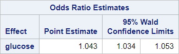
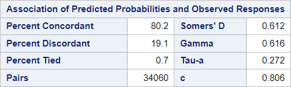

# 03 - Simple logistic regression

## Data

Source of data: mlbench (version 2.1-3.1)
PimaIndiansDiabetes: Pima Indians Diabetes Databas

https://cran.r-project.org/web/packages/mlbench/index.html
e

Data set PID2.csv


```R
library(readr)
PID2 <- read_csv("data/PID2.csv",
                 show_col_types = FALSE)
PID2$diabetes_n <- ifelse(PID2$diabetes == "neg", 0, 1)
head(PID2)

```


<table class="dataframe">
<caption>A tibble: 6 × 10</caption>
<thead>
	<tr><th scope=col>pregnant</th><th scope=col>glucose</th><th scope=col>pressure</th><th scope=col>triceps</th><th scope=col>insulin</th><th scope=col>mass</th><th scope=col>pedigree</th><th scope=col>age</th><th scope=col>diabetes</th><th scope=col>diabetes_n</th></tr>
	<tr><th scope=col>&lt;dbl&gt;</th><th scope=col>&lt;dbl&gt;</th><th scope=col>&lt;dbl&gt;</th><th scope=col>&lt;dbl&gt;</th><th scope=col>&lt;dbl&gt;</th><th scope=col>&lt;dbl&gt;</th><th scope=col>&lt;dbl&gt;</th><th scope=col>&lt;dbl&gt;</th><th scope=col>&lt;chr&gt;</th><th scope=col>&lt;dbl&gt;</th></tr>
</thead>
<tbody>
	<tr><td>1</td><td> 89</td><td>66</td><td>23</td><td> 94</td><td>28.1</td><td>0.167</td><td>21</td><td>neg</td><td>0</td></tr>
	<tr><td>0</td><td>137</td><td>40</td><td>35</td><td>168</td><td>43.1</td><td>2.288</td><td>33</td><td>pos</td><td>1</td></tr>
	<tr><td>3</td><td> 78</td><td>50</td><td>32</td><td> 88</td><td>31.0</td><td>0.248</td><td>26</td><td>pos</td><td>1</td></tr>
	<tr><td>2</td><td>197</td><td>70</td><td>45</td><td>543</td><td>30.5</td><td>0.158</td><td>53</td><td>pos</td><td>1</td></tr>
	<tr><td>1</td><td>189</td><td>60</td><td>23</td><td>846</td><td>30.1</td><td>0.398</td><td>59</td><td>pos</td><td>1</td></tr>
	<tr><td>5</td><td>166</td><td>72</td><td>19</td><td>175</td><td>25.8</td><td>0.587</td><td>51</td><td>pos</td><td>1</td></tr>
</tbody>
</table>


## Question

Does the glucose level predict diabetes?

Model: log[p(X) / (1-p(X))] = ß0 + ß1X


H0: No significant relationship between glucose and diabetes, b1 = zero.

H1: Significant relationship between glucose and diabetes, ß1 <> zero.

## SAS program snippet

The following SAS code will be executed.
proc logistic data = pid2 descending;
  class diabetes;
  model diabetes = glucose;
run;

The option descending reverses the order of the levels in the dependent variable.

## Results

The output is divided into blocks to explain it and to reproduce it afterwards in the different languages.

### Block 1


Row 1 refers to the dataset which was used in this procedure.

Row 2 gives the response variable or dependent variable for the logistic regression.

Row 3 gives the number of response levels equal to the available levels of the dependent variable in the dataset.

Row 4 names the type of model. In this case it is a logistic regression or binary logit as stated here.

Row 5 gives the name of the optimization technique which was used. Here is a source for differences between the statistical programs.
In SAS, the default method is Fisher’s scoring method.
In R, the glm documentation mentions iteratively reweighted least squares (IWLS) as the method.
In Stata, it is the Newton-Raphson algorithm. 
These are the three main methods.

You have to look into the small print in the description of the method.

### R chunk for reproduction

Data set will be part of the result of the summary() function.

The response variable is given in the formula.

The number of levels can be obtained with the table() function. SAS handles character values, R needs numeric values for the response variable.

The summary() function also provides the information that Fisher Scoring was used.


```R
library(broom) 
my_logistic <- glm(diabetes_n ~ glucose, data = PID2, family = binomial)

summary(my_logistic)

# Number of response levels
table("diabetes" = PID2$diabetes, "diabetes_n" = PID2$diabetes_n)

```


    
    Call:
    glm(formula = diabetes_n ~ glucose, family = binomial, data = PID2)
    
    Coefficients:
                 Estimate Std. Error z value Pr(>|z|)    
    (Intercept) -6.095521   0.629787  -9.679   <2e-16 ***
    glucose      0.042421   0.004761   8.911   <2e-16 ***
    ---
    Signif. codes:  0 '***' 0.001 '**' 0.01 '*' 0.05 '.' 0.1 ' ' 1
    
    (Dispersion parameter for binomial family taken to be 1)
    
        Null deviance: 498.10  on 391  degrees of freedom
    Residual deviance: 386.67  on 390  degrees of freedom
    AIC: 390.67
    
    Number of Fisher Scoring iterations: 4
    


            diabetes_n
    diabetes   0   1
         neg 262   0
         pos   0 130


### Block 2


The number of observations used might be less than the number of observations read.
SAS performs a listwise deletion (complete case analysis) if missing values are present.

### R chunk for reproduction


```R
## Number of observations read
nrow(PID2)
## Number of observations used
nobs(my_logistic)
```


392


392


### Block 3


The levels and the frequencies for the dependent variable are provided here.

It is also stated which probability is modeled here. The order was reversed here with the descending option in the proc logistic statement.

By default SAS models the 0 while other statistical programs model the 1. 
Categorical levels would be sorted in alphabetical order and the first level would be modeled.

### R chunk for reproduction


```R
suppressPackageStartupMessages(library(tidyverse))
PID2 %>%
group_by(diabetes, diabetes_n) %>%
count(name = "Total Frequency")
```


<table class="dataframe">
<caption>A grouped_df: 2 × 3</caption>
<thead>
	<tr><th scope=col>diabetes</th><th scope=col>diabetes_n</th><th scope=col>Total Frequency</th></tr>
	<tr><th scope=col>&lt;chr&gt;</th><th scope=col>&lt;dbl&gt;</th><th scope=col>&lt;int&gt;</th></tr>
</thead>
<tbody>
	<tr><td>neg</td><td>0</td><td>262</td></tr>
	<tr><td>pos</td><td>1</td><td>130</td></tr>
</tbody>
</table>


### Block 4


The important information that the model converged can be found here.

The model fit status is described by 
-  AIC (Akaike Information Criterion): Smaller is better.
-  SC (Schwarz Criterion): Smaller is better.
-  -2 Log L (negative two times the log-likelihood)


### R chunk for reproduction


```R
glance(my_logistic)
```


<table class="dataframe">
<caption>A tibble: 1 × 8</caption>
<thead>
	<tr><th scope=col>null.deviance</th><th scope=col>df.null</th><th scope=col>logLik</th><th scope=col>AIC</th><th scope=col>BIC</th><th scope=col>deviance</th><th scope=col>df.residual</th><th scope=col>nobs</th></tr>
	<tr><th scope=col>&lt;dbl&gt;</th><th scope=col>&lt;int&gt;</th><th scope=col>&lt;dbl&gt;</th><th scope=col>&lt;dbl&gt;</th><th scope=col>&lt;dbl&gt;</th><th scope=col>&lt;dbl&gt;</th><th scope=col>&lt;int&gt;</th><th scope=col>&lt;int&gt;</th></tr>
</thead>
<tbody>
	<tr><td>498.0978</td><td>391</td><td>-193.333</td><td>390.666</td><td>398.6085</td><td>386.666</td><td>390</td><td>392</td></tr>
</tbody>
</table>


null.deviance and df.null refer to the intercept only model.

BIC (Bayes information criterion) is also SC (Schwarz criterion).

you can run an intercept model with the following code.


```R
my_logistic_intercept <- glm(diabetes_n ~ 1, data = PID2, family = binomial)
glance(my_logistic_intercept)
```


<table class="dataframe">
<caption>A tibble: 1 × 8</caption>
<thead>
	<tr><th scope=col>null.deviance</th><th scope=col>df.null</th><th scope=col>logLik</th><th scope=col>AIC</th><th scope=col>BIC</th><th scope=col>deviance</th><th scope=col>df.residual</th><th scope=col>nobs</th></tr>
	<tr><th scope=col>&lt;dbl&gt;</th><th scope=col>&lt;int&gt;</th><th scope=col>&lt;dbl&gt;</th><th scope=col>&lt;dbl&gt;</th><th scope=col>&lt;dbl&gt;</th><th scope=col>&lt;dbl&gt;</th><th scope=col>&lt;int&gt;</th><th scope=col>&lt;int&gt;</th></tr>
</thead>
<tbody>
	<tr><td>498.0978</td><td>391</td><td>-249.0489</td><td>500.0978</td><td>504.0691</td><td>498.0978</td><td>391</td><td>392</td></tr>
</tbody>
</table>


The values are similar to the SAS output.

### Block 5


These global tests test the null hypothesis that all regression coefficents are zero.

The tests are different chi-square tests.


### R chunk for reproduction


```R
# z-test
# Wald’s chi-squared statistic for the hypothesis that the coefficient of glucose
# is zero, or equivalently that the odds-ratio is one
m0 <- glm(diabetes_n ~ 1, data = PID2, family = binomial)
m1 <- glm(diabetes_n ~ glucose, data = PID2, family = binomial)

b <- coef(m1)
se <- sqrt(diag(vcov(m1)))
(b[2]/se[2])^2

# likeli ratio test
#-2*(logLik(m0) - logLik(m1))
-2*(logLik(m0) - logLik(m1))

```


<strong>glucose:</strong> 79.4024484682919


    'log Lik.' 111.4318 (df=1)


### Block 6


Column 1 "Parameter" lists the intercept and the parameter in the model.

Column 2 "DF" gives the degrees of freedom for every parameter.

Column 3 "Estimate" lists the logit regression estimates for every parameter given that the other parameter are held constant. 

$log(p / (1 - p)) = -6.10 + 0.04 * glucose$ with p as the probability for diabetes.

Column 4 "Standard Error" gives the standard errors of the individual regression coefficients.

Column 5 "Wald Chi-Square" tests the null hypothesis that the regression coefficient is zero given that the other predictors are in the model.

Column 6 "Pr > ChiSq" gives the p-value for the Wald Chi-Square statistic.

### R chunk for reproduction


```R
tidy(my_logistic)
```


<table class="dataframe">
<caption>A tibble: 2 × 5</caption>
<thead>
	<tr><th scope=col>term</th><th scope=col>estimate</th><th scope=col>std.error</th><th scope=col>statistic</th><th scope=col>p.value</th></tr>
	<tr><th scope=col>&lt;chr&gt;</th><th scope=col>&lt;dbl&gt;</th><th scope=col>&lt;dbl&gt;</th><th scope=col>&lt;dbl&gt;</th><th scope=col>&lt;dbl&gt;</th></tr>
</thead>
<tbody>
	<tr><td>(Intercept)</td><td>-6.09552139</td><td>0.629787038</td><td>-9.678703</td><td>3.713993e-22</td></tr>
	<tr><td>glucose    </td><td> 0.04242099</td><td>0.004760623</td><td> 8.910805</td><td>5.066328e-19</td></tr>
</tbody>
</table>


*term* represents the *Parameter* in the SAS output.

Degrees of freedom are missing.

The estimate and standard error results are similar.

The statistic is a z test in R and a Wald chi-square test in SAS.

The p-value results from this test.


```R
summary(my_logistic)
```


    
    Call:
    glm(formula = diabetes_n ~ glucose, family = binomial, data = PID2)
    
    Coefficients:
                 Estimate Std. Error z value Pr(>|z|)    
    (Intercept) -6.095521   0.629787  -9.679   <2e-16 ***
    glucose      0.042421   0.004761   8.911   <2e-16 ***
    ---
    Signif. codes:  0 '***' 0.001 '**' 0.01 '*' 0.05 '.' 0.1 ' ' 1
    
    (Dispersion parameter for binomial family taken to be 1)
    
        Null deviance: 498.10  on 391  degrees of freedom
    Residual deviance: 386.67  on 390  degrees of freedom
    AIC: 390.67
    
    Number of Fisher Scoring iterations: 4
    


### Block 7


Column 1 "Effect" lists the variables which are interpreted by the point estimate.

Column 2 "Point Estimate" is interpreted as an odds ratio. 
One unit change in the independent variable changes the probability for the modelled event by the estimated value.

Column 3 and 4 give the confidence interval for the odds ratio.

### R chunk for reproduction

Odds ratio estimate are calculated by exponentiation of the estimates.

Confidence intervals are returned by the confint() function.


```R
exp(my_logistic$coeff)
suppressMessages(exp(confint(my_logistic)))
```


<style>
.dl-inline {width: auto; margin:0; padding: 0}
.dl-inline>dt, .dl-inline>dd {float: none; width: auto; display: inline-block}
.dl-inline>dt::after {content: ":\0020"; padding-right: .5ex}
.dl-inline>dt:not(:first-of-type) {padding-left: .5ex}
</style><dl class=dl-inline><dt>(Intercept)</dt><dd>0.00225293517344414</dd><dt>glucose</dt><dd>1.04333361593451</dd></dl>


<table class="dataframe">
<caption>A matrix: 2 × 2 of type dbl</caption>
<thead>
	<tr><th></th><th scope=col>2.5 %</th><th scope=col>97.5 %</th></tr>
</thead>
<tbody>
	<tr><th scope=row>(Intercept)</th><td>0.0006194309</td><td>0.007358113</td></tr>
	<tr><th scope=row>glucose</th><td>1.0340267589</td><td>1.053554337</td></tr>
</tbody>
</table>


### Block 8


These parameter describe the association between the predicted probabilities and observed responses.

For details for calculation see https://documentation.sas.com/doc/en/pgmsascdc/9.4_3.4/statug/statug_logistic_details12.htm

### R chunk for reproduction

The information of block 8 are not directly provided in base R.


```R
library(survival)
concordance(my_logistic)
```


    Call:
    concordance.lm(object = my_logistic)
    
    n= 392 
    Concordance= 0.8058 se= 0.02356
    concordant discordant     tied.x     tied.y    tied.xy 
         27332       6503        225      42049        527 


```R
# Sommer's D is 2C-1
2 * 0.8058 - 1
# Goodman and Kruskal's Gamma (or simple Gamma)
# (#concordant - #discordant) / (#concordant + #discordant)
(27332 - 6503) / (27332 + 6503)
# https://en.wikipedia.org/wiki/Kendall_rank_correlation_coefficient 
# Tau
# 1 - 2*(number of discordant pairs) / (number of pairs)
# 1 - 2 * 6503 / (n * (n - 1) / 2)
392 * 391 / 2
1 - 2 * 6503 / (392 * (392 - 1) / 2)
# Tau a
# (#concordant - # discordant) / n
(27332 - 6503) / (392*391 / 2)
# Tau c below, but what is c?
# 2 * (nc - nd) / (n^2*(m-1)/m)
2 * (27332 - 6503) / (392**2 * (2 - 1) / 2)
```


0.6116


0.615605142603813


76636


0.830288637194008


0.271791325225742


0.54219596001666


The others could be calculated by hand according to the formula mentioned in the previous block 8.


```R
library(yardstick)
obs <- as.integer(PID2$diabetes_n)
pred <- as.integer(round(predict(my_logistic, type = "response")))
str(obs)
str(pred)
df1 <- table(obs, pred)
```

    
    Attache Paket: 'yardstick'
    
    
    Das folgende Objekt ist maskiert 'package:readr':
    
        spec
    
    
    

     int [1:392] 0 1 1 1 1 1 1 0 1 0 ...
     int [1:392] 0 0 0 1 1 1 0 0 0 0 ...
    


```R
cf <- conf_mat(df1, truth = obs, estimate = pred)
summary(cf)
```


<table class="dataframe">
<caption>A tibble: 13 × 3</caption>
<thead>
	<tr><th scope=col>.metric</th><th scope=col>.estimator</th><th scope=col>.estimate</th></tr>
	<tr><th scope=col>&lt;chr&gt;</th><th scope=col>&lt;chr&gt;</th><th scope=col>&lt;dbl&gt;</th></tr>
</thead>
<tbody>
	<tr><td>accuracy            </td><td>binary</td><td>0.7678571</td></tr>
	<tr><td>kap                 </td><td>binary</td><td>0.4405621</td></tr>
	<tr><td>sens                </td><td>binary</td><td>0.7898305</td></tr>
	<tr><td>spec                </td><td>binary</td><td>0.7010309</td></tr>
	<tr><td>ppv                 </td><td>binary</td><td>0.8893130</td></tr>
	<tr><td>npv                 </td><td>binary</td><td>0.5230769</td></tr>
	<tr><td>mcc                 </td><td>binary</td><td>0.4499181</td></tr>
	<tr><td>j_index             </td><td>binary</td><td>0.4908614</td></tr>
	<tr><td>bal_accuracy        </td><td>binary</td><td>0.7454307</td></tr>
	<tr><td>detection_prevalence</td><td>binary</td><td>0.6683673</td></tr>
	<tr><td>precision           </td><td>binary</td><td>0.8893130</td></tr>
	<tr><td>recall              </td><td>binary</td><td>0.7898305</td></tr>
	<tr><td>f_meas              </td><td>binary</td><td>0.8366248</td></tr>
</tbody>
</table>


```R

```
