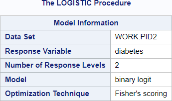
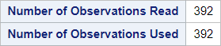
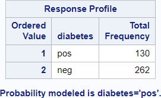
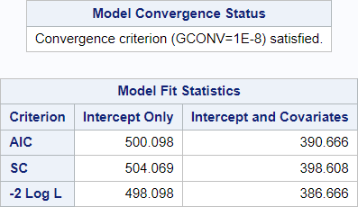
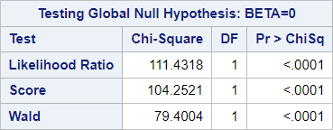
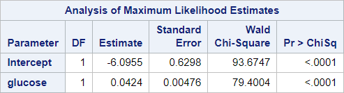
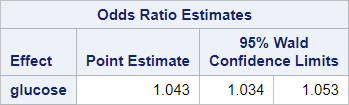
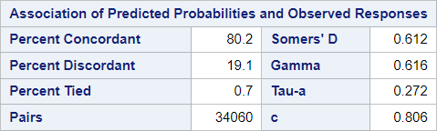

# 03 - Simple logistic regression

## Data

Source of data: mlbench (version 2.1-3.1)
PimaIndiansDiabetes: Pima Indians Diabetes Databas

https://cran.r-project.org/web/packages/mlbench/index.html
e

Data set PID2.csv


```R
library(readr)
PID2 <- read_csv("data/PID2.csv",
                 show_col_types = FALSE)
head(PID2)

```


<table class="dataframe">
<caption>A tibble: 6 × 9</caption>
<thead>
	<tr><th scope=col>pregnant</th><th scope=col>glucose</th><th scope=col>pressure</th><th scope=col>triceps</th><th scope=col>insulin</th><th scope=col>mass</th><th scope=col>pedigree</th><th scope=col>age</th><th scope=col>diabetes</th></tr>
	<tr><th scope=col>&lt;dbl&gt;</th><th scope=col>&lt;dbl&gt;</th><th scope=col>&lt;dbl&gt;</th><th scope=col>&lt;dbl&gt;</th><th scope=col>&lt;dbl&gt;</th><th scope=col>&lt;dbl&gt;</th><th scope=col>&lt;dbl&gt;</th><th scope=col>&lt;dbl&gt;</th><th scope=col>&lt;chr&gt;</th></tr>
</thead>
<tbody>
	<tr><td>1</td><td> 89</td><td>66</td><td>23</td><td> 94</td><td>28.1</td><td>0.167</td><td>21</td><td>neg</td></tr>
	<tr><td>0</td><td>137</td><td>40</td><td>35</td><td>168</td><td>43.1</td><td>2.288</td><td>33</td><td>pos</td></tr>
	<tr><td>3</td><td> 78</td><td>50</td><td>32</td><td> 88</td><td>31.0</td><td>0.248</td><td>26</td><td>pos</td></tr>
	<tr><td>2</td><td>197</td><td>70</td><td>45</td><td>543</td><td>30.5</td><td>0.158</td><td>53</td><td>pos</td></tr>
	<tr><td>1</td><td>189</td><td>60</td><td>23</td><td>846</td><td>30.1</td><td>0.398</td><td>59</td><td>pos</td></tr>
	<tr><td>5</td><td>166</td><td>72</td><td>19</td><td>175</td><td>25.8</td><td>0.587</td><td>51</td><td>pos</td></tr>
</tbody>
</table>


## Question

Does the glucose level predict diabetes?

Model: log[p(X) / (1-p(X))] = ß0 + ß1X


H0: No significant relationship between glucose and diabetes, b1 = zero.

H1: Significant relationship between glucose and diabetes, ß1 <> zero.

## SAS program snippet

The following SAS code will be executed.
proc logistic data = pid2 descending;
  class diabetes;
  model diabetes = glucose;
run;

The option descending reverses the order of the levels in the dependent variable.

## Results

The output is divided into blocks to explain it and to reproduce it afterwards in the different languages.

### Block 1


Row 1 refers to the dataset which was used in this procedure.

Row 2 gives the response variable or dependent variable for the logistic regression.

Row 3 gives the number of response levels equal to the available levels of the dependent variable in the dataset.

Row 4 names the type of model. In this case it is a logistic regression or binary logit as stated here.

Row 5 gives the name of the optimization technique which was used. Here is a source for differences between the statistical programs.
In SAS, the default method is Fisher’s scoring method.
In R, the glm documentation mentions iteratively reweighted least squares (IWLS) as the method.
In Stata, it is the Newton-Raphson algorithm. 
These are the three main methods.

You have to look into the small print in the description of the method.

### Block 2


The number of observations used might be less than the number of observations read.
SAS performs a listwise deletion (complete case analysis) if missing values are present.

### Block 3


The levels and the frequencies for the dependent variable are provided here.

It is also stated which probability is modeled here. The order was reversed here with the descending option in the proc logistic statement.

By default SAS models the 0 while other statistical programs model the 1. 
Categorical levels would be sorted in alphabetical order and the first level would be modeled.

### Block 4


The important information that the model converged can be found here.

The model fit status is described by 
-  AIC (Akaike Information Criterion): Smaller is better.
-  SC (Schwarz Criterion): Smaller is better.
-  -2 Log L (negative two times the log-likelihood)


### Block 5


These global tests test the null hypothesis that all regression coefficents are zero.

The tests are different chi-square tests.


### Block 6


Column 1 "Parameter" lists the intercept and the parameter in the model.

Column 2 "DF" gives the degrees of freedom for every parameter.

Column 3 "Estimate" lists the logit regression estimates for every parameter given that the other parameter are held constant. 

$log(p / (1 - p)) = -6.10 + 0.04 * glucose$ with p as the probability for diabetes.

Column 4 "Standard Error" gives the standard errors of the individual regression coefficients.

Column 5 "Wald Chi-Square" tests the null hypothesis that the regression coefficient is zero given that the other predictors are in the model.

Column 6 "Pr > ChiSq" gives the p-value for the Wald Chi-Square statistic.

### Block 7


Column 1 "Effect" lists the variables which are interpreted by the point estimate.

Column 2 "Point Estimate" is interpreted as an odds ratio. 
One unit change in the independent variable changes the probability for the modelled event by the estimated value.

Column 3 and 4 give the confidence interval for the odds ratio.

### Block 8


These parameter describe the association between the predicted probabilities and observed responses.

For details for calculation see https://documentation.sas.com/doc/en/pgmsascdc/9.4_3.4/statug/statug_logistic_details12.htm

Concordant or discordant pairs are defined as follows: 

If we sort the x/y pairs by x in ascending order and look at a particular pair, 
then it is called a concordant pair if the y-value of this pair is greater than the y-value of the previous pair, 
and from a discordant pair if this is not the case.


```R

```
