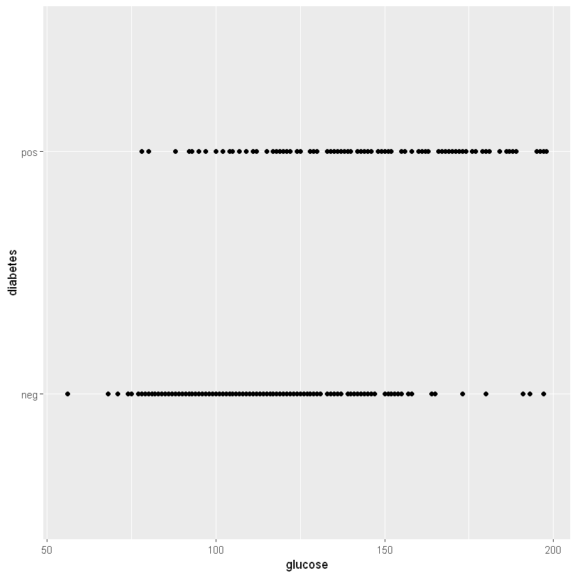
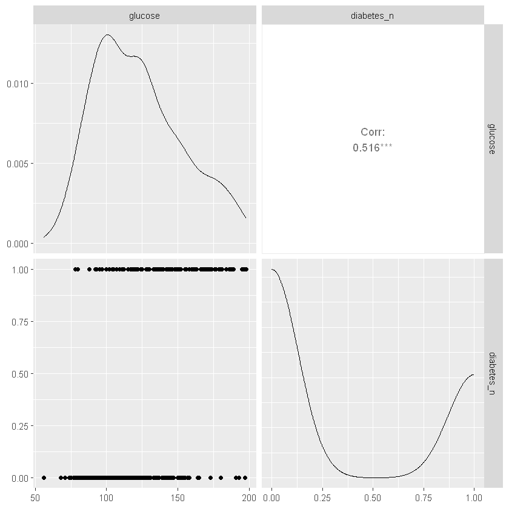
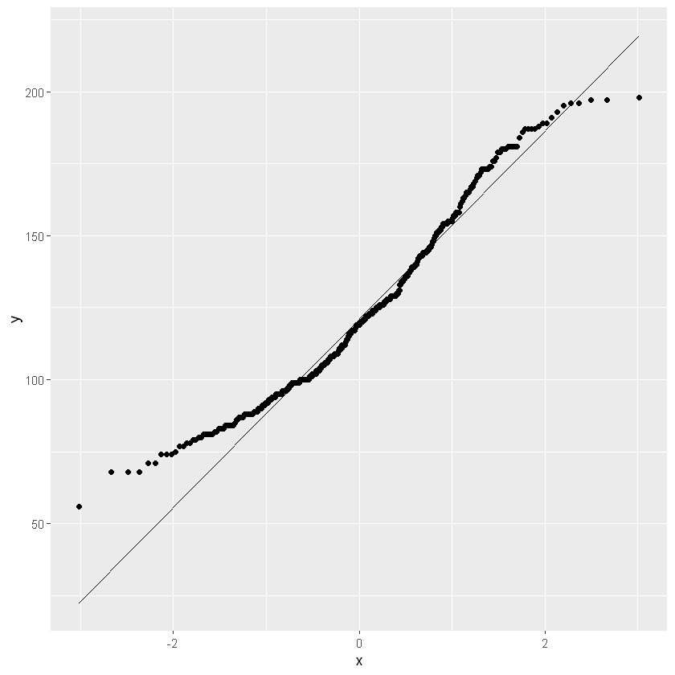

# Working sheet
## 03 - Simple logistic regression with R
V03.01.00 - 2024-02-17

## Load data
Change the path and the file name in the following box.


```R
library(readr)
df <- read_csv("data/PID2.csv",
                 show_col_types = FALSE)
df$diabetes_n <- ifelse(PID2$diabetes == "neg", 0, 1)

```

Look at the structure and the head of the dataset.


```R
str(df)
```

    spc_tbl_ [392 × 10] (S3: spec_tbl_df/tbl_df/tbl/data.frame)
     $ pregnant  : num [1:392] 1 0 3 2 1 5 0 1 1 3 ...
     $ glucose   : num [1:392] 89 137 78 197 189 166 118 103 115 126 ...
     $ pressure  : num [1:392] 66 40 50 70 60 72 84 30 70 88 ...
     $ triceps   : num [1:392] 23 35 32 45 23 19 47 38 30 41 ...
     $ insulin   : num [1:392] 94 168 88 543 846 175 230 83 96 235 ...
     $ mass      : num [1:392] 28.1 43.1 31 30.5 30.1 25.8 45.8 43.3 34.6 39.3 ...
     $ pedigree  : num [1:392] 0.167 2.288 0.248 0.158 0.398 ...
     $ age       : num [1:392] 21 33 26 53 59 51 31 33 32 27 ...
     $ diabetes  : chr [1:392] "neg" "pos" "pos" "pos" ...
     $ diabetes_n: num [1:392] 0 1 1 1 1 1 1 0 1 0 ...
     - attr(*, "spec")=
      .. cols(
      ..   pregnant = col_double(),
      ..   glucose = col_double(),
      ..   pressure = col_double(),
      ..   triceps = col_double(),
      ..   insulin = col_double(),
      ..   mass = col_double(),
      ..   pedigree = col_double(),
      ..   age = col_double(),
      ..   diabetes = col_character()
      .. )
     - attr(*, "problems")=<externalptr> 
    


```R
head(df)
```


<table class="dataframe">
<caption>A tibble: 6 × 10</caption>
<thead>
	<tr><th scope=col>pregnant</th><th scope=col>glucose</th><th scope=col>pressure</th><th scope=col>triceps</th><th scope=col>insulin</th><th scope=col>mass</th><th scope=col>pedigree</th><th scope=col>age</th><th scope=col>diabetes</th><th scope=col>diabetes_n</th></tr>
	<tr><th scope=col>&lt;dbl&gt;</th><th scope=col>&lt;dbl&gt;</th><th scope=col>&lt;dbl&gt;</th><th scope=col>&lt;dbl&gt;</th><th scope=col>&lt;dbl&gt;</th><th scope=col>&lt;dbl&gt;</th><th scope=col>&lt;dbl&gt;</th><th scope=col>&lt;dbl&gt;</th><th scope=col>&lt;chr&gt;</th><th scope=col>&lt;dbl&gt;</th></tr>
</thead>
<tbody>
	<tr><td>1</td><td> 89</td><td>66</td><td>23</td><td> 94</td><td>28.1</td><td>0.167</td><td>21</td><td>neg</td><td>0</td></tr>
	<tr><td>0</td><td>137</td><td>40</td><td>35</td><td>168</td><td>43.1</td><td>2.288</td><td>33</td><td>pos</td><td>1</td></tr>
	<tr><td>3</td><td> 78</td><td>50</td><td>32</td><td> 88</td><td>31.0</td><td>0.248</td><td>26</td><td>pos</td><td>1</td></tr>
	<tr><td>2</td><td>197</td><td>70</td><td>45</td><td>543</td><td>30.5</td><td>0.158</td><td>53</td><td>pos</td><td>1</td></tr>
	<tr><td>1</td><td>189</td><td>60</td><td>23</td><td>846</td><td>30.1</td><td>0.398</td><td>59</td><td>pos</td><td>1</td></tr>
	<tr><td>5</td><td>166</td><td>72</td><td>19</td><td>175</td><td>25.8</td><td>0.587</td><td>51</td><td>pos</td><td>1</td></tr>
</tbody>
</table>


Look at frequencies and descriptive statistics.

The summary() function is the first approach.

describe() from the Hmisc package is an alternative.


```R
summary(df)
```


        pregnant         glucose         pressure         triceps     
     Min.   : 0.000   Min.   : 56.0   Min.   : 24.00   Min.   : 7.00  
     1st Qu.: 1.000   1st Qu.: 99.0   1st Qu.: 62.00   1st Qu.:21.00  
     Median : 2.000   Median :119.0   Median : 70.00   Median :29.00  
     Mean   : 3.301   Mean   :122.6   Mean   : 70.66   Mean   :29.15  
     3rd Qu.: 5.000   3rd Qu.:143.0   3rd Qu.: 78.00   3rd Qu.:37.00  
     Max.   :17.000   Max.   :198.0   Max.   :110.00   Max.   :63.00  
        insulin            mass          pedigree           age       
     Min.   : 14.00   Min.   :18.20   Min.   :0.0850   Min.   :21.00  
     1st Qu.: 76.75   1st Qu.:28.40   1st Qu.:0.2697   1st Qu.:23.00  
     Median :125.50   Median :33.20   Median :0.4495   Median :27.00  
     Mean   :156.06   Mean   :33.09   Mean   :0.5230   Mean   :30.86  
     3rd Qu.:190.00   3rd Qu.:37.10   3rd Qu.:0.6870   3rd Qu.:36.00  
     Max.   :846.00   Max.   :67.10   Max.   :2.4200   Max.   :81.00  
       diabetes           diabetes_n    
     Length:392         Min.   :0.0000  
     Class :character   1st Qu.:0.0000  
     Mode  :character   Median :0.0000  
                        Mean   :0.3316  
                        3rd Qu.:1.0000  
                        Max.   :1.0000  


```R
library(Hmisc)
describe(df)
```


    df 
    
     10  Variables      392  Observations
    --------------------------------------------------------------------------------
    pregnant 
           n  missing distinct     Info     Mean      Gmd      .05      .10 
         392        0       17    0.977    3.301    3.363        0        0 
         .25      .50      .75      .90      .95 
           1        2        5        8       10 
                                                                                
    Value       0.00  0.85  1.87  2.89  3.91  4.93  5.95  6.97  7.99  8.84  9.86
    Frequency     56    93    64    45    27    21    19    20    14    11     6
    Proportion 0.143 0.237 0.163 0.115 0.069 0.054 0.048 0.051 0.036 0.028 0.015
                                                  
    Value      10.88 11.90 12.92 13.94 14.96 17.00
    Frequency      5     5     3     1     1     1
    Proportion 0.013 0.013 0.008 0.003 0.003 0.003
    
    For the frequency table, variable is rounded to the nearest 0.17
    --------------------------------------------------------------------------------
    glucose 
           n  missing distinct     Info     Mean      Gmd      .05      .10 
         392        0      117        1    122.6    34.92     81.0     87.0 
         .25      .50      .75      .90      .95 
        99.0    119.0    143.0    170.9    181.0 
    
    lowest :  56  68  71  74  75, highest: 193 195 196 197 198
    --------------------------------------------------------------------------------
    pressure 
           n  missing distinct     Info     Mean      Gmd      .05      .10 
         392        0       37    0.997    70.66    13.89       50       56 
         .25      .50      .75      .90      .95 
          62       70       78       86       90 
    
    lowest :  24  30  38  40  44, highest:  98 100 102 106 110
    --------------------------------------------------------------------------------
    triceps 
           n  missing distinct     Info     Mean      Gmd      .05      .10 
         392        0       48    0.999    29.15    12.01    13.00    15.00 
         .25      .50      .75      .90      .95 
       21.00    29.00    37.00    43.00    46.45 
    
    lowest :  7  8 10 11 12, highest: 51 52 56 60 63
    --------------------------------------------------------------------------------
    insulin 
           n  missing distinct     Info     Mean      Gmd      .05      .10 
         392        0      184        1    156.1    116.3    42.55    51.10 
         .25      .50      .75      .90      .95 
       76.75   125.50   190.00   292.80   396.50 
    
    lowest :  14  15  16  18  22, highest: 579 600 680 744 846
    --------------------------------------------------------------------------------
    mass 
           n  missing distinct     Info     Mean      Gmd      .05      .10 
         392        0      194        1    33.09    7.768    22.26    24.42 
         .25      .50      .75      .90      .95 
       28.40    33.20    37.10    42.07    45.24 
    
    lowest : 18.2 19.3 19.4 19.5 19.6, highest: 53.2 55   57.3 59.4 67.1
    --------------------------------------------------------------------------------
    pedigree 
           n  missing distinct     Info     Mean      Gmd      .05      .10 
         392        0      331        1    0.523   0.3521   0.1535   0.1834 
         .25      .50      .75      .90      .95 
      0.2698   0.4495   0.6870   0.9422   1.1603 
    
    lowest : 0.085 0.088 0.089 0.101 0.107, highest: 1.699 2.137 2.288 2.329 2.42 
    --------------------------------------------------------------------------------
    age 
           n  missing distinct     Info     Mean      Gmd      .05      .10 
         392        0       43    0.996    30.86    10.62    21.00    22.00 
         .25      .50      .75      .90      .95 
       23.00    27.00    36.00    46.00    52.45 
    
    lowest : 21 22 23 24 25, highest: 59 60 61 63 81
    --------------------------------------------------------------------------------
    diabetes 
           n  missing distinct 
         392        0        2 
                          
    Value        neg   pos
    Frequency    262   130
    Proportion 0.668 0.332
    --------------------------------------------------------------------------------
    diabetes_n 
           n  missing distinct     Info      Sum     Mean      Gmd 
         392        0        2    0.665      130   0.3316   0.4444 
    
    --------------------------------------------------------------------------------


Plot the variables of interest with a scatter plot.

Either as single plots as in the following plot.


```R
library(ggplot2)
ggplot(df, aes(x = glucose, y = diabetes)) +
  geom_point()
```


    

    


```R
library(GGally)
library(tidyverse)
ggpairs(df %>% select(glucose, diabetes_n))
```


    

    


```R
ggplot(df, aes(sample = glucose)) + 
  geom_qq() +
  geom_qq_line()
```


    

    


## Assumptions for logistic regression

- The dependent variable is nominally scaled with exactly two values (dichotomous).
- The independent variable is either nominally scaled or at least interval scaled.
- Independence of observations.
- We need at least a certain number of cases per predictor. As with many other regressions, binomial logistic regression results improve as the sample size increases.
- There should be no outliers in the data.
- Linearity. There must be a linear relationship between the continuous independent variables and the logit transformation of the dependent variable.
- No multicolinearity.


The dependent variable is nominally scaled with exactly two values (dichotomous).


```R
table(df$diabetes)
table(df$diabetes_n)
```


    
    neg pos 
    262 130 


    
      0   1 
    262 130 


```R
library(broom) 
my_logistic <- glm(diabetes_n ~ glucose, data = PID2, family = binomial)

summary(my_logistic)

```


    
    Call:
    glm(formula = diabetes_n ~ glucose, family = binomial, data = PID2)
    
    Coefficients:
                 Estimate Std. Error z value Pr(>|z|)    
    (Intercept) -6.095521   0.629787  -9.679   <2e-16 ***
    glucose      0.042421   0.004761   8.911   <2e-16 ***
    ---
    Signif. codes:  0 '***' 0.001 '**' 0.01 '*' 0.05 '.' 0.1 ' ' 1
    
    (Dispersion parameter for binomial family taken to be 1)
    
        Null deviance: 498.10  on 391  degrees of freedom
    Residual deviance: 386.67  on 390  degrees of freedom
    AIC: 390.67
    
    Number of Fisher Scoring iterations: 4
    


```R
glance(my_logistic)
```


<table class="dataframe">
<caption>A tibble: 1 × 8</caption>
<thead>
	<tr><th scope=col>null.deviance</th><th scope=col>df.null</th><th scope=col>logLik</th><th scope=col>AIC</th><th scope=col>BIC</th><th scope=col>deviance</th><th scope=col>df.residual</th><th scope=col>nobs</th></tr>
	<tr><th scope=col>&lt;dbl&gt;</th><th scope=col>&lt;int&gt;</th><th scope=col>&lt;dbl&gt;</th><th scope=col>&lt;dbl&gt;</th><th scope=col>&lt;dbl&gt;</th><th scope=col>&lt;dbl&gt;</th><th scope=col>&lt;int&gt;</th><th scope=col>&lt;int&gt;</th></tr>
</thead>
<tbody>
	<tr><td>498.0978</td><td>391</td><td>-193.333</td><td>390.666</td><td>398.6085</td><td>386.666</td><td>390</td><td>392</td></tr>
</tbody>
</table>


```R
my_logistic_intercept <- glm(diabetes_n ~ 1, data = PID2, family = binomial)
glance(my_logistic_intercept)
```


<table class="dataframe">
<caption>A tibble: 1 × 8</caption>
<thead>
	<tr><th scope=col>null.deviance</th><th scope=col>df.null</th><th scope=col>logLik</th><th scope=col>AIC</th><th scope=col>BIC</th><th scope=col>deviance</th><th scope=col>df.residual</th><th scope=col>nobs</th></tr>
	<tr><th scope=col>&lt;dbl&gt;</th><th scope=col>&lt;int&gt;</th><th scope=col>&lt;dbl&gt;</th><th scope=col>&lt;dbl&gt;</th><th scope=col>&lt;dbl&gt;</th><th scope=col>&lt;dbl&gt;</th><th scope=col>&lt;int&gt;</th><th scope=col>&lt;int&gt;</th></tr>
</thead>
<tbody>
	<tr><td>498.0978</td><td>391</td><td>-249.0489</td><td>500.0978</td><td>504.0691</td><td>498.0978</td><td>391</td><td>392</td></tr>
</tbody>
</table>


```R
# z-test
# Wald’s chi-squared statistic for the hypothesis that the coefficient of glucose
# is zero, or equivalently that the odds-ratio is one
m0 <- glm(diabetes_n ~ 1, data = PID2, family = binomial)
m1 <- glm(diabetes_n ~ glucose, data = PID2, family = binomial)

b <- coef(m1)
se <- sqrt(diag(vcov(m1)))
(b[2]/se[2])^2

# likeli ratio test
#-2*(logLik(m0) - logLik(m1))
-2*(logLik(m0) - logLik(m1))

```


<strong>glucose:</strong> 79.4024484682919


    'log Lik.' 111.4318 (df=1)


```R
tidy(my_logistic)
```


<table class="dataframe">
<caption>A tibble: 2 × 5</caption>
<thead>
	<tr><th scope=col>term</th><th scope=col>estimate</th><th scope=col>std.error</th><th scope=col>statistic</th><th scope=col>p.value</th></tr>
	<tr><th scope=col>&lt;chr&gt;</th><th scope=col>&lt;dbl&gt;</th><th scope=col>&lt;dbl&gt;</th><th scope=col>&lt;dbl&gt;</th><th scope=col>&lt;dbl&gt;</th></tr>
</thead>
<tbody>
	<tr><td>(Intercept)</td><td>-6.09552139</td><td>0.629787038</td><td>-9.678703</td><td>3.713993e-22</td></tr>
	<tr><td>glucose    </td><td> 0.04242099</td><td>0.004760623</td><td> 8.910805</td><td>5.066328e-19</td></tr>
</tbody>
</table>


```R
summary(my_logistic)
```


    
    Call:
    glm(formula = diabetes_n ~ glucose, family = binomial, data = PID2)
    
    Coefficients:
                 Estimate Std. Error z value Pr(>|z|)    
    (Intercept) -6.095521   0.629787  -9.679   <2e-16 ***
    glucose      0.042421   0.004761   8.911   <2e-16 ***
    ---
    Signif. codes:  0 '***' 0.001 '**' 0.01 '*' 0.05 '.' 0.1 ' ' 1
    
    (Dispersion parameter for binomial family taken to be 1)
    
        Null deviance: 498.10  on 391  degrees of freedom
    Residual deviance: 386.67  on 390  degrees of freedom
    AIC: 390.67
    
    Number of Fisher Scoring iterations: 4
    


```R
exp(my_logistic$coeff)
suppressMessages(exp(confint(my_logistic)))
```


<style>
.dl-inline {width: auto; margin:0; padding: 0}
.dl-inline>dt, .dl-inline>dd {float: none; width: auto; display: inline-block}
.dl-inline>dt::after {content: ":\0020"; padding-right: .5ex}
.dl-inline>dt:not(:first-of-type) {padding-left: .5ex}
</style><dl class=dl-inline><dt>(Intercept)</dt><dd>0.00225293517344414</dd><dt>glucose</dt><dd>1.04333361593451</dd></dl>


<table class="dataframe">
<caption>A matrix: 2 × 2 of type dbl</caption>
<thead>
	<tr><th></th><th scope=col>2.5 %</th><th scope=col>97.5 %</th></tr>
</thead>
<tbody>
	<tr><th scope=row>(Intercept)</th><td>0.0006194309</td><td>0.007358113</td></tr>
	<tr><th scope=row>glucose</th><td>1.0340267589</td><td>1.053554337</td></tr>
</tbody>
</table>


```R
library(survival)
concordance(my_logistic)
```


    Call:
    concordance.lm(object = my_logistic)
    
    n= 392 
    Concordance= 0.8058 se= 0.02356
    concordant discordant     tied.x     tied.y    tied.xy 
         27332       6503        225      42049        527 


```R
# Sommer's D is 2C-1
2 * 0.8058 - 1
# Goodman and Kruskal's Gamma (or simple Gamma)
# (#concordant - #discordant) / (#concordant + #discordant)
(27332 - 6503) / (27332 + 6503)
# https://en.wikipedia.org/wiki/Kendall_rank_correlation_coefficient 
# Tau
# 1 - 2*(number of discordant pairs) / (number of pairs)
# 1 - 2 * 6503 / (n * (n - 1) / 2)
392 * 391 / 2
1 - 2 * 6503 / (392 * (392 - 1) / 2)
# Tau a
# (#concordant - # discordant) / n
(27332 - 6503) / (392*391 / 2)
# Tau c below, but what is c?
# 2 * (nc - nd) / (n^2*(m-1)/m)
2 * (27332 - 6503) / (392**2 * (2 - 1) / 2)
```


0.6116


0.615605142603813


76636


0.830288637194008


0.271791325225742


0.54219596001666


The others could be calculated by hand according to the formula mentioned in the previous block 8.


```R
library(yardstick)
obs <- as.integer(df$diabetes_n)
pred <- as.integer(round(predict(my_logistic, type = "response")))
str(obs)
str(pred)
df1 <- table(obs, pred)
```

     int [1:392] 0 1 1 1 1 1 1 0 1 0 ...
     int [1:392] 0 0 0 1 1 1 0 0 0 0 ...
    


```R
cf <- conf_mat(df1, truth = obs, estimate = pred)
summary(cf)
```


<table class="dataframe">
<caption>A tibble: 13 × 3</caption>
<thead>
	<tr><th scope=col>.metric</th><th scope=col>.estimator</th><th scope=col>.estimate</th></tr>
	<tr><th scope=col>&lt;chr&gt;</th><th scope=col>&lt;chr&gt;</th><th scope=col>&lt;dbl&gt;</th></tr>
</thead>
<tbody>
	<tr><td>accuracy            </td><td>binary</td><td>0.7678571</td></tr>
	<tr><td>kap                 </td><td>binary</td><td>0.4405621</td></tr>
	<tr><td>sens                </td><td>binary</td><td>0.7898305</td></tr>
	<tr><td>spec                </td><td>binary</td><td>0.7010309</td></tr>
	<tr><td>ppv                 </td><td>binary</td><td>0.8893130</td></tr>
	<tr><td>npv                 </td><td>binary</td><td>0.5230769</td></tr>
	<tr><td>mcc                 </td><td>binary</td><td>0.4499181</td></tr>
	<tr><td>j_index             </td><td>binary</td><td>0.4908614</td></tr>
	<tr><td>bal_accuracy        </td><td>binary</td><td>0.7454307</td></tr>
	<tr><td>detection_prevalence</td><td>binary</td><td>0.6683673</td></tr>
	<tr><td>precision           </td><td>binary</td><td>0.8893130</td></tr>
	<tr><td>recall              </td><td>binary</td><td>0.7898305</td></tr>
	<tr><td>f_meas              </td><td>binary</td><td>0.8366248</td></tr>
</tbody>
</table>


```R

```
