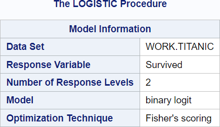
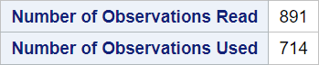
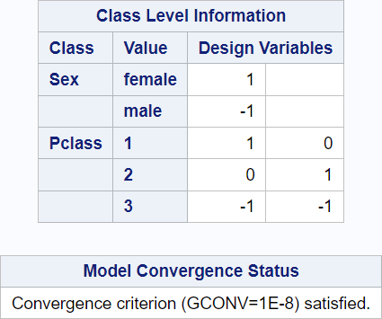
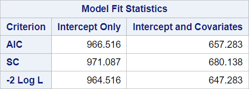
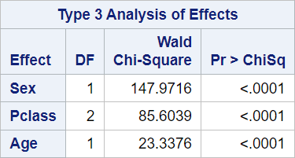
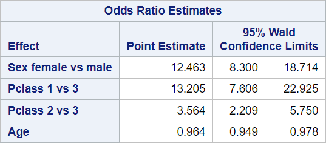
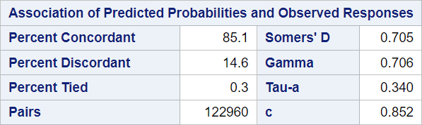

# 04 - Multiple logistic regression

## Data

Source of data: Titanic

www.kaggle.com

https://www.kaggle.com/datasets/hesh97/titanicdataset-traincsv 

Dataset titanic.csv


```R
library(readr)
titanic <- read_csv("data/titanic.csv",
                 show_col_types = FALSE)
titanic$Pclass <- as.factor(titanic$Pclass)
titanic$Sex <- as.factor(titanic$Sex)

head(titanic)

```


<table class="dataframe">
<caption>A tibble: 6 × 12</caption>
<thead>
	<tr><th scope=col>PassengerId</th><th scope=col>Survived</th><th scope=col>Pclass</th><th scope=col>Name</th><th scope=col>Sex</th><th scope=col>Age</th><th scope=col>SibSp</th><th scope=col>Parch</th><th scope=col>Ticket</th><th scope=col>Fare</th><th scope=col>Cabin</th><th scope=col>Embarked</th></tr>
	<tr><th scope=col>&lt;dbl&gt;</th><th scope=col>&lt;dbl&gt;</th><th scope=col>&lt;fct&gt;</th><th scope=col>&lt;chr&gt;</th><th scope=col>&lt;fct&gt;</th><th scope=col>&lt;dbl&gt;</th><th scope=col>&lt;dbl&gt;</th><th scope=col>&lt;dbl&gt;</th><th scope=col>&lt;chr&gt;</th><th scope=col>&lt;dbl&gt;</th><th scope=col>&lt;chr&gt;</th><th scope=col>&lt;chr&gt;</th></tr>
</thead>
<tbody>
	<tr><td>1</td><td>0</td><td>3</td><td>Braund, Mr. Owen Harris                            </td><td>male  </td><td>22</td><td>1</td><td>0</td><td>A/5 21171       </td><td> 7.2500</td><td>NA  </td><td>S</td></tr>
	<tr><td>2</td><td>1</td><td>1</td><td>Cumings, Mrs. John Bradley (Florence Briggs Thayer)</td><td>female</td><td>38</td><td>1</td><td>0</td><td>PC 17599        </td><td>71.2833</td><td>C85 </td><td>C</td></tr>
	<tr><td>3</td><td>1</td><td>3</td><td>Heikkinen, Miss. Laina                             </td><td>female</td><td>26</td><td>0</td><td>0</td><td>STON/O2. 3101282</td><td> 7.9250</td><td>NA  </td><td>S</td></tr>
	<tr><td>4</td><td>1</td><td>1</td><td>Futrelle, Mrs. Jacques Heath (Lily May Peel)       </td><td>female</td><td>35</td><td>1</td><td>0</td><td>113803          </td><td>53.1000</td><td>C123</td><td>S</td></tr>
	<tr><td>5</td><td>0</td><td>3</td><td>Allen, Mr. William Henry                           </td><td>male  </td><td>35</td><td>0</td><td>0</td><td>373450          </td><td> 8.0500</td><td>NA  </td><td>S</td></tr>
	<tr><td>6</td><td>0</td><td>3</td><td>Moran, Mr. James                                   </td><td>male  </td><td>NA</td><td>0</td><td>0</td><td>330877          </td><td> 8.4583</td><td>NA  </td><td>Q</td></tr>
</tbody>
</table>


## SAS program snippet

The following SAS code will be executed.
proc logistic data = titanic descending;
  class sex Pclass;
  model survived = sex Pclass age;
run;

The option descending reverses the order of the levels in the dependent variable.

## Results

The output is divided into blocks to explain it and to reproduce it afterwards in the different languages.

The sequence and contents of the blocks differes between simple and multiple logistic regression.

The occurrence of categorical variables also adds other blocks.

### Block 1


Row 1 refers to the dataset which was used in this procedure.

Row 2 gives the response variable or dependent variable for the logistic regression.

Row 3 gives the number of response levels equal to the available levels of the dependent variable in the dataset.

Row 4 names the type of model. In this case it is a logistic regression or binary logit as stated here.

Row 5 gives the name of the optimization technique which was used. Here is a source for differences between the statistical programs.
In SAS, the default method is Fisher’s scoring method.
In R, the glm documentation mentions iteratively reweighted least squares (IWLS) as the method.
In Stata, it is the Newton-Raphson algorithm. 
These are the three main methods.

You have to look into the small print in the description of the method.

### R chunk for reproduction


```R
library(broom) 
my_logistic <- glm(Survived ~ Sex + Pclass + Age, data = titanic, family = binomial)

summary(my_logistic)

# Number of response levels
table("survived" = titanic$Survived)
```


    
    Call:
    glm(formula = Survived ~ Sex + Pclass + Age, family = binomial, 
        data = titanic)
    
    Coefficients:
                 Estimate Std. Error z value Pr(>|z|)    
    (Intercept)  3.777013   0.401123   9.416  < 2e-16 ***
    Sexmale     -2.522781   0.207391 -12.164  < 2e-16 ***
    Pclass2     -1.309799   0.278066  -4.710 2.47e-06 ***
    Pclass3     -2.580625   0.281442  -9.169  < 2e-16 ***
    Age         -0.036985   0.007656  -4.831 1.36e-06 ***
    ---
    Signif. codes:  0 '***' 0.001 '**' 0.01 '*' 0.05 '.' 0.1 ' ' 1
    
    (Dispersion parameter for binomial family taken to be 1)
    
        Null deviance: 964.52  on 713  degrees of freedom
    Residual deviance: 647.28  on 709  degrees of freedom
      (177 Beobachtungen als fehlend gelöscht)
    AIC: 657.28
    
    Number of Fisher Scoring iterations: 5
    


    survived
      0   1 
    549 342 


Data set will be part of the result of the summary() function.

The response variable is given in the formula.

The number of levels can be obtained with the table() function. SAS handles character values, R needs numeric values for the response variable.

The summary() function also provides the information that Fisher Scoring was used.

### Block 2


The number of observations used might be less than the number of observations read. SAS performs a listwise deletion (complete case analysis) if missing values are present.

### R chunk for reproduction


```R
nrow(titanic)
nobs(my_logistic)
nrow(titanic) - nobs(my_logistic)
```


891


714


177


The number of observations is the result of the nrow() function.

The number of observations used is the result of the nobs() function.


### Block 3


The levels and the frequencies for the dependent variable are provided here.

It is also stated which probability is modeled here. The order was reversed here with the descending option in the proc logistic statement.

By default SAS models the 0 while other statistical programs model the 1. 
Categorical levels would be sorted in alphabetical order and the first level would be modeled.

### R chunk for reproduction


```R
suppressPackageStartupMessages(library(tidyverse))
titanic %>%
group_by(Survived) %>%
count(name = "Total Frequency")
```


<table class="dataframe">
<caption>A grouped_df: 2 × 2</caption>
<thead>
	<tr><th scope=col>Survived</th><th scope=col>Total Frequency</th></tr>
	<tr><th scope=col>&lt;dbl&gt;</th><th scope=col>&lt;int&gt;</th></tr>
</thead>
<tbody>
	<tr><td>0</td><td>549</td></tr>
	<tr><td>1</td><td>342</td></tr>
</tbody>
</table>


### Block 4


The important information that the model converged can be found here.

Coding of categorical is listed here.

This coding might differ from the coding in other statistic programming languages.


## R chunk for reproduction


```R
contrasts(titanic$Sex)

contrasts(titanic$Pclass)

```


<table class="dataframe">
<caption>A matrix: 2 × 1 of type dbl</caption>
<thead>
	<tr><th></th><th scope=col>male</th></tr>
</thead>
<tbody>
	<tr><th scope=row>female</th><td>0</td></tr>
	<tr><th scope=row>male</th><td>1</td></tr>
</tbody>
</table>


<table class="dataframe">
<caption>A matrix: 3 × 2 of type dbl</caption>
<thead>
	<tr><th></th><th scope=col>2</th><th scope=col>3</th></tr>
</thead>
<tbody>
	<tr><th scope=row>1</th><td>0</td><td>0</td></tr>
	<tr><th scope=row>2</th><td>1</td><td>0</td></tr>
	<tr><th scope=row>3</th><td>0</td><td>1</td></tr>
</tbody>
</table>


R and SAS have a different default coding.

R uses dummy coding.

SAS uses sum coding.

### Block 5


The model fit status is described by 
-  AIC (Akaike Information Criterion): Smaller is better.
-  SC (Schwarz Criterion): Smaller is better.
-  -2 Log L (negative two times the log-likelihood)


### R chunk for reproduction


```R
glance(my_logistic)
```


<table class="dataframe">
<caption>A tibble: 1 × 8</caption>
<thead>
	<tr><th scope=col>null.deviance</th><th scope=col>df.null</th><th scope=col>logLik</th><th scope=col>AIC</th><th scope=col>BIC</th><th scope=col>deviance</th><th scope=col>df.residual</th><th scope=col>nobs</th></tr>
	<tr><th scope=col>&lt;dbl&gt;</th><th scope=col>&lt;int&gt;</th><th scope=col>&lt;dbl&gt;</th><th scope=col>&lt;dbl&gt;</th><th scope=col>&lt;dbl&gt;</th><th scope=col>&lt;dbl&gt;</th><th scope=col>&lt;int&gt;</th><th scope=col>&lt;int&gt;</th></tr>
</thead>
<tbody>
	<tr><td>964.516</td><td>713</td><td>-323.6416</td><td>657.2831</td><td>680.1375</td><td>647.2831</td><td>709</td><td>714</td></tr>
</tbody>
</table>


null.deviance and df.null refer to the intercept only model.

BIC (Bayes information criterion) is also SC (Schwarz criterion).

you can run an intercept model with the following code.


```R
my_logistic_intercept <- glm(Survived ~ 1, 
                             data = titanic %>% select(Survived, Age, Sex, Pclass) %>% na.omit(), 
                             family = binomial)
glance(my_logistic_intercept)

```


<table class="dataframe">
<caption>A tibble: 1 × 8</caption>
<thead>
	<tr><th scope=col>null.deviance</th><th scope=col>df.null</th><th scope=col>logLik</th><th scope=col>AIC</th><th scope=col>BIC</th><th scope=col>deviance</th><th scope=col>df.residual</th><th scope=col>nobs</th></tr>
	<tr><th scope=col>&lt;dbl&gt;</th><th scope=col>&lt;int&gt;</th><th scope=col>&lt;dbl&gt;</th><th scope=col>&lt;dbl&gt;</th><th scope=col>&lt;dbl&gt;</th><th scope=col>&lt;dbl&gt;</th><th scope=col>&lt;int&gt;</th><th scope=col>&lt;int&gt;</th></tr>
</thead>
<tbody>
	<tr><td>964.516</td><td>713</td><td>-482.258</td><td>966.516</td><td>971.0868</td><td>964.516</td><td>713</td><td>714</td></tr>
</tbody>
</table>


The values are similiar to the SAS output.

### Block 6


These global tests test the null hypothesis that all regression coefficents are zero.

The tests are different chi-square tests.


### R chunk for reproduction

TODO: Here is a lot to do for reproduction. There are some differences for the tests.

#### Globaltest


```R
#if (!require("BiocManager", quietly = TRUE))
#install.packages("BiocManager")
#BiocManager::install(version = "3.18")
#library(BiocManager)
#BiocManager::install("globaltest")library(globaltest) # from Bioconductor
gt(Survived ~ 1, Survived ~ Age + Sex + Pclass, data = titanic)
   

```


      p-value Statistic Expected Std.dev #Cov
    1  0.0217     0.588    0.112   0.158    6


#### Likely ratio test


```R
library(lmtest)
lrtest(my_logistic_intercept, my_logistic)
```


<table class="dataframe">
<caption>A anova: 2 × 5</caption>
<thead>
	<tr><th></th><th scope=col>#Df</th><th scope=col>LogLik</th><th scope=col>Df</th><th scope=col>Chisq</th><th scope=col>Pr(&gt;Chisq)</th></tr>
	<tr><th></th><th scope=col>&lt;dbl&gt;</th><th scope=col>&lt;dbl&gt;</th><th scope=col>&lt;dbl&gt;</th><th scope=col>&lt;dbl&gt;</th><th scope=col>&lt;dbl&gt;</th></tr>
</thead>
<tbody>
	<tr><th scope=row>1</th><td>1</td><td>-482.2580</td><td>NA</td><td>      NA</td><td>          NA</td></tr>
	<tr><th scope=row>2</th><td>5</td><td>-323.6416</td><td> 4</td><td>317.2328</td><td>2.074158e-67</td></tr>
</tbody>
</table>


```R
# z-test
# Wald’s chi-squared statistic for the hypothesis that the coefficient of glucose
# is zero, or equivalently that the odds-ratio is one
m0 <- glm(Survived ~ 1, data = titanic, family = binomial)
m1 <- glm(Survived ~ Age + Sex + Pclass, data = titanic, family = binomial)
b <- coef(m1)
b
se <- sqrt(diag(vcov(m1)))
se
```


<style>
.dl-inline {width: auto; margin:0; padding: 0}
.dl-inline>dt, .dl-inline>dd {float: none; width: auto; display: inline-block}
.dl-inline>dt::after {content: ":\0020"; padding-right: .5ex}
.dl-inline>dt:not(:first-of-type) {padding-left: .5ex}
</style><dl class=dl-inline><dt>(Intercept)</dt><dd>3.77701265255884</dd><dt>Age</dt><dd>-0.0369852655754339</dd><dt>Sexmale</dt><dd>-2.52278091988034</dd><dt>Pclass2</dt><dd>-1.30979926778885</dd><dt>Pclass3</dt><dd>-2.58062531749203</dd></dl>


<style>
.dl-inline {width: auto; margin:0; padding: 0}
.dl-inline>dt, .dl-inline>dd {float: none; width: auto; display: inline-block}
.dl-inline>dt::after {content: ":\0020"; padding-right: .5ex}
.dl-inline>dt:not(:first-of-type) {padding-left: .5ex}
</style><dl class=dl-inline><dt>(Intercept)</dt><dd>0.401123305028256</dd><dt>Age</dt><dd>0.00765594772920162</dd><dt>Sexmale</dt><dd>0.207390924398501</dd><dt>Pclass2</dt><dd>0.278065526836441</dd><dt>Pclass3</dt><dd>0.281442019670307</dd></dl>


```R
# z-test
# Wald’s chi-squared statistic for the hypothesis that the coefficient of glucose
# is zero, or equivalently that the odds-ratio is one
m0 <- glm(Survived ~ 1, data = titanic, family = binomial)
m1 <- glm(Survived ~ Age + Sex + Pclass, data = titanic, family = binomial)

b <- coef(m1)
b
se <- sqrt(diag(vcov(m1)))
se
(b[2]/se[2])^2

# likeli ratio test
#-2*(logLik(m0) - logLik(m1))
-2*(logLik(m0) - logLik(m1))
```


<style>
.dl-inline {width: auto; margin:0; padding: 0}
.dl-inline>dt, .dl-inline>dd {float: none; width: auto; display: inline-block}
.dl-inline>dt::after {content: ":\0020"; padding-right: .5ex}
.dl-inline>dt:not(:first-of-type) {padding-left: .5ex}
</style><dl class=dl-inline><dt>(Intercept)</dt><dd>3.77701265255884</dd><dt>Age</dt><dd>-0.0369852655754339</dd><dt>Sexmale</dt><dd>-2.52278091988034</dd><dt>Pclass2</dt><dd>-1.30979926778885</dd><dt>Pclass3</dt><dd>-2.58062531749203</dd></dl>


<style>
.dl-inline {width: auto; margin:0; padding: 0}
.dl-inline>dt, .dl-inline>dd {float: none; width: auto; display: inline-block}
.dl-inline>dt::after {content: ":\0020"; padding-right: .5ex}
.dl-inline>dt:not(:first-of-type) {padding-left: .5ex}
</style><dl class=dl-inline><dt>(Intercept)</dt><dd>0.401123305028256</dd><dt>Age</dt><dd>0.00765594772920162</dd><dt>Sexmale</dt><dd>0.207390924398501</dd><dt>Pclass2</dt><dd>0.278065526836441</dd><dt>Pclass3</dt><dd>0.281442019670307</dd></dl>


<strong>Age:</strong> 23.3377811955831


    'log Lik.' 539.372 (df=1)


### Block 7


Column 1 "Effect" lists the variables which are interpreted by the point estimate.

Column 2 "Point Estimate" is interpreted as an odds ratio. 
One unit change in the independent variable changes the probability for the modelled event by the estimated value.

Column 3 and 4 give the confidence interval for the odds ratio.

### R chunk for reproduction

Here is a lot to do for reproduction.


```R
(b[2]/se[2])^2
(b[3]/se[3])^2
(b[4]/se[4])^2
(b[5]/se[5])^2
```


<strong>Age:</strong> 23.3377811955831


<strong>Sexmale:</strong> 147.972012559647


<strong>Pclass2:</strong> 22.1878481769787


<strong>Pclass3:</strong> 84.0759977560193


### Block 8


Column 1 "Parameter" lists the intercept and the parameter in the model.

Column 2 "DF" gives the degrees of freedom for every parameter.

Column 3 "Estimate" lists the logit regression estimates for every parameter given that the other parameter are held constant. 

$log(p / (1 - p)) = -6.10 + 0.04 * glucose$ with p as the probability for diabetes.

Column 4 "Standard Error" gives the standard errors of the individual regression coefficients.

Column 5 "Wald Chi-Square" tests the null hypothesis that the regression coefficient is zero given that the other predictors are in the model.

Column 6 "Pr > ChiSq" gives the p-value for the Wald Chi-Square statistic.

### R chunk for reproduction


```R
tidy(my_logistic)
```


<table class="dataframe">
<caption>A tibble: 5 × 5</caption>
<thead>
	<tr><th scope=col>term</th><th scope=col>estimate</th><th scope=col>std.error</th><th scope=col>statistic</th><th scope=col>p.value</th></tr>
	<tr><th scope=col>&lt;chr&gt;</th><th scope=col>&lt;dbl&gt;</th><th scope=col>&lt;dbl&gt;</th><th scope=col>&lt;dbl&gt;</th><th scope=col>&lt;dbl&gt;</th></tr>
</thead>
<tbody>
	<tr><td>(Intercept)</td><td> 3.77701265</td><td>0.401123305</td><td>  9.416089</td><td>4.682044e-21</td></tr>
	<tr><td>Sexmale    </td><td>-2.52278092</td><td>0.207390924</td><td>-12.164375</td><td>4.811152e-34</td></tr>
	<tr><td>Pclass2    </td><td>-1.30979927</td><td>0.278065527</td><td> -4.710398</td><td>2.472337e-06</td></tr>
	<tr><td>Pclass3    </td><td>-2.58062532</td><td>0.281442020</td><td> -9.169296</td><td>4.761161e-20</td></tr>
	<tr><td>Age        </td><td>-0.03698527</td><td>0.007655948</td><td> -4.830919</td><td>1.359041e-06</td></tr>
</tbody>
</table>


The estimates here are different from the SAS estimates because the reference levels are different by default.


The block above is a result of the SAS code below with a changed coding of class variables.
proc logistic data = titanic descending;
  class sex (param = ref ref = "female") Pclass (param = ref ref = "1");
  model survived = sex Pclass age;
run;

The coding in R can be changed manually.


```R
titanic_relev <- titanic
titanic_relev$Sexfemale <- ifelse(titanic_relev$Sex == "female", 1, -1)
titanic_relev$Pclass1 <- (titanic_relev$Pclass == "1") * 1 + (titanic_relev$Pclass == "2") * 0 + (titanic_relev$Pclass == "3") * (-1)
titanic_relev$Pclass2 <- (titanic_relev$Pclass == "1") * 0 + (titanic_relev$Pclass == "2") * 1 + (titanic_relev$Pclass == "3") * (-1)

my_logistic_relev <- glm(Survived ~ Age + Sexfemale + Pclass1 + Pclass2, data = titanic_relev, family = binomial)
tidy(my_logistic_relev)
```


<table class="dataframe">
<caption>A tibble: 5 × 5</caption>
<thead>
	<tr><th scope=col>term</th><th scope=col>estimate</th><th scope=col>std.error</th><th scope=col>statistic</th><th scope=col>p.value</th></tr>
	<tr><th scope=col>&lt;chr&gt;</th><th scope=col>&lt;dbl&gt;</th><th scope=col>&lt;dbl&gt;</th><th scope=col>&lt;dbl&gt;</th><th scope=col>&lt;dbl&gt;</th></tr>
</thead>
<tbody>
	<tr><td>(Intercept)</td><td> 1.21881400</td><td>0.257562502</td><td> 4.73210964</td><td>2.221983e-06</td></tr>
	<tr><td>Age        </td><td>-0.03698527</td><td>0.007655948</td><td>-4.83091929</td><td>1.359041e-06</td></tr>
	<tr><td>Sexfemale  </td><td> 1.26139046</td><td>0.103695462</td><td>12.16437473</td><td>4.811152e-34</td></tr>
	<tr><td>Pclass1    </td><td> 1.29680820</td><td>0.167829578</td><td> 7.72693475</td><td>1.101671e-14</td></tr>
	<tr><td>Pclass2    </td><td>-0.01299107</td><td>0.147025941</td><td>-0.08835905</td><td>9.295913e-01</td></tr>
</tbody>
</table>


Changing the coding results in similar results as in the SAS output.

### Block 9


Column 1 "Effect" lists the variables which are interpreted by the point estimate.

Column 2 "Point Estimate" is interpreted as an odds ratio. 
One unit change in the independent variable changes the probability for the modelled event by the estimated value.

Column 3 and 4 give the confidence interval for the odds ratio.


## R code for reproduction

TODO: Here is a lot to do for reproduction. There is a diffence to the SAS output for categorical variables.


```R
exp(coef(my_logistic_relev))
```


<style>
.dl-inline {width: auto; margin:0; padding: 0}
.dl-inline>dt, .dl-inline>dd {float: none; width: auto; display: inline-block}
.dl-inline>dt::after {content: ":\0020"; padding-right: .5ex}
.dl-inline>dt:not(:first-of-type) {padding-left: .5ex}
</style><dl class=dl-inline><dt>(Intercept)</dt><dd>3.38317290185694</dd><dt>Age</dt><dd>0.963690334666985</dd><dt>Sexfemale</dt><dd>3.53032685428354</dd><dt>Pclass1</dt><dd>3.65760365934018</dd><dt>Pclass2</dt><dd>0.987092947060537</dd></dl>


```R
suppressMessages(exp(confint(my_logistic_relev)))
```


<table class="dataframe">
<caption>A matrix: 5 × 2 of type dbl</caption>
<thead>
	<tr><th></th><th scope=col>2.5 %</th><th scope=col>97.5 %</th></tr>
</thead>
<tbody>
	<tr><th scope=row>(Intercept)</th><td>2.0589570</td><td>5.6604961</td></tr>
	<tr><th scope=row>Age</th><td>0.9490535</td><td>0.9780124</td></tr>
	<tr><th scope=row>Sexfemale</th><td>2.8929687</td><td>4.3463297</td></tr>
	<tr><th scope=row>Pclass1</th><td>2.6493306</td><td>5.1202648</td></tr>
	<tr><th scope=row>Pclass2</th><td>0.7386874</td><td>1.3155812</td></tr>
</tbody>
</table>


### Block 10


These parameter describe the association between the predicted probabilities and observed responses.


## R code for reproduction


```R
library(survival)
concordance(my_logistic)
```


    Call:
    concordance.lm(object = my_logistic)
    
    n= 714 
    Concordance= 0.8523 se= 0.01549
    concordant discordant     tied.x     tied.y    tied.xy 
        104647      18004        309     130627        954 


```R
library(yardstick)
obs <- my_logistic$model$Survived
pred <- as.integer(round(predict(my_logistic, type = "response")))
str(obs)
str(pred)
df1 <- table(obs, pred)
```

     num [1:714] 0 1 1 1 0 0 0 1 1 1 ...
     int [1:714] 0 1 1 1 0 0 0 1 1 1 ...
    


```R
cf <- conf_mat(df1, truth = obs, estimate = pred)
summary(cf)
```


<table class="dataframe">
<caption>A tibble: 13 × 3</caption>
<thead>
	<tr><th scope=col>.metric</th><th scope=col>.estimator</th><th scope=col>.estimate</th></tr>
	<tr><th scope=col>&lt;chr&gt;</th><th scope=col>&lt;chr&gt;</th><th scope=col>&lt;dbl&gt;</th></tr>
</thead>
<tbody>
	<tr><td>accuracy            </td><td>binary</td><td>0.7885154</td></tr>
	<tr><td>kap                 </td><td>binary</td><td>0.5579763</td></tr>
	<tr><td>sens                </td><td>binary</td><td>0.8109339</td></tr>
	<tr><td>spec                </td><td>binary</td><td>0.7527273</td></tr>
	<tr><td>ppv                 </td><td>binary</td><td>0.8396226</td></tr>
	<tr><td>npv                 </td><td>binary</td><td>0.7137931</td></tr>
	<tr><td>mcc                 </td><td>binary</td><td>0.5585150</td></tr>
	<tr><td>j_index             </td><td>binary</td><td>0.5636612</td></tr>
	<tr><td>bal_accuracy        </td><td>binary</td><td>0.7818306</td></tr>
	<tr><td>detection_prevalence</td><td>binary</td><td>0.5938375</td></tr>
	<tr><td>precision           </td><td>binary</td><td>0.8396226</td></tr>
	<tr><td>recall              </td><td>binary</td><td>0.8109339</td></tr>
	<tr><td>f_meas              </td><td>binary</td><td>0.8250290</td></tr>
</tbody>
</table>


```R

```
