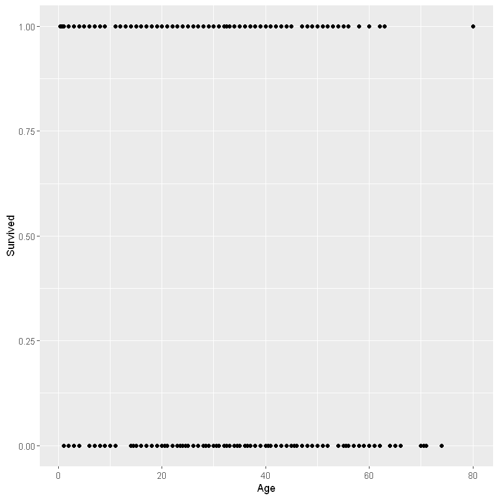
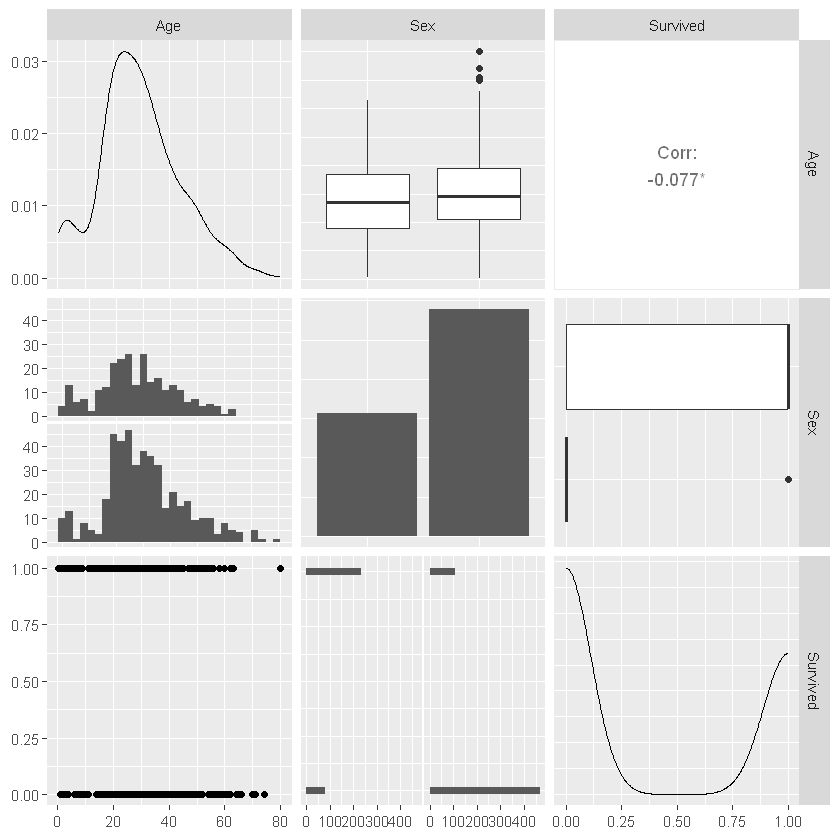
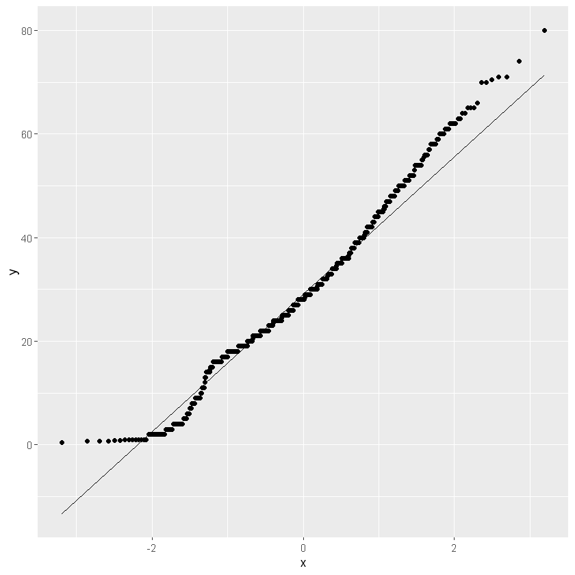

# Working sheet
## 04 - Multiple logistic regression with R
V04.01.00 - 2024-02-24

## Load data
Change the path and the file name in the following box.


```R
library(readr)
df <- read_csv("data/titanic.csv",
                 show_col_types = FALSE)
df$Pclass <- as.factor(df$Pclass)
df$Sex <- as.factor(df$Sex)

```

Look at the structure and the head of the dataset.


```R
str(df)
```

    spc_tbl_ [891 × 12] (S3: spec_tbl_df/tbl_df/tbl/data.frame)
     $ PassengerId: num [1:891] 1 2 3 4 5 6 7 8 9 10 ...
     $ Survived   : num [1:891] 0 1 1 1 0 0 0 0 1 1 ...
     $ Pclass     : Factor w/ 3 levels "1","2","3": 3 1 3 1 3 3 1 3 3 2 ...
     $ Name       : chr [1:891] "Braund, Mr. Owen Harris" "Cumings, Mrs. John Bradley (Florence Briggs Thayer)" "Heikkinen, Miss. Laina" "Futrelle, Mrs. Jacques Heath (Lily May Peel)" ...
     $ Sex        : Factor w/ 2 levels "female","male": 2 1 1 1 2 2 2 2 1 1 ...
     $ Age        : num [1:891] 22 38 26 35 35 NA 54 2 27 14 ...
     $ SibSp      : num [1:891] 1 1 0 1 0 0 0 3 0 1 ...
     $ Parch      : num [1:891] 0 0 0 0 0 0 0 1 2 0 ...
     $ Ticket     : chr [1:891] "A/5 21171" "PC 17599" "STON/O2. 3101282" "113803" ...
     $ Fare       : num [1:891] 7.25 71.28 7.92 53.1 8.05 ...
     $ Cabin      : chr [1:891] NA "C85" NA "C123" ...
     $ Embarked   : chr [1:891] "S" "C" "S" "S" ...
     - attr(*, "spec")=
      .. cols(
      ..   PassengerId = col_double(),
      ..   Survived = col_double(),
      ..   Pclass = col_double(),
      ..   Name = col_character(),
      ..   Sex = col_character(),
      ..   Age = col_double(),
      ..   SibSp = col_double(),
      ..   Parch = col_double(),
      ..   Ticket = col_character(),
      ..   Fare = col_double(),
      ..   Cabin = col_character(),
      ..   Embarked = col_character()
      .. )
     - attr(*, "problems")=<externalptr> 
    


```R
head(df)
```


<table class="dataframe">
<caption>A tibble: 6 × 12</caption>
<thead>
	<tr><th scope=col>PassengerId</th><th scope=col>Survived</th><th scope=col>Pclass</th><th scope=col>Name</th><th scope=col>Sex</th><th scope=col>Age</th><th scope=col>SibSp</th><th scope=col>Parch</th><th scope=col>Ticket</th><th scope=col>Fare</th><th scope=col>Cabin</th><th scope=col>Embarked</th></tr>
	<tr><th scope=col>&lt;dbl&gt;</th><th scope=col>&lt;dbl&gt;</th><th scope=col>&lt;fct&gt;</th><th scope=col>&lt;chr&gt;</th><th scope=col>&lt;fct&gt;</th><th scope=col>&lt;dbl&gt;</th><th scope=col>&lt;dbl&gt;</th><th scope=col>&lt;dbl&gt;</th><th scope=col>&lt;chr&gt;</th><th scope=col>&lt;dbl&gt;</th><th scope=col>&lt;chr&gt;</th><th scope=col>&lt;chr&gt;</th></tr>
</thead>
<tbody>
	<tr><td>1</td><td>0</td><td>3</td><td>Braund, Mr. Owen Harris                            </td><td>male  </td><td>22</td><td>1</td><td>0</td><td>A/5 21171       </td><td> 7.2500</td><td>NA  </td><td>S</td></tr>
	<tr><td>2</td><td>1</td><td>1</td><td>Cumings, Mrs. John Bradley (Florence Briggs Thayer)</td><td>female</td><td>38</td><td>1</td><td>0</td><td>PC 17599        </td><td>71.2833</td><td>C85 </td><td>C</td></tr>
	<tr><td>3</td><td>1</td><td>3</td><td>Heikkinen, Miss. Laina                             </td><td>female</td><td>26</td><td>0</td><td>0</td><td>STON/O2. 3101282</td><td> 7.9250</td><td>NA  </td><td>S</td></tr>
	<tr><td>4</td><td>1</td><td>1</td><td>Futrelle, Mrs. Jacques Heath (Lily May Peel)       </td><td>female</td><td>35</td><td>1</td><td>0</td><td>113803          </td><td>53.1000</td><td>C123</td><td>S</td></tr>
	<tr><td>5</td><td>0</td><td>3</td><td>Allen, Mr. William Henry                           </td><td>male  </td><td>35</td><td>0</td><td>0</td><td>373450          </td><td> 8.0500</td><td>NA  </td><td>S</td></tr>
	<tr><td>6</td><td>0</td><td>3</td><td>Moran, Mr. James                                   </td><td>male  </td><td>NA</td><td>0</td><td>0</td><td>330877          </td><td> 8.4583</td><td>NA  </td><td>Q</td></tr>
</tbody>
</table>


Look at frequencies and descriptive statistics.

The summary() function is the first approach.

describe() from the Hmisc package is an alternative.


```R
summary(df)
```


      PassengerId       Survived      Pclass      Name               Sex     
     Min.   :  1.0   Min.   :0.0000   1:216   Length:891         female:314  
     1st Qu.:223.5   1st Qu.:0.0000   2:184   Class :character   male  :577  
     Median :446.0   Median :0.0000   3:491   Mode  :character               
     Mean   :446.0   Mean   :0.3838                                          
     3rd Qu.:668.5   3rd Qu.:1.0000                                          
     Max.   :891.0   Max.   :1.0000                                          
                                                                             
          Age            SibSp           Parch           Ticket         
     Min.   : 0.42   Min.   :0.000   Min.   :0.0000   Length:891        
     1st Qu.:20.12   1st Qu.:0.000   1st Qu.:0.0000   Class :character  
     Median :28.00   Median :0.000   Median :0.0000   Mode  :character  
     Mean   :29.70   Mean   :0.523   Mean   :0.3816                     
     3rd Qu.:38.00   3rd Qu.:1.000   3rd Qu.:0.0000                     
     Max.   :80.00   Max.   :8.000   Max.   :6.0000                     
     NA's   :177                                                        
          Fare           Cabin             Embarked        
     Min.   :  0.00   Length:891         Length:891        
     1st Qu.:  7.91   Class :character   Class :character  
     Median : 14.45   Mode  :character   Mode  :character  
     Mean   : 32.20                                        
     3rd Qu.: 31.00                                        
     Max.   :512.33                                        
                                                           


```R
library(Hmisc)
describe(df)
```

    
    Attache Paket: 'Hmisc'
    
    
    Die folgenden Objekte sind maskiert von 'package:base':
    
        format.pval, units
    
    
    


    df 
    
     12  Variables      891  Observations
    --------------------------------------------------------------------------------
    PassengerId 
           n  missing distinct     Info     Mean      Gmd      .05      .10 
         891        0      891        1      446    297.3     45.5     90.0 
         .25      .50      .75      .90      .95 
       223.5    446.0    668.5    802.0    846.5 
    
    lowest :   1   2   3   4   5, highest: 887 888 889 890 891
    --------------------------------------------------------------------------------
    Survived 
           n  missing distinct     Info      Sum     Mean      Gmd 
         891        0        2     0.71      342   0.3838   0.4735 
    
    --------------------------------------------------------------------------------
    Pclass 
           n  missing distinct 
         891        0        3 
                                
    Value          1     2     3
    Frequency    216   184   491
    Proportion 0.242 0.207 0.551
    --------------------------------------------------------------------------------
    Name 
           n  missing distinct 
         891        0      891 
    
    lowest : Abbing, Mr. Anthony                    Abbott, Mr. Rossmore Edward            Abbott, Mrs. Stanton (Rosa Hunt)       Abelson, Mr. Samuel                    Abelson, Mrs. Samuel (Hannah Wizosky) 
    highest: Yousseff, Mr. Gerious                  Yrois, Miss. Henriette ("Mrs Harbeck") Zabour, Miss. Hileni                   Zabour, Miss. Thamine                  Zimmerman, Mr. Leo                    
    --------------------------------------------------------------------------------
    Sex 
           n  missing distinct 
         891        0        2 
                            
    Value      female   male
    Frequency     314    577
    Proportion  0.352  0.648
    --------------------------------------------------------------------------------
    Age 
           n  missing distinct     Info     Mean      Gmd      .05      .10 
         714      177       88    0.999     29.7    16.21     4.00    14.00 
         .25      .50      .75      .90      .95 
       20.12    28.00    38.00    50.00    56.00 
    
    lowest : 0.42 0.67 0.75 0.83 0.92, highest: 70   70.5 71   74   80  
    --------------------------------------------------------------------------------
    SibSp 
           n  missing distinct     Info     Mean      Gmd 
         891        0        7    0.669    0.523    0.823 
                                                        
    Value       0.00  0.96  2.00  2.96  4.00  4.96  8.00
    Frequency    608   209    28    16    18     5     7
    Proportion 0.682 0.235 0.031 0.018 0.020 0.006 0.008
    
    For the frequency table, variable is rounded to the nearest 0.08
    --------------------------------------------------------------------------------
    Parch 
           n  missing distinct     Info     Mean      Gmd 
         891        0        7    0.556   0.3816   0.6259 
                                                        
    Value       0.00  0.96  1.98  3.00  3.96  4.98  6.00
    Frequency    678   118    80     5     4     5     1
    Proportion 0.761 0.132 0.090 0.006 0.004 0.006 0.001
    
    For the frequency table, variable is rounded to the nearest 0.06
    --------------------------------------------------------------------------------
    Ticket 
           n  missing distinct 
         891        0      681 
    
    lowest : 110152      110413      110465      110564      110813     
    highest: W./C. 6608  W./C. 6609  W.E.P. 5734 W/C 14208   WE/P 5735  
    --------------------------------------------------------------------------------
    Fare 
           n  missing distinct     Info     Mean      Gmd      .05      .10 
         891        0      248        1     32.2    36.78    7.225    7.550 
         .25      .50      .75      .90      .95 
       7.910   14.454   31.000   77.958  112.079 
    
    lowest : 0       4.0125  5       6.2375  6.4375 
    highest: 227.525 247.521 262.375 263     512.329
    --------------------------------------------------------------------------------
    Cabin 
           n  missing distinct 
         204      687      147 
    
    lowest : A10 A14 A16 A19 A20, highest: F33 F38 F4  G6  T  
    --------------------------------------------------------------------------------
    Embarked 
           n  missing distinct 
         889        2        3 
                                
    Value          C     Q     S
    Frequency    168    77   644
    Proportion 0.189 0.087 0.724
    --------------------------------------------------------------------------------


Plot the variables of interest with a scatter plot.

Either as single plots as in the following plot.


```R
library(ggplot2)
ggplot(df, aes(x = Age, y = Survived)) +
  geom_point()
```

    Warning message:
    "Removed 177 rows containing missing values (`geom_point()`)."
    


    

    


```R
library(GGally)
library(tidyverse)
ggpairs(df %>% select(Age, Sex, Survived))
```

    Warning message:
    "Removed 177 rows containing non-finite values (`stat_density()`)."
    Warning message:
    "Removed 177 rows containing non-finite values (`stat_boxplot()`)."
    Warning message in ggally_statistic(data = data, mapping = mapping, na.rm = na.rm, :
    "Removed 177 rows containing missing values"
    `stat_bin()` using `bins = 30`. Pick better value with `binwidth`.
    Warning message:
    "Removed 177 rows containing non-finite values (`stat_bin()`)."
    Warning message:
    "Removed 177 rows containing missing values (`geom_point()`)."
    `stat_bin()` using `bins = 30`. Pick better value with `binwidth`.
    


    

    


```R
ggplot(df, aes(sample = Age)) + 
  geom_qq() +
  geom_qq_line()
```

    Warning message:
    "Removed 177 rows containing non-finite values (`stat_qq()`)."
    Warning message:
    "Removed 177 rows containing non-finite values (`stat_qq_line()`)."
    


    

    


## Assumptions for logistic regression

- The dependent variable is nominally scaled with exactly two values (dichotomous).
- The independent variable is either nominally scaled or at least interval scaled.
- Independence of observations.
- We need at least a certain number of cases per predictor. As with many other regressions, binomial logistic regression results improve as the sample size increases.
- There should be no outliers in the data.
- Linearity. There must be a linear relationship between the continuous independent variables and the logit transformation of the dependent variable.
- No multicolinearity.


The dependent variable is nominally scaled with exactly two values (dichotomous).


```R
table(df$Survived)
```


    
      0   1 
    549 342 


```R
library(broom) 
my_logistic <- glm(Survived ~ Sex + Pclass + Age, data = df, family = binomial)

summary(my_logistic)

```


    
    Call:
    glm(formula = Survived ~ Sex + Pclass + Age, family = binomial, 
        data = df)
    
    Coefficients:
                 Estimate Std. Error z value Pr(>|z|)    
    (Intercept)  3.777013   0.401123   9.416  < 2e-16 ***
    Sexmale     -2.522781   0.207391 -12.164  < 2e-16 ***
    Pclass2     -1.309799   0.278066  -4.710 2.47e-06 ***
    Pclass3     -2.580625   0.281442  -9.169  < 2e-16 ***
    Age         -0.036985   0.007656  -4.831 1.36e-06 ***
    ---
    Signif. codes:  0 '***' 0.001 '**' 0.01 '*' 0.05 '.' 0.1 ' ' 1
    
    (Dispersion parameter for binomial family taken to be 1)
    
        Null deviance: 964.52  on 713  degrees of freedom
    Residual deviance: 647.28  on 709  degrees of freedom
      (177 Beobachtungen als fehlend gelöscht)
    AIC: 657.28
    
    Number of Fisher Scoring iterations: 5
    


```R
glance(my_logistic)
```


<table class="dataframe">
<caption>A tibble: 1 × 8</caption>
<thead>
	<tr><th scope=col>null.deviance</th><th scope=col>df.null</th><th scope=col>logLik</th><th scope=col>AIC</th><th scope=col>BIC</th><th scope=col>deviance</th><th scope=col>df.residual</th><th scope=col>nobs</th></tr>
	<tr><th scope=col>&lt;dbl&gt;</th><th scope=col>&lt;int&gt;</th><th scope=col>&lt;dbl&gt;</th><th scope=col>&lt;dbl&gt;</th><th scope=col>&lt;dbl&gt;</th><th scope=col>&lt;dbl&gt;</th><th scope=col>&lt;int&gt;</th><th scope=col>&lt;int&gt;</th></tr>
</thead>
<tbody>
	<tr><td>498.0978</td><td>391</td><td>-193.333</td><td>390.666</td><td>398.6085</td><td>386.666</td><td>390</td><td>392</td></tr>
</tbody>
</table>


```R
my_logistic_intercept <- glm(Survived ~ 1, data = df, family = binomial)
glance(my_logistic_intercept)
```


<table class="dataframe">
<caption>A tibble: 1 × 8</caption>
<thead>
	<tr><th scope=col>null.deviance</th><th scope=col>df.null</th><th scope=col>logLik</th><th scope=col>AIC</th><th scope=col>BIC</th><th scope=col>deviance</th><th scope=col>df.residual</th><th scope=col>nobs</th></tr>
	<tr><th scope=col>&lt;dbl&gt;</th><th scope=col>&lt;int&gt;</th><th scope=col>&lt;dbl&gt;</th><th scope=col>&lt;dbl&gt;</th><th scope=col>&lt;dbl&gt;</th><th scope=col>&lt;dbl&gt;</th><th scope=col>&lt;int&gt;</th><th scope=col>&lt;int&gt;</th></tr>
</thead>
<tbody>
	<tr><td>1186.655</td><td>890</td><td>-593.3276</td><td>1188.655</td><td>1193.447</td><td>1186.655</td><td>890</td><td>891</td></tr>
</tbody>
</table>


```R
# z-test
# Wald’s chi-squared statistic for the hypothesis that the coefficient of age
# is zero, or equivalently that the odds-ratio is one
m0 <- glm(Survived ~ 1, data = df, family = binomial)
m1 <- glm(Survived ~ Age, data = df, family = binomial)

b <- coef(m1)
se <- sqrt(diag(vcov(m1)))
(b[2]/se[2])^2

# likeli ratio test
#-2*(logLik(m0) - logLik(m1))
-2*(logLik(m0) - logLik(m1))

```


<strong>Age:</strong> 4.23106809150687


    'log Lik.' 226.4267 (df=1)


```R
tidy(my_logistic)
```


<table class="dataframe">
<caption>A tibble: 5 × 5</caption>
<thead>
	<tr><th scope=col>term</th><th scope=col>estimate</th><th scope=col>std.error</th><th scope=col>statistic</th><th scope=col>p.value</th></tr>
	<tr><th scope=col>&lt;chr&gt;</th><th scope=col>&lt;dbl&gt;</th><th scope=col>&lt;dbl&gt;</th><th scope=col>&lt;dbl&gt;</th><th scope=col>&lt;dbl&gt;</th></tr>
</thead>
<tbody>
	<tr><td>(Intercept)</td><td> 3.77701265</td><td>0.401123305</td><td>  9.416089</td><td>4.682044e-21</td></tr>
	<tr><td>Sexmale    </td><td>-2.52278092</td><td>0.207390924</td><td>-12.164375</td><td>4.811152e-34</td></tr>
	<tr><td>Pclass2    </td><td>-1.30979927</td><td>0.278065527</td><td> -4.710398</td><td>2.472337e-06</td></tr>
	<tr><td>Pclass3    </td><td>-2.58062532</td><td>0.281442020</td><td> -9.169296</td><td>4.761161e-20</td></tr>
	<tr><td>Age        </td><td>-0.03698527</td><td>0.007655948</td><td> -4.830919</td><td>1.359041e-06</td></tr>
</tbody>
</table>


```R
summary(my_logistic)
```


    
    Call:
    glm(formula = Survived ~ Sex + Pclass + Age, family = binomial, 
        data = df)
    
    Coefficients:
                 Estimate Std. Error z value Pr(>|z|)    
    (Intercept)  3.777013   0.401123   9.416  < 2e-16 ***
    Sexmale     -2.522781   0.207391 -12.164  < 2e-16 ***
    Pclass2     -1.309799   0.278066  -4.710 2.47e-06 ***
    Pclass3     -2.580625   0.281442  -9.169  < 2e-16 ***
    Age         -0.036985   0.007656  -4.831 1.36e-06 ***
    ---
    Signif. codes:  0 '***' 0.001 '**' 0.01 '*' 0.05 '.' 0.1 ' ' 1
    
    (Dispersion parameter for binomial family taken to be 1)
    
        Null deviance: 964.52  on 713  degrees of freedom
    Residual deviance: 647.28  on 709  degrees of freedom
      (177 Beobachtungen als fehlend gelöscht)
    AIC: 657.28
    
    Number of Fisher Scoring iterations: 5
    


```R
exp(my_logistic$coeff)
suppressMessages(exp(confint(my_logistic)))
```


<style>
.dl-inline {width: auto; margin:0; padding: 0}
.dl-inline>dt, .dl-inline>dd {float: none; width: auto; display: inline-block}
.dl-inline>dt::after {content: ":\0020"; padding-right: .5ex}
.dl-inline>dt:not(:first-of-type) {padding-left: .5ex}
</style><dl class=dl-inline><dt>(Intercept)</dt><dd>43.685343313411</dd><dt>Sexmale</dt><dd>0.0802361658591633</dd><dt>Pclass2</dt><dd>0.269874223397568</dd><dt>Pclass3</dt><dd>0.0757266360242514</dd><dt>Age</dt><dd>0.963690334666985</dd></dl>


<table class="dataframe">
<caption>A matrix: 5 × 2 of type dbl</caption>
<thead>
	<tr><th></th><th scope=col>2.5 %</th><th scope=col>97.5 %</th></tr>
</thead>
<tbody>
	<tr><th scope=row>(Intercept)</th><td>20.37890724</td><td>98.3863313</td></tr>
	<tr><th scope=row>Sexmale</th><td> 0.05293643</td><td> 0.1194848</td></tr>
	<tr><th scope=row>Pclass2</th><td> 0.15515074</td><td> 0.4621731</td></tr>
	<tr><th scope=row>Pclass3</th><td> 0.04299250</td><td> 0.1297997</td></tr>
	<tr><th scope=row>Age</th><td> 0.94905346</td><td> 0.9780124</td></tr>
</tbody>
</table>


```R
library(survival)
concordance(my_logistic)
```


    Call:
    concordance.lm(object = my_logistic)
    
    n= 714 
    Concordance= 0.8523 se= 0.01549
    concordant discordant     tied.x     tied.y    tied.xy 
        104647      18004        309     130627        954 


```R
library(yardstick)
obs <- as.integer(df %>% select(Survived, Age, Sex, Pclass) %>% na.omit() %>% pull(Survived))
pred <- as.integer(round(predict(my_logistic, type = "response")))
str(obs)
str(pred)
df1 <- table("Observed" = obs, "Predicted" = pred)
df1
```

     int [1:714] 0 1 1 1 0 0 0 1 1 1 ...
     int [1:714] 0 1 1 1 0 0 0 1 1 1 ...
    


            Predicted
    Observed   0   1
           0 356  68
           1  83 207


```R
cf <- conf_mat(df1, truth = obs, estimate = pred)
summary(cf)
```


<table class="dataframe">
<caption>A tibble: 13 × 3</caption>
<thead>
	<tr><th scope=col>.metric</th><th scope=col>.estimator</th><th scope=col>.estimate</th></tr>
	<tr><th scope=col>&lt;chr&gt;</th><th scope=col>&lt;chr&gt;</th><th scope=col>&lt;dbl&gt;</th></tr>
</thead>
<tbody>
	<tr><td>accuracy            </td><td>binary</td><td>0.7885154</td></tr>
	<tr><td>kap                 </td><td>binary</td><td>0.5579763</td></tr>
	<tr><td>sens                </td><td>binary</td><td>0.8109339</td></tr>
	<tr><td>spec                </td><td>binary</td><td>0.7527273</td></tr>
	<tr><td>ppv                 </td><td>binary</td><td>0.8396226</td></tr>
	<tr><td>npv                 </td><td>binary</td><td>0.7137931</td></tr>
	<tr><td>mcc                 </td><td>binary</td><td>0.5585150</td></tr>
	<tr><td>j_index             </td><td>binary</td><td>0.5636612</td></tr>
	<tr><td>bal_accuracy        </td><td>binary</td><td>0.7818306</td></tr>
	<tr><td>detection_prevalence</td><td>binary</td><td>0.5938375</td></tr>
	<tr><td>precision           </td><td>binary</td><td>0.8396226</td></tr>
	<tr><td>recall              </td><td>binary</td><td>0.8109339</td></tr>
	<tr><td>f_meas              </td><td>binary</td><td>0.8250290</td></tr>
</tbody>
</table>


```R

```
