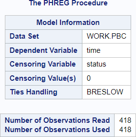
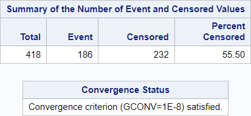
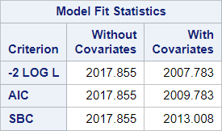
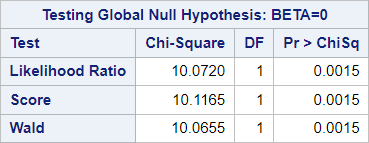
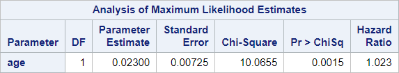

# 05 - Simple Cox regression - Continous variable

## Data

Source of data:  Mayo Clinic trial in PBC conducted between 1974 and 1984

Data set pbc.csv


```R
library(readr)
pbc <- read_csv("data/pbc.csv",
                 show_col_types = FALSE)
head(pbc)

```


<table class="dataframe">
<caption>A tibble: 6 × 20</caption>
<thead>
	<tr><th scope=col>id</th><th scope=col>time</th><th scope=col>status</th><th scope=col>trt</th><th scope=col>age</th><th scope=col>sex</th><th scope=col>ascites</th><th scope=col>hepato</th><th scope=col>spiders</th><th scope=col>edema</th><th scope=col>bili</th><th scope=col>chol</th><th scope=col>albumin</th><th scope=col>copper</th><th scope=col>alk.phos</th><th scope=col>ast</th><th scope=col>trig</th><th scope=col>platelet</th><th scope=col>protime</th><th scope=col>stage</th></tr>
	<tr><th scope=col>&lt;dbl&gt;</th><th scope=col>&lt;dbl&gt;</th><th scope=col>&lt;dbl&gt;</th><th scope=col>&lt;chr&gt;</th><th scope=col>&lt;dbl&gt;</th><th scope=col>&lt;chr&gt;</th><th scope=col>&lt;chr&gt;</th><th scope=col>&lt;chr&gt;</th><th scope=col>&lt;chr&gt;</th><th scope=col>&lt;dbl&gt;</th><th scope=col>&lt;dbl&gt;</th><th scope=col>&lt;chr&gt;</th><th scope=col>&lt;dbl&gt;</th><th scope=col>&lt;chr&gt;</th><th scope=col>&lt;chr&gt;</th><th scope=col>&lt;chr&gt;</th><th scope=col>&lt;chr&gt;</th><th scope=col>&lt;chr&gt;</th><th scope=col>&lt;chr&gt;</th><th scope=col>&lt;chr&gt;</th></tr>
</thead>
<tbody>
	<tr><td>1</td><td> 400</td><td>2</td><td>1</td><td>58.76523</td><td>f</td><td>1</td><td>1</td><td>1</td><td>1.0</td><td>14.5</td><td>261</td><td>2.60</td><td>156</td><td>1718  </td><td>137.95</td><td>172</td><td>190</td><td>12.2</td><td>4</td></tr>
	<tr><td>2</td><td>4500</td><td>0</td><td>1</td><td>56.44627</td><td>f</td><td>0</td><td>1</td><td>1</td><td>0.0</td><td> 1.1</td><td>302</td><td>4.14</td><td>54 </td><td>7394.8</td><td>113.52</td><td>88 </td><td>221</td><td>10.6</td><td>3</td></tr>
	<tr><td>3</td><td>1012</td><td>2</td><td>1</td><td>70.07255</td><td>m</td><td>0</td><td>0</td><td>0</td><td>0.5</td><td> 1.4</td><td>176</td><td>3.48</td><td>210</td><td>516   </td><td>96.1  </td><td>55 </td><td>151</td><td>12  </td><td>4</td></tr>
	<tr><td>4</td><td>1925</td><td>2</td><td>1</td><td>54.74059</td><td>f</td><td>0</td><td>1</td><td>1</td><td>0.5</td><td> 1.8</td><td>244</td><td>2.54</td><td>64 </td><td>6121.8</td><td>60.63 </td><td>92 </td><td>183</td><td>10.3</td><td>4</td></tr>
	<tr><td>5</td><td>1504</td><td>1</td><td>2</td><td>38.10541</td><td>f</td><td>0</td><td>1</td><td>1</td><td>0.0</td><td> 3.4</td><td>279</td><td>3.53</td><td>143</td><td>671   </td><td>113.15</td><td>72 </td><td>136</td><td>10.9</td><td>3</td></tr>
	<tr><td>6</td><td>2503</td><td>2</td><td>2</td><td>66.25873</td><td>f</td><td>0</td><td>1</td><td>0</td><td>0.0</td><td> 0.8</td><td>248</td><td>3.98</td><td>50 </td><td>944   </td><td>93    </td><td>63 </td><td>.  </td><td>11  </td><td>3</td></tr>
</tbody>
</table>


## SAS program snippet

The following SAS code will be executed.
proc phreg data = pbc;
  model time*status(0) = age;
run;

## Results

The output is divided into blocks to explain it and to reproduce it afterwards in the different languages.

### Block 1


Row 1 refers to the dataset which was used in this procedure.

Row 2 gives the response variable or dependent variable for the Cox regression.

Row 3 gives the censoring variable.

Row 4 gives the censoring values.

Row 5 informs about the handling of ties. The default methods of the different statistical programs might differ.

The number of observations used might be less than the number of observations read.
SAS performs a listwise deletion (complete case analysis) if missing values are present.

### Block 2


This block presents the number of events and of censored values and the proportion of censored values.

The important information that the model converged can be found here.

### Block 3


The model fit status is described by 
-  AIC (Akaike Information Criterion): Smaller is better.
-  SBC (Schwarz Bayesian (Information) Criterion): Smaller is better.
-  -2 Log L (negative two times the log-likelihood)


### Block 4


These global tests test the null hypothesis that all regression coefficents are zero.

The tests are different chi-square tests.

### Block 5


Column 1 "Parameter" lists the parameter in the model.

Column 2 "DF" gives the degrees of freedom for every parameter.

Column 3 "Estimate" lists the regression estimates for every parameter given that the other parameter are held constant.

Column 4 "Standard Error" gives the standard errors of the individual regression coefficients.

Column 5 "Chi-Square" tests the null hypothesis that the regression coefficient is zero given that the other predictors are in the model.

Column 6 "Pr > ChiSq" gives the p-value for the Chi-Square statistic.

Column 7 "Hazard Ratio" is the exponentiated coefficient as hazard ratio


```R

```
