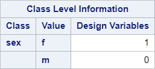
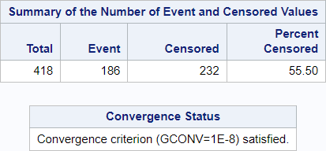
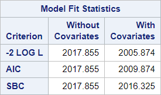
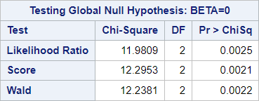
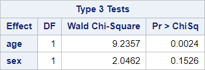
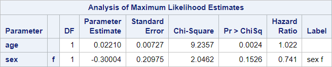

# 06 - Multiple Cox regression

## Data

Source of data:  Mayo Clinic trial in PBC conducted between 1974 and 1984

Data set pbc.csv


```R
library(readr)
pbc <- read_csv("../data/pbc.csv",
                 show_col_types = FALSE)
head(pbc)

```


<table class="dataframe">
<caption>A tibble: 6 × 20</caption>
<thead>
	<tr><th scope=col>id</th><th scope=col>time</th><th scope=col>status</th><th scope=col>trt</th><th scope=col>age</th><th scope=col>sex</th><th scope=col>ascites</th><th scope=col>hepato</th><th scope=col>spiders</th><th scope=col>edema</th><th scope=col>bili</th><th scope=col>chol</th><th scope=col>albumin</th><th scope=col>copper</th><th scope=col>alk.phos</th><th scope=col>ast</th><th scope=col>trig</th><th scope=col>platelet</th><th scope=col>protime</th><th scope=col>stage</th></tr>
	<tr><th scope=col>&lt;dbl&gt;</th><th scope=col>&lt;dbl&gt;</th><th scope=col>&lt;dbl&gt;</th><th scope=col>&lt;chr&gt;</th><th scope=col>&lt;dbl&gt;</th><th scope=col>&lt;chr&gt;</th><th scope=col>&lt;chr&gt;</th><th scope=col>&lt;chr&gt;</th><th scope=col>&lt;chr&gt;</th><th scope=col>&lt;dbl&gt;</th><th scope=col>&lt;dbl&gt;</th><th scope=col>&lt;chr&gt;</th><th scope=col>&lt;dbl&gt;</th><th scope=col>&lt;chr&gt;</th><th scope=col>&lt;chr&gt;</th><th scope=col>&lt;chr&gt;</th><th scope=col>&lt;chr&gt;</th><th scope=col>&lt;chr&gt;</th><th scope=col>&lt;chr&gt;</th><th scope=col>&lt;chr&gt;</th></tr>
</thead>
<tbody>
	<tr><td>1</td><td> 400</td><td>2</td><td>1</td><td>58.76523</td><td>f</td><td>1</td><td>1</td><td>1</td><td>1.0</td><td>14.5</td><td>261</td><td>2.60</td><td>156</td><td>1718  </td><td>137.95</td><td>172</td><td>190</td><td>12.2</td><td>4</td></tr>
	<tr><td>2</td><td>4500</td><td>0</td><td>1</td><td>56.44627</td><td>f</td><td>0</td><td>1</td><td>1</td><td>0.0</td><td> 1.1</td><td>302</td><td>4.14</td><td>54 </td><td>7394.8</td><td>113.52</td><td>88 </td><td>221</td><td>10.6</td><td>3</td></tr>
	<tr><td>3</td><td>1012</td><td>2</td><td>1</td><td>70.07255</td><td>m</td><td>0</td><td>0</td><td>0</td><td>0.5</td><td> 1.4</td><td>176</td><td>3.48</td><td>210</td><td>516   </td><td>96.1  </td><td>55 </td><td>151</td><td>12  </td><td>4</td></tr>
	<tr><td>4</td><td>1925</td><td>2</td><td>1</td><td>54.74059</td><td>f</td><td>0</td><td>1</td><td>1</td><td>0.5</td><td> 1.8</td><td>244</td><td>2.54</td><td>64 </td><td>6121.8</td><td>60.63 </td><td>92 </td><td>183</td><td>10.3</td><td>4</td></tr>
	<tr><td>5</td><td>1504</td><td>1</td><td>2</td><td>38.10541</td><td>f</td><td>0</td><td>1</td><td>1</td><td>0.0</td><td> 3.4</td><td>279</td><td>3.53</td><td>143</td><td>671   </td><td>113.15</td><td>72 </td><td>136</td><td>10.9</td><td>3</td></tr>
	<tr><td>6</td><td>2503</td><td>2</td><td>2</td><td>66.25873</td><td>f</td><td>0</td><td>1</td><td>0</td><td>0.0</td><td> 0.8</td><td>248</td><td>3.98</td><td>50 </td><td>944   </td><td>93    </td><td>63 </td><td>.  </td><td>11  </td><td>3</td></tr>
</tbody>
</table>


## SAS program snippet

The following SAS code will be executed.
proc phreg data = pbc;
  class sex;
  model time*status(0) = sex;
run;

## R chunk

Packages will be loaded in the chunk where they are first needed.

A similar R program might look like this. It uses the lm() function.

The tidy() function from the broom-packages formats the output into a tibble for easier processing.


```R
library(tidyverse)
library(broom)
library(survival)
pbc1 <- pbc %>% select(time, status, age, sex) %>% na.omit()
pbc1$status <- ifelse(pbc1$status == 0, 0, 1) # recode of status, all events equal 1, censored equal 0
my_cox <- coxph(formula = Surv(time, status) ~ age + sex, data = pbc1)
tidy(my_cox)
```


<table class="dataframe">
<caption>A tibble: 2 × 5</caption>
<thead>
	<tr><th scope=col>term</th><th scope=col>estimate</th><th scope=col>std.error</th><th scope=col>statistic</th><th scope=col>p.value</th></tr>
	<tr><th scope=col>&lt;chr&gt;</th><th scope=col>&lt;dbl&gt;</th><th scope=col>&lt;dbl&gt;</th><th scope=col>&lt;dbl&gt;</th><th scope=col>&lt;dbl&gt;</th></tr>
</thead>
<tbody>
	<tr><td>age </td><td>0.02209746</td><td>0.007271229</td><td>3.039027</td><td>0.002373437</td></tr>
	<tr><td>sexm</td><td>0.29995205</td><td>0.209753305</td><td>1.430023</td><td>0.152710421</td></tr>
</tbody>
</table>


## Results

The output is divided into blocks to explain it and to reproduce it afterwards in the different languages.

### Block 1


Row 1 refers to the dataset which was used in this procedure.

Row 2 gives the response variable or dependent variable for the Cox regression.

Row 3 gives the censoring variable.

Row 4 gives the censoring values.

Row 5 informs about the handling of ties. The default methods of the different statistical programs might differ.

The number of observations used might be less than the number of observations read.
SAS performs a listwise deletion (complete case analysis) if missing values are present.

### R chunk for reproduction


```R
nrow(pbc1)
nobs(my_cox) # Number of events
```


418


186


### Block 2


Coding of categorical is listed here.

This coding might differ from the coding in other statistic programming languages.

### R chunk for reproduction


```R
table(pbc1$sex)
contrasts(as.factor(pbc1$sex))
```


    
      f   m 
    374  44 


<table class="dataframe">
<caption>A matrix: 2 × 1 of type dbl</caption>
<thead>
	<tr><th></th><th scope=col>m</th></tr>
</thead>
<tbody>
	<tr><th scope=row>f</th><td>0</td></tr>
	<tr><th scope=row>m</th><td>1</td></tr>
</tbody>
</table>


See the difference between SAS and R.

The consequence is the other direction of the effect of the gender.

### Block 3


This block presents the number of events and of censored values and the proportion of censored values.

The important information that the model converged can be found here.

### R chunk for reproduction


```R
nrow(pbc)
table(pbc$status)
table(pbc1$status)
```


418


    
      0   1   2 
    232  25 161 


    
      0   1 
    232 186 


### Block 4


The model fit status is described by 
-  AIC (Akaike Information Criterion): Smaller is better.
-  SBC (Schwarz Bayesian (Information) Criterion): Smaller is better.
-  -2 Log L (negative two times the log-likelihood)


### R chunk for reproduction


```R
glance(my_cox)
```


<table class="dataframe">
<caption>A tibble: 1 × 18</caption>
<thead>
	<tr><th scope=col>n</th><th scope=col>nevent</th><th scope=col>statistic.log</th><th scope=col>p.value.log</th><th scope=col>statistic.sc</th><th scope=col>p.value.sc</th><th scope=col>statistic.wald</th><th scope=col>p.value.wald</th><th scope=col>statistic.robust</th><th scope=col>p.value.robust</th><th scope=col>r.squared</th><th scope=col>r.squared.max</th><th scope=col>concordance</th><th scope=col>std.error.concordance</th><th scope=col>logLik</th><th scope=col>AIC</th><th scope=col>BIC</th><th scope=col>nobs</th></tr>
	<tr><th scope=col>&lt;int&gt;</th><th scope=col>&lt;dbl&gt;</th><th scope=col>&lt;dbl&gt;</th><th scope=col>&lt;dbl&gt;</th><th scope=col>&lt;dbl&gt;</th><th scope=col>&lt;dbl&gt;</th><th scope=col>&lt;dbl&gt;</th><th scope=col>&lt;dbl&gt;</th><th scope=col>&lt;dbl&gt;</th><th scope=col>&lt;dbl&gt;</th><th scope=col>&lt;dbl&gt;</th><th scope=col>&lt;dbl&gt;</th><th scope=col>&lt;dbl&gt;</th><th scope=col>&lt;dbl&gt;</th><th scope=col>&lt;dbl&gt;</th><th scope=col>&lt;dbl&gt;</th><th scope=col>&lt;dbl&gt;</th><th scope=col>&lt;int&gt;</th></tr>
</thead>
<tbody>
	<tr><td>418</td><td>186</td><td>11.97965</td><td>0.002504107</td><td>12.29379</td><td>0.002140117</td><td>12.24</td><td>0.002202114</td><td>NA</td><td>NA</td><td>0.02825265</td><td>0.9919921</td><td>0.569148</td><td>0.02173493</td><td>-1002.922</td><td>2009.844</td><td>2016.295</td><td>418</td></tr>
</tbody>
</table>


### Block 5


These global tests test the null hypothesis that all regression coefficents are zero.

The tests are different chi-square tests.

### R chunk for reproduction

Todo: Reproduce global test Likelihood Ratio by hand

Score: see above statistic.sc

Wald: see above statistic.wald


```R
glance(my_cox)$statistic.sc

glance(my_cox)$statistic.wald
```


<strong>test:</strong> 12.2937892784102


<strong>test:</strong> 12.24


### Block 6


This block provides a global test for categorical variables and their influence.

The global chi-square value is equal to the level chi-square value in the next block if the categorical variable is binary.

### R chunk for reproduction


```R
tidy(my_cox)
```


<table class="dataframe">
<caption>A tibble: 2 × 5</caption>
<thead>
	<tr><th scope=col>term</th><th scope=col>estimate</th><th scope=col>std.error</th><th scope=col>statistic</th><th scope=col>p.value</th></tr>
	<tr><th scope=col>&lt;chr&gt;</th><th scope=col>&lt;dbl&gt;</th><th scope=col>&lt;dbl&gt;</th><th scope=col>&lt;dbl&gt;</th><th scope=col>&lt;dbl&gt;</th></tr>
</thead>
<tbody>
	<tr><td>age </td><td>0.02209746</td><td>0.007271229</td><td>3.039027</td><td>0.002373437</td></tr>
	<tr><td>sexm</td><td>0.29995205</td><td>0.209753305</td><td>1.430023</td><td>0.152710421</td></tr>
</tbody>
</table>


### Block 7


Column 1 "Parameter" lists the parameter in the model.

Column 2 "" gives the level of the Parameter.

Column 3 "DF" gives the degrees of freedom for every parameter.

Column 4 "Estimate" lists the regression estimates for every parameter given that the other parameter are held constant.

Column 5 "Standard Error" gives the standard errors of the individual regression coefficients.

Column 6 "Chi-Square" tests the null hypothesis that the regression coefficient is zero given that the other predictors are in the model.

Column 7 "Pr > ChiSq" gives the p-value for the Chi-Square statistic.

Column 8 "Hazard Ratio" is the exponentiated coefficient as hazard ratio


```R
summary(my_cox)
```


    Call:
    coxph(formula = Surv(time, status) ~ age + sex, data = pbc1)
    
      n= 418, number of events= 186 
    
             coef exp(coef) se(coef)     z Pr(>|z|)   
    age  0.022097  1.022343 0.007271 3.039  0.00237 **
    sexm 0.299952  1.349794 0.209753 1.430  0.15271   
    ---
    Signif. codes:  0 '***' 0.001 '**' 0.01 '*' 0.05 '.' 0.1 ' ' 1
    
         exp(coef) exp(-coef) lower .95 upper .95
    age      1.022     0.9781    1.0079     1.037
    sexm     1.350     0.7409    0.8948     2.036
    
    Concordance= 0.569  (se = 0.022 )
    Likelihood ratio test= 11.98  on 2 df,   p=0.003
    Wald test            = 12.24  on 2 df,   p=0.002
    Score (logrank) test = 12.29  on 2 df,   p=0.002
    


```R

```
