# 07 - MMRM Mixed model repeated measures 

## Data

Source of data: SAS Support

https://support.sas.com/documentation/cdl/en/statug/63347/HTML/default/viewer.htm#statug_mixed_sect034.htm

Dataset pr.csv


```R
library(readr)
df1 <- read_csv("data/PR.csv",
                 show_col_types = FALSE)
df1$Person_fct <- as.factor(df1$Person)
df1$Age_fct <- as.factor(df1$Age)
head(df1)

```


<table class="dataframe">
<caption>A tibble: 6 × 6</caption>
<thead>
	<tr><th scope=col>Person</th><th scope=col>Gender</th><th scope=col>y</th><th scope=col>Age</th><th scope=col>Person_fct</th><th scope=col>Age_fct</th></tr>
	<tr><th scope=col>&lt;dbl&gt;</th><th scope=col>&lt;chr&gt;</th><th scope=col>&lt;dbl&gt;</th><th scope=col>&lt;dbl&gt;</th><th scope=col>&lt;fct&gt;</th><th scope=col>&lt;fct&gt;</th></tr>
</thead>
<tbody>
	<tr><td>1</td><td>F</td><td>21.0</td><td> 8</td><td>1</td><td>8 </td></tr>
	<tr><td>1</td><td>F</td><td>20.0</td><td>10</td><td>1</td><td>10</td></tr>
	<tr><td>1</td><td>F</td><td>21.5</td><td>12</td><td>1</td><td>12</td></tr>
	<tr><td>1</td><td>F</td><td>23.0</td><td>14</td><td>1</td><td>14</td></tr>
	<tr><td>2</td><td>F</td><td>21.0</td><td> 8</td><td>2</td><td>8 </td></tr>
	<tr><td>2</td><td>F</td><td>21.5</td><td>10</td><td>2</td><td>10</td></tr>
</tbody>
</table>


## SAS program snippet

The following SAS code will be executed.
proc mixed data=pr method=ml covtest;
   class Person Gender;
   model y = Gender Age Gender*Age / s;
   repeated / type=un subject=Person r;
run;

## Results

The output is divided into blocks to explain it and to reproduce it afterwards in the different languages.

### Block 1
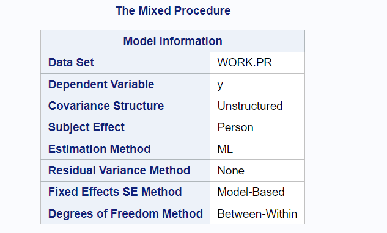

This block gives information about the model.

### R chunk for reproduction


```R
library(mmrm)
my_mmrm <- mmrm(
  formula = y ~ Gender + Age_fct + Gender * Age_fct + us(Age_fct | Person_fct),
  data = df1
)
summary(my_mmrm)
```


    mmrm fit
    
    Formula:     y ~ Gender + Age_fct + Gender * Age_fct + us(Age_fct | Person_fct)
    Data:        df1 (used 108 observations from 27 subjects with maximum 4 
    timepoints)
    Covariance:  unstructured (10 variance parameters)
    Method:      Satterthwaite
    Inference:   REML
    
    Model selection criteria:
         AIC      BIC   logLik deviance 
         434      447     -207      414 
    
    Coefficients: 
                      Estimate Std. Error      df t value Pr(>|t|)    
    (Intercept)        21.1818     0.7017 24.9990  30.188  < 2e-16 ***
    GenderM             1.6932     0.9115 24.9990   1.858 0.075040 .  
    Age_fct10           1.0455     0.6155 25.0000   1.699 0.101793    
    Age_fct12           1.9091     0.6068 25.0000   3.146 0.004241 ** 
    Age_fct14           2.9091     0.6729 25.0010   4.323 0.000215 ***
    GenderM:Age_fct10  -0.1080     0.7995 25.0000  -0.135 0.893671    
    GenderM:Age_fct12   0.9347     0.7883 25.0000   1.186 0.246906    
    GenderM:Age_fct14   1.6847     0.8741 25.0010   1.927 0.065377 .  
    ---
    Signif. codes:  0 '***' 0.001 '**' 0.01 '*' 0.05 '.' 0.1 ' ' 1
    
    Covariance estimate:
            8     10     12     14
    8  5.4155 2.7170 3.9106 2.7104
    10 2.7170 4.1850 2.9274 3.3173
    12 3.9106 2.9274 6.4564 4.1312
    14 2.7104 3.3173 4.1312 4.9858
    


```R
library(mmrm)
my_mmrm <- mmrm(
  formula = y ~ Gender + Age_fct + Gender * Age_fct + us(Age_fct | Person_fct),
  data = df1
)
summary(my_mmrm)
```


    mmrm fit
    
    Formula:     y ~ Gender + Age_fct + Gender * Age_fct + us(Age_fct | Person_fct)
    Data:        df1 (used 108 observations from 27 subjects with maximum 4 
    timepoints)
    Covariance:  unstructured (10 variance parameters)
    Method:      Satterthwaite
    Inference:   REML
    
    Model selection criteria:
         AIC      BIC   logLik deviance 
         434      447     -207      414 
    
    Coefficients: 
                      Estimate Std. Error      df t value Pr(>|t|)    
    (Intercept)        21.1818     0.7017 24.9990  30.188  < 2e-16 ***
    GenderM             1.6932     0.9115 24.9990   1.858 0.075040 .  
    Age_fct10           1.0455     0.6155 25.0000   1.699 0.101793    
    Age_fct12           1.9091     0.6068 25.0000   3.146 0.004241 ** 
    Age_fct14           2.9091     0.6729 25.0010   4.323 0.000215 ***
    GenderM:Age_fct10  -0.1080     0.7995 25.0000  -0.135 0.893671    
    GenderM:Age_fct12   0.9347     0.7883 25.0000   1.186 0.246906    
    GenderM:Age_fct14   1.6847     0.8741 25.0010   1.927 0.065377 .  
    ---
    Signif. codes:  0 '***' 0.001 '**' 0.01 '*' 0.05 '.' 0.1 ' ' 1
    
    Covariance estimate:
            8     10     12     14
    8  5.4155 2.7170 3.9106 2.7104
    10 2.7170 4.1850 2.9274 3.3173
    12 3.9106 2.9274 6.4564 4.1312
    14 2.7104 3.3173 4.1312 4.9858
    


# Todo: Complete the following cells

### Block 2
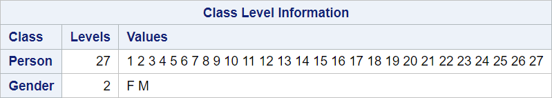

This block gives the level for the categorical variables.

### R chunk for reproduction


```R

```

### Block 3
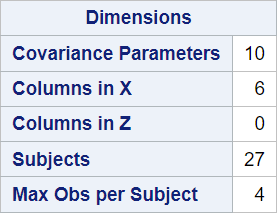

This block gives information about the number of subjects and the maximal number of observations per subject.

### R chunk for reproduction


```R

```

### Block 4
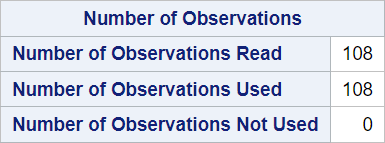

The number of observations used might be less than the number of observations read. SAS performs a listwise deletion (complete case analysis) if missing values are present.

### R chunk for reproduction


```R

```

### Block 5
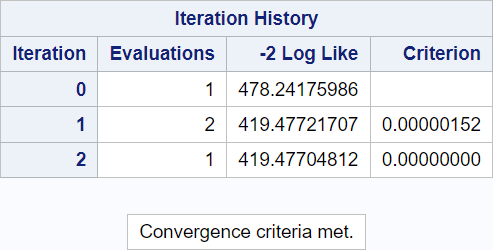

This block gives information about the iteration process.

### R chunk for reproduction


```R

```

### Block 6
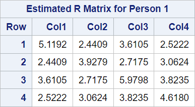

This block informs about the status of the iterative estimation process at the end of the Newton-Raphson optimization.

### R chunk for reproduction


```R

```

### Block 7
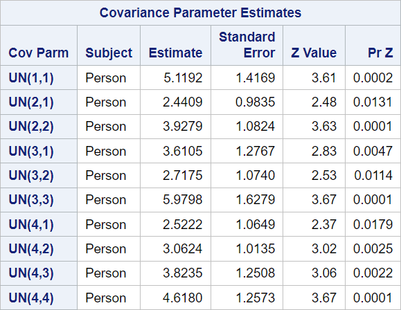

Details for this block can be found in the SAS Proc MIXED manuals in Mixed Models Theory.

### R chunk for reproduction


```R

```

### Block 8
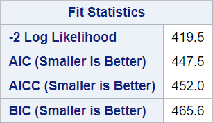

This block gives statistics about the estimated mixed models.

### R chunk for reproduction


```R

```

### Block 9
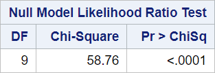

This block gives the likelihood ratio test for the null model.

### R chunk for reproduction


```R

```

### Block 10
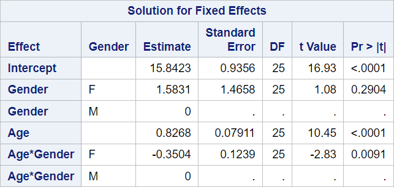

This block provides the estimates for the fixed effects of the model.

### R chunk for reproduction


```R

```

### Block 11
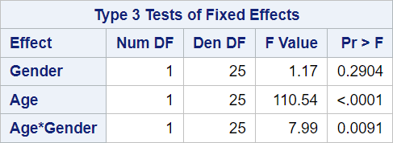

This block contains hypothesis tests for the significance of each of the fixed effects.

### R chunk for reproduction


```R

```
