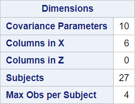
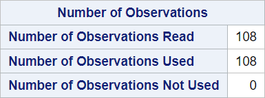
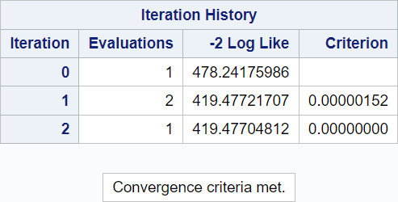
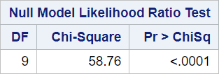
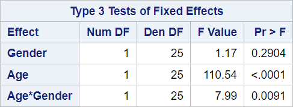

# 07 - MMRM Mixed model repeated measures 

## Data

Source of data: SAS Support

https://support.sas.com/documentation/cdl/en/statug/63347/HTML/default/viewer.htm#statug_mixed_sect034.htm

Dataset pr.csv


```R
library(readr)
pr <- read_csv("data/PR.csv",
                 show_col_types = FALSE)
head(pr)

```


<table class="dataframe">
<caption>A tibble: 6 × 4</caption>
<thead>
	<tr><th scope=col>Person</th><th scope=col>Gender</th><th scope=col>y</th><th scope=col>Age</th></tr>
	<tr><th scope=col>&lt;dbl&gt;</th><th scope=col>&lt;chr&gt;</th><th scope=col>&lt;dbl&gt;</th><th scope=col>&lt;dbl&gt;</th></tr>
</thead>
<tbody>
	<tr><td>1</td><td>F</td><td>21.0</td><td> 8</td></tr>
	<tr><td>1</td><td>F</td><td>20.0</td><td>10</td></tr>
	<tr><td>1</td><td>F</td><td>21.5</td><td>12</td></tr>
	<tr><td>1</td><td>F</td><td>23.0</td><td>14</td></tr>
	<tr><td>2</td><td>F</td><td>21.0</td><td> 8</td></tr>
	<tr><td>2</td><td>F</td><td>21.5</td><td>10</td></tr>
</tbody>
</table>


## SAS program snippet

The following SAS code will be executed.
proc mixed data=pr method=ml covtest;
   class Person Gender;
   model y = Gender Age Gender*Age / s;
   repeated / type=un subject=Person r;
run;

## Results

The output is divided into blocks to explain it and to reproduce it afterwards in the different languages.

### Block 1


This block gives information about the model.


```R

```

### Block 2


This block gives the level for the categorical variables.


```R

```

### Block 3


This block gives information about the number of subjects and the maximal number of observations per subject.


```R

```

### Block 4


The number of observations used might be less than the number of observations read. SAS performs a listwise deletion (complete case analysis) if missing values are present.


```R

```

### Block 5


This block gives information about the iteration process.


```R

```

### Block 6


This block informs about the status of the iterative estimation process at the end of the Newton-Raphson optimization.


```R

```

### Block 7


Details for this block can be found in the SAS Proc MIXED manuals in Mixed Models Theory.


```R

```

### Block 8


This block gives statistics about the estimated mixed models.


```R

```

### Block 9


This block gives the likelihood ratio test for the null model.


```R

```

### Block 10


This block provides the estimates for the fixed effects of the model.


```R

```

### Block 11


This block contains hypothesis tests for the significance of each of the fixed effects.


```R

```
