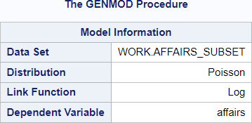
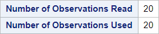

# 08 - Poisson regression

## Data

Source of data: R-Package "AER", data Affairs

Data was filtered with 20 rows remaining.

Dataset affairs_subsetxx.csv


```R
library(readr)
affairs_subset <- read_csv("data/affairs_subset.csv",
                 show_col_types = FALSE)
head(affairs_subset)

```


<table class="dataframe">
<caption>A tibble: 6 × 8</caption>
<thead>
	<tr><th scope=col>affairs</th><th scope=col>gender</th><th scope=col>age</th><th scope=col>yearsmarried</th><th scope=col>children</th><th scope=col>religiousness</th><th scope=col>education</th><th scope=col>rating</th></tr>
	<tr><th scope=col>&lt;dbl&gt;</th><th scope=col>&lt;chr&gt;</th><th scope=col>&lt;dbl&gt;</th><th scope=col>&lt;dbl&gt;</th><th scope=col>&lt;chr&gt;</th><th scope=col>&lt;dbl&gt;</th><th scope=col>&lt;dbl&gt;</th><th scope=col>&lt;dbl&gt;</th></tr>
</thead>
<tbody>
	<tr><td>12</td><td>female</td><td>42</td><td>15</td><td>yes</td><td>5</td><td> 9</td><td>1</td></tr>
	<tr><td> 0</td><td>female</td><td>32</td><td>15</td><td>yes</td><td>2</td><td>14</td><td>4</td></tr>
	<tr><td> 0</td><td>male  </td><td>32</td><td>10</td><td>yes</td><td>3</td><td>20</td><td>5</td></tr>
	<tr><td> 0</td><td>female</td><td>32</td><td>15</td><td>yes</td><td>4</td><td>18</td><td>4</td></tr>
	<tr><td>12</td><td>male  </td><td>37</td><td>15</td><td>yes</td><td>5</td><td>17</td><td>2</td></tr>
	<tr><td>12</td><td>female</td><td>42</td><td>15</td><td>yes</td><td>4</td><td>12</td><td>1</td></tr>
</tbody>
</table>


## SAS program snippet

The following SAS code will be executed.
proc genmod data = affairs_subset;
  class children(ref = 'no') gender(ref = 'female') / param=glm;
  model affairs=age education gender rating religiousness yearsmarried / type3 dist=poisson;
run;

## Results

The output is divided into blocks to explain it and to reproduce it afterwards in the different languages.

### Block 1


This block lists the dataset, the distribution, which PROC GENMOD used, the link function and the dependent variable.

### R chunk for reproduction


```R
library(broom)
my_glm <- glm(affairs ~ age + education + gender + rating + religiousness + yearsmarried,
                     family = 'poisson', data = affairs_subset)
glance(my_glm)
```


<table class="dataframe">
<caption>A tibble: 1 × 8</caption>
<thead>
	<tr><th scope=col>null.deviance</th><th scope=col>df.null</th><th scope=col>logLik</th><th scope=col>AIC</th><th scope=col>BIC</th><th scope=col>deviance</th><th scope=col>df.residual</th><th scope=col>nobs</th></tr>
	<tr><th scope=col>&lt;dbl&gt;</th><th scope=col>&lt;int&gt;</th><th scope=col>&lt;dbl&gt;</th><th scope=col>&lt;dbl&gt;</th><th scope=col>&lt;dbl&gt;</th><th scope=col>&lt;dbl&gt;</th><th scope=col>&lt;int&gt;</th><th scope=col>&lt;int&gt;</th></tr>
</thead>
<tbody>
	<tr><td>150.3413</td><td>19</td><td>-36.16375</td><td>86.3275</td><td>93.29762</td><td>41.23102</td><td>13</td><td>20</td></tr>
</tbody>
</table>


The number of used observations can be gained from the glance() function.

The distribution is part of the function call.

The number of observations in the dataset can be retrieved from the nrow() function.


```R
nrow(affairs_subset)

my_glm
```


20


    
    Call:  glm(formula = affairs ~ age + education + gender + rating + religiousness + 
        yearsmarried, family = "poisson", data = affairs_subset)
    
    Coefficients:
      (Intercept)            age      education     gendermale         rating  
         14.13138       -0.17494       -0.51178        2.97300       -0.81165  
    religiousness   yearsmarried  
         -0.07533        0.11765  
    
    Degrees of Freedom: 19 Total (i.e. Null);  13 Residual
    Null Deviance:	    150.3 
    Residual Deviance: 41.23 	AIC: 86.33


### Block 2


This block gives the number of observations in the dataset and the numbers of observations which were used to fit the model.

### R chunk for reproduction


```R
glance(my_glm)
nrow(affairs_subset)

```


<table class="dataframe">
<caption>A tibble: 1 × 8</caption>
<thead>
	<tr><th scope=col>null.deviance</th><th scope=col>df.null</th><th scope=col>logLik</th><th scope=col>AIC</th><th scope=col>BIC</th><th scope=col>deviance</th><th scope=col>df.residual</th><th scope=col>nobs</th></tr>
	<tr><th scope=col>&lt;dbl&gt;</th><th scope=col>&lt;int&gt;</th><th scope=col>&lt;dbl&gt;</th><th scope=col>&lt;dbl&gt;</th><th scope=col>&lt;dbl&gt;</th><th scope=col>&lt;dbl&gt;</th><th scope=col>&lt;int&gt;</th><th scope=col>&lt;int&gt;</th></tr>
</thead>
<tbody>
	<tr><td>150.3413</td><td>19</td><td>-36.16375</td><td>86.3275</td><td>93.29762</td><td>41.23102</td><td>13</td><td>20</td></tr>
</tbody>
</table>


20


The number of used observations can be gained from the glance() function.

The number of observations in the dataset can be retrieved from the nrow() function.

### Block 3


For the class variables the levels are given.

### R chunk for reproduction


```R
table(affairs_subset$children)

table(affairs_subset$gender)
```


    
     no yes 
      2  18 


    
    female   male 
        11      9 


```R

```


<table class="dataframe">
<caption>A tibble: 1 × 8</caption>
<thead>
	<tr><th scope=col>null.deviance</th><th scope=col>df.null</th><th scope=col>logLik</th><th scope=col>AIC</th><th scope=col>BIC</th><th scope=col>deviance</th><th scope=col>df.residual</th><th scope=col>nobs</th></tr>
	<tr><th scope=col>&lt;dbl&gt;</th><th scope=col>&lt;int&gt;</th><th scope=col>&lt;dbl&gt;</th><th scope=col>&lt;dbl&gt;</th><th scope=col>&lt;dbl&gt;</th><th scope=col>&lt;dbl&gt;</th><th scope=col>&lt;int&gt;</th><th scope=col>&lt;int&gt;</th></tr>
</thead>
<tbody>
	<tr><td>150.3413</td><td>19</td><td>-36.16375</td><td>86.3275</td><td>93.29762</td><td>41.23102</td><td>13</td><td>20</td></tr>
</tbody>
</table>


### Block 4


A lot of criteria for assessing the goodness of fit are given.


### R chunk for reproduction


```R
glance(my_glm)
```


<table class="dataframe">
<caption>A tibble: 1 × 8</caption>
<thead>
	<tr><th scope=col>null.deviance</th><th scope=col>df.null</th><th scope=col>logLik</th><th scope=col>AIC</th><th scope=col>BIC</th><th scope=col>deviance</th><th scope=col>df.residual</th><th scope=col>nobs</th></tr>
	<tr><th scope=col>&lt;dbl&gt;</th><th scope=col>&lt;int&gt;</th><th scope=col>&lt;dbl&gt;</th><th scope=col>&lt;dbl&gt;</th><th scope=col>&lt;dbl&gt;</th><th scope=col>&lt;dbl&gt;</th><th scope=col>&lt;int&gt;</th><th scope=col>&lt;int&gt;</th></tr>
</thead>
<tbody>
	<tr><td>150.3413</td><td>19</td><td>-36.16375</td><td>86.3275</td><td>93.29762</td><td>41.23102</td><td>13</td><td>20</td></tr>
</tbody>
</table>


Nearly all of the criteria can be provided by the glance() function.

Log Likelihood is calculated differently or has a different term (TODO)

Missing criteria

- Scaled daviance
- Pearson Chi-Square
- Scaled Pearson Chi-Square
- Full Log likelihood or log likelihood

### Block 5


This block provides parameter estimates with standard error, confidence interval, test statistic and probability.

### R chunk for reproduction


```R
my_model <- glm(affairs ~ age + education + gender + rating + religiousness + yearsmarried,
                     family = 'poisson', data = affairs_subset)
tidy(my_model)
```


<table class="dataframe">
<caption>A tibble: 7 × 5</caption>
<thead>
	<tr><th scope=col>term</th><th scope=col>estimate</th><th scope=col>std.error</th><th scope=col>statistic</th><th scope=col>p.value</th></tr>
	<tr><th scope=col>&lt;chr&gt;</th><th scope=col>&lt;dbl&gt;</th><th scope=col>&lt;dbl&gt;</th><th scope=col>&lt;dbl&gt;</th><th scope=col>&lt;dbl&gt;</th></tr>
</thead>
<tbody>
	<tr><td>(Intercept)  </td><td>14.13137756</td><td>2.28380578</td><td> 6.1876442</td><td>6.106998e-10</td></tr>
	<tr><td>age          </td><td>-0.17493751</td><td>0.05743164</td><td>-3.0460131</td><td>2.318977e-03</td></tr>
	<tr><td>education    </td><td>-0.51178177</td><td>0.12333162</td><td>-4.1496398</td><td>3.329989e-05</td></tr>
	<tr><td>gendermale   </td><td> 2.97300483</td><td>0.80465782</td><td> 3.6947442</td><td>2.201083e-04</td></tr>
	<tr><td>rating       </td><td>-0.81165480</td><td>0.17507142</td><td>-4.6361354</td><td>3.549835e-06</td></tr>
	<tr><td>religiousness</td><td>-0.07532957</td><td>0.17921813</td><td>-0.4203234</td><td>6.742493e-01</td></tr>
	<tr><td>yearsmarried </td><td> 0.11764964</td><td>0.08208607</td><td> 1.4332473</td><td>1.517872e-01</td></tr>
</tbody>
</table>


### Block 6


This block provides the likely ratio statistic for testing the significance of the effect. 

### R chunk for reproduction


```R

```


```R
my_model <- glm(affairs ~ age + education + gender + rating + religiousness + yearsmarried,
                     family = 'poisson', data = affairs_subset)
summary(my_model)

```


    
    Call:
    glm(formula = affairs ~ age + education + gender + rating + religiousness + 
        yearsmarried, family = "poisson", data = affairs_subset)
    
    Coefficients:
                  Estimate Std. Error z value Pr(>|z|)    
    (Intercept)   14.13138    2.28381   6.188 6.11e-10 ***
    age           -0.17494    0.05743  -3.046  0.00232 ** 
    education     -0.51178    0.12333  -4.150 3.33e-05 ***
    gendermale     2.97300    0.80466   3.695  0.00022 ***
    rating        -0.81165    0.17507  -4.636 3.55e-06 ***
    religiousness -0.07533    0.17922  -0.420  0.67425    
    yearsmarried   0.11765    0.08209   1.433  0.15179    
    ---
    Signif. codes:  0 '***' 0.001 '**' 0.01 '*' 0.05 '.' 0.1 ' ' 1
    
    (Dispersion parameter for poisson family taken to be 1)
    
        Null deviance: 150.341  on 19  degrees of freedom
    Residual deviance:  41.231  on 13  degrees of freedom
    AIC: 86.327
    
    Number of Fisher Scoring iterations: 6
    


```R

```
