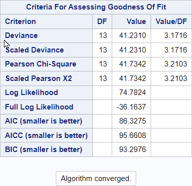

# 08 - Poisson regression

## Data

Source of data: R-Package "AER", data Affairs

Data was filtered with 20 rows remaining.

Dataset affairs_subsetxx.csv


```R
library(readr)
affairs_subset <- read_csv("data/affairs_subset.csv",
                 show_col_types = FALSE)
head(affairs_subset)

```


<table class="dataframe">
<caption>A tibble: 6 × 8</caption>
<thead>
	<tr><th scope=col>affairs</th><th scope=col>gender</th><th scope=col>age</th><th scope=col>yearsmarried</th><th scope=col>children</th><th scope=col>religiousness</th><th scope=col>education</th><th scope=col>rating</th></tr>
	<tr><th scope=col>&lt;dbl&gt;</th><th scope=col>&lt;chr&gt;</th><th scope=col>&lt;dbl&gt;</th><th scope=col>&lt;dbl&gt;</th><th scope=col>&lt;chr&gt;</th><th scope=col>&lt;dbl&gt;</th><th scope=col>&lt;dbl&gt;</th><th scope=col>&lt;dbl&gt;</th></tr>
</thead>
<tbody>
	<tr><td>12</td><td>female</td><td>42</td><td>15</td><td>yes</td><td>5</td><td> 9</td><td>1</td></tr>
	<tr><td> 0</td><td>female</td><td>32</td><td>15</td><td>yes</td><td>2</td><td>14</td><td>4</td></tr>
	<tr><td> 0</td><td>male  </td><td>32</td><td>10</td><td>yes</td><td>3</td><td>20</td><td>5</td></tr>
	<tr><td> 0</td><td>female</td><td>32</td><td>15</td><td>yes</td><td>4</td><td>18</td><td>4</td></tr>
	<tr><td>12</td><td>male  </td><td>37</td><td>15</td><td>yes</td><td>5</td><td>17</td><td>2</td></tr>
	<tr><td>12</td><td>female</td><td>42</td><td>15</td><td>yes</td><td>4</td><td>12</td><td>1</td></tr>
</tbody>
</table>


## SAS program snippet

The following SAS code will be executed.
proc genmod data = affairs_subset;
  class children(ref = 'no') gender(ref = 'female') / param=glm;
  model affairs=age education gender rating religiousness yearsmarried / type3 dist=poisson;
run;

## Results

The output is divided into blocks to explain it and to reproduce it afterwards in the different languages.

### Block 1


This block lists the dataset, the distribution, which PROC GENMOD used, the link function and the dependent variable.

### Block 2


This block gives the number of observations in the dataset and the numbers of observations which were used to fit the model.

### Block 3


For the class variables the levels are given.

### Block 4


A lot of criteria for assessing the goodness of fit are given.


### Block 5


This block provides parameter estimates with standard error, confidence interval, test statistic and probability.

### Block 6


This block provides the likely ratio statistic for testing the significance of the effect. 


```R

```
