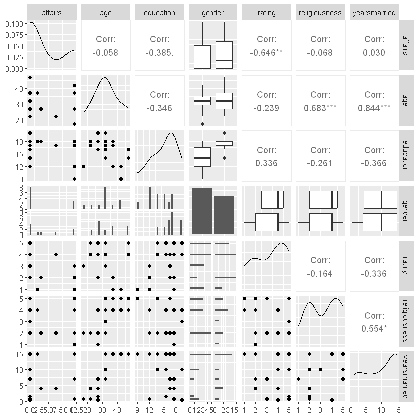

# Working sheet
## 08 - Poisson regression
V08.01.00 - 2024-02-26

## Load data
Change the path and the filename in the following box.


```R
library(readr)
df <- read_csv("data/affairs_subset.csv",
                 show_col_types = FALSE)

```

Look at the structure and the head of the dataset.


```R
str(df)
```

    spc_tbl_ [20 × 8] (S3: spec_tbl_df/tbl_df/tbl/data.frame)
     $ affairs      : num [1:20] 12 0 0 0 12 12 0 12 2 0 ...
     $ gender       : chr [1:20] "female" "female" "male" "female" ...
     $ age          : num [1:20] 42 32 32 32 37 42 27 17.5 37 27 ...
     $ yearsmarried : num [1:20] 15 15 10 15 15 15 0.417 0.75 15 1.5 ...
     $ children     : chr [1:20] "yes" "yes" "yes" "yes" ...
     $ religiousness: num [1:20] 5 2 3 4 5 4 4 2 4 2 ...
     $ education    : num [1:20] 9 14 20 18 17 12 20 12 18 16 ...
     $ rating       : num [1:20] 1 4 5 4 2 1 4 3 1 5 ...
     - attr(*, "spec")=
      .. cols(
      ..   affairs = col_double(),
      ..   gender = col_character(),
      ..   age = col_double(),
      ..   yearsmarried = col_double(),
      ..   children = col_character(),
      ..   religiousness = col_double(),
      ..   education = col_double(),
      ..   rating = col_double()
      .. )
     - attr(*, "problems")=<externalptr> 
    


```R
head(df)
```


<table class="dataframe">
<caption>A tibble: 6 × 8</caption>
<thead>
	<tr><th scope=col>affairs</th><th scope=col>gender</th><th scope=col>age</th><th scope=col>yearsmarried</th><th scope=col>children</th><th scope=col>religiousness</th><th scope=col>education</th><th scope=col>rating</th></tr>
	<tr><th scope=col>&lt;dbl&gt;</th><th scope=col>&lt;chr&gt;</th><th scope=col>&lt;dbl&gt;</th><th scope=col>&lt;dbl&gt;</th><th scope=col>&lt;chr&gt;</th><th scope=col>&lt;dbl&gt;</th><th scope=col>&lt;dbl&gt;</th><th scope=col>&lt;dbl&gt;</th></tr>
</thead>
<tbody>
	<tr><td>12</td><td>female</td><td>42</td><td>15</td><td>yes</td><td>5</td><td> 9</td><td>1</td></tr>
	<tr><td> 0</td><td>female</td><td>32</td><td>15</td><td>yes</td><td>2</td><td>14</td><td>4</td></tr>
	<tr><td> 0</td><td>male  </td><td>32</td><td>10</td><td>yes</td><td>3</td><td>20</td><td>5</td></tr>
	<tr><td> 0</td><td>female</td><td>32</td><td>15</td><td>yes</td><td>4</td><td>18</td><td>4</td></tr>
	<tr><td>12</td><td>male  </td><td>37</td><td>15</td><td>yes</td><td>5</td><td>17</td><td>2</td></tr>
	<tr><td>12</td><td>female</td><td>42</td><td>15</td><td>yes</td><td>4</td><td>12</td><td>1</td></tr>
</tbody>
</table>


Look at frequencies and descriptive statistics.

The summary() function is the first approach.

describe() from the Hmisc package is an alternative.

```R
summary(df)
```


        affairs         gender               age         yearsmarried   
     Min.   : 0.00   Length:20          Min.   :17.50   Min.   : 0.417  
     1st Qu.: 0.00   Class :character   1st Qu.:27.00   1st Qu.: 4.000  
     Median : 0.00   Mode  :character   Median :32.00   Median :10.000  
     Mean   : 3.60                      Mean   :32.52   Mean   : 9.521  
     3rd Qu.: 8.25                      3rd Qu.:37.00   3rd Qu.:15.000  
     Max.   :12.00                      Max.   :47.00   Max.   :15.000  
       children         religiousness    education        rating    
     Length:20          Min.   :1.00   Min.   : 9.0   Min.   :1.00  
     Class :character   1st Qu.:2.00   1st Qu.:14.0   1st Qu.:2.00  
     Mode  :character   Median :4.00   Median :16.5   Median :4.00  
                        Mean   :3.35   Mean   :15.8   Mean   :3.30  
                        3rd Qu.:4.25   3rd Qu.:18.0   3rd Qu.:4.25  
                        Max.   :5.00   Max.   :20.0   Max.   :5.00  


```R
library(Hmisc)
describe(df)
```


    df 
    
     8  Variables      20  Observations
    --------------------------------------------------------------------------------
    affairs 
           n  missing distinct     Info     Mean      Gmd 
          20        0        5     0.77      3.6    5.232 
                                       
    Value         0    2    3    7   12
    Frequency    12    1    1    1    5
    Proportion 0.60 0.05 0.05 0.05 0.25
    
    For the frequency table, variable is rounded to the nearest 0
    --------------------------------------------------------------------------------
    gender 
           n  missing distinct 
          20        0        2 
                            
    Value      female   male
    Frequency      11      9
    Proportion   0.55   0.45
    --------------------------------------------------------------------------------
    age 
           n  missing distinct     Info     Mean      Gmd 
          20        0        7    0.961    32.52    9.213 
                                                 
    Value      17.5 22.0 27.0 32.0 37.0 42.0 47.0
    Frequency     1    2    4    6    3    2    2
    Proportion 0.05 0.10 0.20 0.30 0.15 0.10 0.10
    
    For the frequency table, variable is rounded to the nearest 0
    --------------------------------------------------------------------------------
    yearsmarried 
           n  missing distinct     Info     Mean      Gmd 
          20        0        7    0.905    9.521    6.524 
                                                               
    Value       0.417  0.750  1.500  4.000  7.000 10.000 15.000
    Frequency       1      2      1      2      2      3      9
    Proportion   0.05   0.10   0.05   0.10   0.10   0.15   0.45
    
    For the frequency table, variable is rounded to the nearest 0
    --------------------------------------------------------------------------------
    children 
           n  missing distinct 
          20        0        2 
                      
    Value       no yes
    Frequency    2  18
    Proportion 0.1 0.9
    --------------------------------------------------------------------------------
    religiousness 
           n  missing distinct     Info     Mean      Gmd 
          20        0        5    0.917     3.35    1.521 
                                       
    Value         1    2    3    4    5
    Frequency     1    7    1    6    5
    Proportion 0.05 0.35 0.05 0.30 0.25
    
    For the frequency table, variable is rounded to the nearest 0
    --------------------------------------------------------------------------------
    education 
           n  missing distinct     Info     Mean      Gmd 
          20        0        7    0.972     15.8    3.316 
                                                 
    Value         9   12   14   16   17   18   20
    Frequency     1    3    3    3    3    5    2
    Proportion 0.05 0.15 0.15 0.15 0.15 0.25 0.10
    
    For the frequency table, variable is rounded to the nearest 0
    --------------------------------------------------------------------------------
    rating 
           n  missing distinct     Info     Mean      Gmd 
          20        0        5    0.947      3.3    1.663 
                                       
    Value         1    2    3    4    5
    Frequency     3    4    2    6    5
    Proportion 0.15 0.20 0.10 0.30 0.25
    
    For the frequency table, variable is rounded to the nearest 0
    --------------------------------------------------------------------------------


Plot the variables of interest with a scatter plot matrix from package GGally.


```R
library(GGally)
library(tidyverse)
df1 <- df %>% dplyr::select(affairs, age, education, gender, rating, religiousness, yearsmarried)
ggpairs(df1)

```

    `stat_bin()` using `bins = 30`. Pick better value with `binwidth`.
    `stat_bin()` using `bins = 30`. Pick better value with `binwidth`.
    `stat_bin()` using `bins = 30`. Pick better value with `binwidth`.
    `stat_bin()` using `bins = 30`. Pick better value with `binwidth`.
    `stat_bin()` using `bins = 30`. Pick better value with `binwidth`.
    `stat_bin()` using `bins = 30`. Pick better value with `binwidth`.
    


    

    


## Assumptions of Poisson regression

- Dependent variable contains count data
- One or more independent variables on a continous, ordinal or nominal scale.
- Independence of individual observations
- Distribution of counts follows a Poisson distribution
- Equidispersion, mean and variance of the model are identical


TODO: Check completeness of the assumptions and add example code for the checks.

## Coding of categorical variables

- gender
- children

If using character variables, the first level of the alphabetic sort order will be regardes as reference level.

For some functions the character variable has to be converted to a factor, e.g., for the contrasts() function.


```R
table(df$gender)
table(df$children)
```


    
    female   male 
        11      9 


    
     no yes 
      2  18 


```R
contrasts(as.factor(df$gender))
contrasts(as.factor(df$children))
```


<table class="dataframe">
<caption>A matrix: 2 × 1 of type dbl</caption>
<thead>
	<tr><th></th><th scope=col>male</th></tr>
</thead>
<tbody>
	<tr><th scope=row>female</th><td>0</td></tr>
	<tr><th scope=row>male</th><td>1</td></tr>
</tbody>
</table>


<table class="dataframe">
<caption>A matrix: 2 × 1 of type dbl</caption>
<thead>
	<tr><th></th><th scope=col>yes</th></tr>
</thead>
<tbody>
	<tr><th scope=row>no</th><td>0</td></tr>
	<tr><th scope=row>yes</th><td>1</td></tr>
</tbody>
</table>


Dummy coding is the default coding.

## Fit the model


```R
library(MASS)
library(broom)
my_glm <- glm(affairs ~ age + education + gender + rating + religiousness + yearsmarried,
                     family = 'poisson', data = affairs_subset)

```

## Summary of the model


```R
summary(my_glm)
```


    
    Call:
    glm(formula = affairs ~ age + education + gender + rating + religiousness + 
        yearsmarried, family = "poisson", data = affairs_subset)
    
    Coefficients:
                  Estimate Std. Error z value Pr(>|z|)    
    (Intercept)   14.13138    2.28381   6.188 6.11e-10 ***
    age           -0.17494    0.05743  -3.046  0.00232 ** 
    education     -0.51178    0.12333  -4.150 3.33e-05 ***
    gendermale     2.97300    0.80466   3.695  0.00022 ***
    rating        -0.81165    0.17507  -4.636 3.55e-06 ***
    religiousness -0.07533    0.17922  -0.420  0.67425    
    yearsmarried   0.11765    0.08209   1.433  0.15179    
    ---
    Signif. codes:  0 '***' 0.001 '**' 0.01 '*' 0.05 '.' 0.1 ' ' 1
    
    (Dispersion parameter for poisson family taken to be 1)
    
        Null deviance: 150.341  on 19  degrees of freedom
    Residual deviance:  41.231  on 13  degrees of freedom
    AIC: 86.327
    
    Number of Fisher Scoring iterations: 6
    


## Estimates


```R
tidy(my_glm)
```


<table class="dataframe">
<caption>A tibble: 7 × 5</caption>
<thead>
	<tr><th scope=col>term</th><th scope=col>estimate</th><th scope=col>std.error</th><th scope=col>statistic</th><th scope=col>p.value</th></tr>
	<tr><th scope=col>&lt;chr&gt;</th><th scope=col>&lt;dbl&gt;</th><th scope=col>&lt;dbl&gt;</th><th scope=col>&lt;dbl&gt;</th><th scope=col>&lt;dbl&gt;</th></tr>
</thead>
<tbody>
	<tr><td>(Intercept)  </td><td>14.13137756</td><td>2.28380578</td><td> 6.1876442</td><td>6.106998e-10</td></tr>
	<tr><td>age          </td><td>-0.17493751</td><td>0.05743164</td><td>-3.0460131</td><td>2.318977e-03</td></tr>
	<tr><td>education    </td><td>-0.51178177</td><td>0.12333162</td><td>-4.1496398</td><td>3.329989e-05</td></tr>
	<tr><td>gendermale   </td><td> 2.97300483</td><td>0.80465782</td><td> 3.6947442</td><td>2.201083e-04</td></tr>
	<tr><td>rating       </td><td>-0.81165480</td><td>0.17507142</td><td>-4.6361354</td><td>3.549835e-06</td></tr>
	<tr><td>religiousness</td><td>-0.07532957</td><td>0.17921813</td><td>-0.4203234</td><td>6.742493e-01</td></tr>
	<tr><td>yearsmarried </td><td> 0.11764964</td><td>0.08208607</td><td> 1.4332473</td><td>1.517872e-01</td></tr>
</tbody>
</table>


## Model


```R
glance(my_glm)
```


<table class="dataframe">
<caption>A tibble: 1 × 8</caption>
<thead>
	<tr><th scope=col>null.deviance</th><th scope=col>df.null</th><th scope=col>logLik</th><th scope=col>AIC</th><th scope=col>BIC</th><th scope=col>deviance</th><th scope=col>df.residual</th><th scope=col>nobs</th></tr>
	<tr><th scope=col>&lt;dbl&gt;</th><th scope=col>&lt;int&gt;</th><th scope=col>&lt;dbl&gt;</th><th scope=col>&lt;dbl&gt;</th><th scope=col>&lt;dbl&gt;</th><th scope=col>&lt;dbl&gt;</th><th scope=col>&lt;int&gt;</th><th scope=col>&lt;int&gt;</th></tr>
</thead>
<tbody>
	<tr><td>150.3413</td><td>19</td><td>-36.16375</td><td>86.3275</td><td>93.29762</td><td>41.23102</td><td>13</td><td>20</td></tr>
</tbody>
</table>


## Residuals


```R
augment(my_glm) %>% head()
```


<table class="dataframe">
<caption>A tibble: 6 × 13</caption>
<thead>
	<tr><th scope=col>affairs</th><th scope=col>age</th><th scope=col>education</th><th scope=col>gender</th><th scope=col>rating</th><th scope=col>religiousness</th><th scope=col>yearsmarried</th><th scope=col>.fitted</th><th scope=col>.resid</th><th scope=col>.hat</th><th scope=col>.sigma</th><th scope=col>.cooksd</th><th scope=col>.std.resid</th></tr>
	<tr><th scope=col>&lt;dbl&gt;</th><th scope=col>&lt;dbl&gt;</th><th scope=col>&lt;dbl&gt;</th><th scope=col>&lt;chr&gt;</th><th scope=col>&lt;dbl&gt;</th><th scope=col>&lt;dbl&gt;</th><th scope=col>&lt;dbl&gt;</th><th scope=col>&lt;dbl&gt;</th><th scope=col>&lt;dbl&gt;</th><th scope=col>&lt;dbl&gt;</th><th scope=col>&lt;dbl&gt;</th><th scope=col>&lt;dbl&gt;</th><th scope=col>&lt;dbl&gt;</th></tr>
</thead>
<tbody>
	<tr><td>12</td><td>42</td><td> 9</td><td>female</td><td>1</td><td>5</td><td>15</td><td> 2.7544080</td><td>-0.9774667</td><td>0.89313444</td><td>1.640387</td><td>9.7965566967</td><td>-2.9900821</td></tr>
	<tr><td> 0</td><td>32</td><td>14</td><td>female</td><td>4</td><td>2</td><td>15</td><td>-0.2641014</td><td>-1.2392705</td><td>0.35754882</td><td>1.799085</td><td>0.0950296746</td><td>-1.5461301</td></tr>
	<tr><td> 0</td><td>32</td><td>20</td><td>male  </td><td>5</td><td>3</td><td>10</td><td>-1.8370198</td><td>-0.5644315</td><td>0.06041688</td><td>1.845986</td><td>0.0015573357</td><td>-0.5822957</td></tr>
	<tr><td> 0</td><td>32</td><td>18</td><td>female</td><td>4</td><td>4</td><td>15</td><td>-2.4618877</td><td>-0.4129742</td><td>0.06684414</td><td>1.849510</td><td>0.0009351316</td><td>-0.4275095</td></tr>
	<tr><td>12</td><td>37</td><td>17</td><td>male  </td><td>2</td><td>5</td><td>15</td><td> 1.6961914</td><td> 2.4156663</td><td>0.52456403</td><td>1.553414</td><td>2.6057698931</td><td> 3.5034097</td></tr>
	<tr><td>12</td><td>42</td><td>12</td><td>female</td><td>1</td><td>4</td><td>15</td><td> 1.2943922</td><td> 3.4452723</td><td>0.39044262</td><td>1.346540</td><td>2.8693442345</td><td> 4.4128204</td></tr>
</tbody>
</table>


Only the first rows are displayed.
