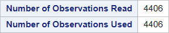
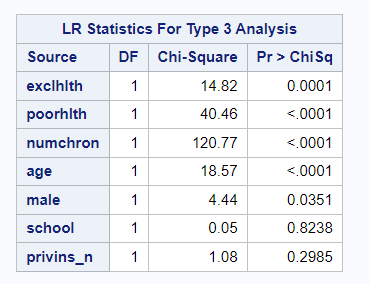
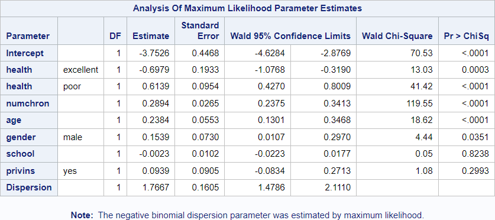

# 09 - Negative binomial regression - Coding of categorical variables

## Data

Source of data: DebTrivedi in R package "MixAll"

Data set debtrivedi.csv


```R
library(readr)
debtrivedi <- read_csv("data/debtrivedi.csv",
                 show_col_types = FALSE)
debtrivedi$poorhlth <- ifelse(debtrivedi$health == "poor", 1, 0)
debtrivedi$exclhlth <- ifelse(debtrivedi$health == "excellent", 1, 0)
debtrivedi$male <- ifelse(debtrivedi$gender == "male", 1, 0)
debtrivedi$privins_n <- ifelse(debtrivedi$privins == "yes", 1, 0)

head(debtrivedi)

```


<table class="dataframe">
<caption>A tibble: 6 × 23</caption>
<thead>
	<tr><th scope=col>ofp</th><th scope=col>ofnp</th><th scope=col>opp</th><th scope=col>opnp</th><th scope=col>emer</th><th scope=col>hosp</th><th scope=col>health</th><th scope=col>numchron</th><th scope=col>adldiff</th><th scope=col>region</th><th scope=col>⋯</th><th scope=col>married</th><th scope=col>school</th><th scope=col>faminc</th><th scope=col>employed</th><th scope=col>privins</th><th scope=col>medicaid</th><th scope=col>poorhlth</th><th scope=col>exclhlth</th><th scope=col>male</th><th scope=col>privins_n</th></tr>
	<tr><th scope=col>&lt;dbl&gt;</th><th scope=col>&lt;dbl&gt;</th><th scope=col>&lt;dbl&gt;</th><th scope=col>&lt;dbl&gt;</th><th scope=col>&lt;dbl&gt;</th><th scope=col>&lt;dbl&gt;</th><th scope=col>&lt;chr&gt;</th><th scope=col>&lt;dbl&gt;</th><th scope=col>&lt;chr&gt;</th><th scope=col>&lt;chr&gt;</th><th scope=col>⋯</th><th scope=col>&lt;chr&gt;</th><th scope=col>&lt;dbl&gt;</th><th scope=col>&lt;dbl&gt;</th><th scope=col>&lt;chr&gt;</th><th scope=col>&lt;chr&gt;</th><th scope=col>&lt;chr&gt;</th><th scope=col>&lt;dbl&gt;</th><th scope=col>&lt;dbl&gt;</th><th scope=col>&lt;dbl&gt;</th><th scope=col>&lt;dbl&gt;</th></tr>
</thead>
<tbody>
	<tr><td> 5</td><td>0</td><td>0</td><td>0</td><td>0</td><td>1</td><td>average</td><td>2</td><td>no </td><td>other</td><td>⋯</td><td>yes</td><td> 6</td><td>2.8810</td><td>yes</td><td>yes</td><td>no </td><td>0</td><td>0</td><td>1</td><td>1</td></tr>
	<tr><td> 1</td><td>0</td><td>2</td><td>0</td><td>2</td><td>0</td><td>average</td><td>2</td><td>no </td><td>other</td><td>⋯</td><td>yes</td><td>10</td><td>2.7478</td><td>no </td><td>yes</td><td>no </td><td>0</td><td>0</td><td>0</td><td>1</td></tr>
	<tr><td>13</td><td>0</td><td>0</td><td>0</td><td>3</td><td>3</td><td>poor   </td><td>4</td><td>yes</td><td>other</td><td>⋯</td><td>no </td><td>10</td><td>0.6532</td><td>no </td><td>no </td><td>yes</td><td>1</td><td>0</td><td>0</td><td>0</td></tr>
	<tr><td>16</td><td>0</td><td>5</td><td>0</td><td>1</td><td>1</td><td>poor   </td><td>2</td><td>yes</td><td>other</td><td>⋯</td><td>yes</td><td> 3</td><td>0.6588</td><td>no </td><td>yes</td><td>no </td><td>1</td><td>0</td><td>1</td><td>1</td></tr>
	<tr><td> 3</td><td>0</td><td>0</td><td>0</td><td>0</td><td>0</td><td>average</td><td>2</td><td>yes</td><td>other</td><td>⋯</td><td>yes</td><td> 6</td><td>0.6588</td><td>no </td><td>yes</td><td>no </td><td>0</td><td>0</td><td>0</td><td>1</td></tr>
	<tr><td>17</td><td>0</td><td>0</td><td>0</td><td>0</td><td>0</td><td>poor   </td><td>5</td><td>yes</td><td>other</td><td>⋯</td><td>no </td><td> 7</td><td>0.3301</td><td>no </td><td>no </td><td>yes</td><td>1</td><td>0</td><td>0</td><td>0</td></tr>
</tbody>
</table>


## SAS program snippet

The categorical variables in this model are coded manually.


data debtrivedi;
  set debtrivedi;
  poorhlth = 0;
  if health = "poor" then poorhlth = 1;
  exclhlth = 0;
  if health = "excellent" then exclhlth = 1;
  male = 0;
  if gender = "male" then male = 1;
  privins_n = 0;
  if privins = "yes" then privins_n = 1;
run;
  
The following SAS code will be executed.
proc genmod data = debtrivedi;
  model hosp = exclhlth poorhlth numchron age male school privins_n / type3 dist=negbin;
run;

Differences to the default encoding and the reference encoding can be found below.

### R chunk
Packages will be loaded in the chunk were they are first needed.

A similar R program might look like this. It uses the glm.nb() function.

The tidy() function from the broom-packages formats the output into a tibble for easier processing.


```R
library(MASS)
library(broom)
my_glm <- glm.nb(hosp ~ exclhlth + poorhlth + numchron + age + male + school + privins_n, data = debtrivedi)
tidy(my_glm)

```


<table class="dataframe">
<caption>A tibble: 8 × 5</caption>
<thead>
	<tr><th scope=col>term</th><th scope=col>estimate</th><th scope=col>std.error</th><th scope=col>statistic</th><th scope=col>p.value</th></tr>
	<tr><th scope=col>&lt;chr&gt;</th><th scope=col>&lt;dbl&gt;</th><th scope=col>&lt;dbl&gt;</th><th scope=col>&lt;dbl&gt;</th><th scope=col>&lt;dbl&gt;</th></tr>
</thead>
<tbody>
	<tr><td>(Intercept)</td><td>-3.752639734</td><td>0.44190797</td><td>-8.4919032</td><td>2.032803e-17</td></tr>
	<tr><td>exclhlth   </td><td>-0.697874635</td><td>0.19315090</td><td>-3.6131058</td><td>3.025512e-04</td></tr>
	<tr><td>poorhlth   </td><td> 0.613926301</td><td>0.09521661</td><td> 6.4476805</td><td>1.135749e-10</td></tr>
	<tr><td>numchron   </td><td> 0.289418299</td><td>0.02541425</td><td>11.3880328</td><td>4.796974e-30</td></tr>
	<tr><td>age        </td><td> 0.238444463</td><td>0.05483476</td><td> 4.3484178</td><td>1.371232e-05</td></tr>
	<tr><td>male       </td><td> 0.153862333</td><td>0.07264766</td><td> 2.1179256</td><td>3.418137e-02</td></tr>
	<tr><td>school     </td><td>-0.002271456</td><td>0.01019223</td><td>-0.2228615</td><td>8.236433e-01</td></tr>
	<tr><td>privins_n  </td><td> 0.093922247</td><td>0.09042523</td><td> 1.0386730</td><td>2.989568e-01</td></tr>
</tbody>
</table>


## Results

The output is divided into blocks to explain it and to reproduce it afterwards in the different languages.

### Block 1


This block provides the name of the dataset, the response distribution, the link function and the reponse variable.

### R chunk for reproduction


```R
summary(my_glm)
```


    
    Call:
    glm.nb(formula = hosp ~ exclhlth + poorhlth + numchron + age + 
        male + school + privins_n, data = debtrivedi, init.theta = 0.5660185253, 
        link = log)
    
    Coefficients:
                 Estimate Std. Error z value Pr(>|z|)    
    (Intercept) -3.752640   0.441908  -8.492  < 2e-16 ***
    exclhlth    -0.697875   0.193151  -3.613 0.000303 ***
    poorhlth     0.613926   0.095217   6.448 1.14e-10 ***
    numchron     0.289418   0.025414  11.388  < 2e-16 ***
    age          0.238444   0.054835   4.348 1.37e-05 ***
    male         0.153862   0.072648   2.118 0.034181 *  
    school      -0.002271   0.010192  -0.223 0.823643    
    privins_n    0.093922   0.090425   1.039 0.298957    
    ---
    Signif. codes:  0 '***' 0.001 '**' 0.01 '*' 0.05 '.' 0.1 ' ' 1
    
    (Dispersion parameter for Negative Binomial(0.566) family taken to be 1)
    
        Null deviance: 2879.7  on 4405  degrees of freedom
    Residual deviance: 2547.9  on 4398  degrees of freedom
    AIC: 5731.1
    
    Number of Fisher Scoring iterations: 1
    
    
                  Theta:  0.5660 
              Std. Err.:  0.0513 
    
     2 x log-likelihood:  -5713.1250 


### Block 2


This block provides the number of observations read from the dateset and the number of observations used in the model.

### R chunk for reproduction


```R
nrow(debtrivedi)
nobs(my_glm)
```


4406


4406


### Block 3


This block displays some criteria for assessing the goodnes of fit.

### R chunk for reproduction


```R
glance(my_glm)
```


<table class="dataframe">
<caption>A tibble: 1 × 8</caption>
<thead>
	<tr><th scope=col>null.deviance</th><th scope=col>df.null</th><th scope=col>logLik</th><th scope=col>AIC</th><th scope=col>BIC</th><th scope=col>deviance</th><th scope=col>df.residual</th><th scope=col>nobs</th></tr>
	<tr><th scope=col>&lt;dbl&gt;</th><th scope=col>&lt;int&gt;</th><th scope=col>&lt;logLik&gt;</th><th scope=col>&lt;dbl&gt;</th><th scope=col>&lt;dbl&gt;</th><th scope=col>&lt;dbl&gt;</th><th scope=col>&lt;int&gt;</th><th scope=col>&lt;int&gt;</th></tr>
</thead>
<tbody>
	<tr><td>2879.693</td><td>4405</td><td>-2856.562</td><td>5731.125</td><td>5788.641</td><td>2547.901</td><td>4398</td><td>4406</td></tr>
</tbody>
</table>


```R
my_glm_intercept <- glm.nb(hosp ~ 1, data = debtrivedi)
glance(my_glm_intercept)

```


<table class="dataframe">
<caption>A tibble: 1 × 8</caption>
<thead>
	<tr><th scope=col>null.deviance</th><th scope=col>df.null</th><th scope=col>logLik</th><th scope=col>AIC</th><th scope=col>BIC</th><th scope=col>deviance</th><th scope=col>df.residual</th><th scope=col>nobs</th></tr>
	<tr><th scope=col>&lt;dbl&gt;</th><th scope=col>&lt;int&gt;</th><th scope=col>&lt;logLik&gt;</th><th scope=col>&lt;dbl&gt;</th><th scope=col>&lt;dbl&gt;</th><th scope=col>&lt;dbl&gt;</th><th scope=col>&lt;int&gt;</th><th scope=col>&lt;int&gt;</th></tr>
</thead>
<tbody>
	<tr><td>2490.834</td><td>4405</td><td>-3009.625</td><td>6023.249</td><td>6036.031</td><td>2490.834</td><td>4405</td><td>4406</td></tr>
</tbody>
</table>


### Block 4


This block contains the results from fitting a generalized linear model to the data.

### R chunk for reproduction


```R
tidy(my_glm)
```


<table class="dataframe">
<caption>A tibble: 8 × 5</caption>
<thead>
	<tr><th scope=col>term</th><th scope=col>estimate</th><th scope=col>std.error</th><th scope=col>statistic</th><th scope=col>p.value</th></tr>
	<tr><th scope=col>&lt;chr&gt;</th><th scope=col>&lt;dbl&gt;</th><th scope=col>&lt;dbl&gt;</th><th scope=col>&lt;dbl&gt;</th><th scope=col>&lt;dbl&gt;</th></tr>
</thead>
<tbody>
	<tr><td>(Intercept)</td><td>-3.752639734</td><td>0.44190797</td><td>-8.4919032</td><td>2.032803e-17</td></tr>
	<tr><td>exclhlth   </td><td>-0.697874635</td><td>0.19315090</td><td>-3.6131058</td><td>3.025512e-04</td></tr>
	<tr><td>poorhlth   </td><td> 0.613926301</td><td>0.09521661</td><td> 6.4476805</td><td>1.135749e-10</td></tr>
	<tr><td>numchron   </td><td> 0.289418299</td><td>0.02541425</td><td>11.3880328</td><td>4.796974e-30</td></tr>
	<tr><td>age        </td><td> 0.238444463</td><td>0.05483476</td><td> 4.3484178</td><td>1.371232e-05</td></tr>
	<tr><td>male       </td><td> 0.153862333</td><td>0.07264766</td><td> 2.1179256</td><td>3.418137e-02</td></tr>
	<tr><td>school     </td><td>-0.002271456</td><td>0.01019223</td><td>-0.2228615</td><td>8.236433e-01</td></tr>
	<tr><td>privins_n  </td><td> 0.093922247</td><td>0.09042523</td><td> 1.0386730</td><td>2.989568e-01</td></tr>
</tbody>
</table>


### Block 5



This block contains one row for each effect in the model with the name of the effect, the likelihood ratio statistic for testing the significance of the effect, the degrees of freedom for the effect, and the p-value computed from the chi-square distribution.

### R chunk for reproduction

TODO:


```R
library(lmtest)
library(car)
#my_glm <- glm.nb(hosp ~ exclhlth + poorhlth + numchron + age + male + school + privins_n, data = debtrivedi)
#my_glm_age <- glm.nb(hosp ~ exclhlth + poorhlth + numchron + male + school + privins_n, data = debtrivedi)
#lrtest(my_glm_age, my_glm_intercept)
car::Anova(my_glm, type = 3, test.statistic = "Wald")
```


<table class="dataframe">
<caption>A anova: 8 × 3</caption>
<thead>
	<tr><th></th><th scope=col>Df</th><th scope=col>Chisq</th><th scope=col>Pr(&gt;Chisq)</th></tr>
	<tr><th></th><th scope=col>&lt;dbl&gt;</th><th scope=col>&lt;dbl&gt;</th><th scope=col>&lt;dbl&gt;</th></tr>
</thead>
<tbody>
	<tr><th scope=row>(Intercept)</th><td>1</td><td> 72.11241965</td><td>2.032803e-17</td></tr>
	<tr><th scope=row>exclhlth</th><td>1</td><td> 13.05453345</td><td>3.025512e-04</td></tr>
	<tr><th scope=row>poorhlth</th><td>1</td><td> 41.57258349</td><td>1.135749e-10</td></tr>
	<tr><th scope=row>numchron</th><td>1</td><td>129.68729106</td><td>4.796974e-30</td></tr>
	<tr><th scope=row>age</th><td>1</td><td> 18.90873703</td><td>1.371232e-05</td></tr>
	<tr><th scope=row>male</th><td>1</td><td>  4.48560891</td><td>3.418137e-02</td></tr>
	<tr><th scope=row>school</th><td>1</td><td>  0.04966727</td><td>8.236433e-01</td></tr>
	<tr><th scope=row>privins_n</th><td>1</td><td>  1.07884162</td><td>2.989568e-01</td></tr>
</tbody>
</table>


```R
car::Anova(my_glm, type = 3, test.statistic = "LR")
```


<table class="dataframe">
<caption>A anova: 7 × 3</caption>
<thead>
	<tr><th></th><th scope=col>LR Chisq</th><th scope=col>Df</th><th scope=col>Pr(&gt;Chisq)</th></tr>
	<tr><th></th><th scope=col>&lt;dbl&gt;</th><th scope=col>&lt;dbl&gt;</th><th scope=col>&lt;dbl&gt;</th></tr>
</thead>
<tbody>
	<tr><th scope=row>exclhlth</th><td> 14.8593794</td><td>1</td><td>1.158306e-04</td></tr>
	<tr><th scope=row>poorhlth</th><td> 41.1621381</td><td>1</td><td>1.401105e-10</td></tr>
	<tr><th scope=row>numchron</th><td>124.1017411</td><td>1</td><td>8.003294e-29</td></tr>
	<tr><th scope=row>age</th><td> 18.5851057</td><td>1</td><td>1.624851e-05</td></tr>
	<tr><th scope=row>male</th><td>  4.4396288</td><td>1</td><td>3.511388e-02</td></tr>
	<tr><th scope=row>school</th><td>  0.0495539</td><td>1</td><td>8.238413e-01</td></tr>
	<tr><th scope=row>privins_n</th><td>  1.0817987</td><td>1</td><td>2.982955e-01</td></tr>
</tbody>
</table>


==========================


### Block 6


This block provides the class level information for the refence coding of the categorical parameters.
See the following code block.
proc genmod data = debtrivedi;
  class health (param = ref ref = "average") gender (param = ref ref = "female") privins (param = ref ref = "no");
  model hosp = health numchron age gender school privins / type3 dist=negbin;
run;
### R chunk for reproduction


```R
my_glm <- glm.nb(hosp ~ health + numchron + age + gender + school + privins_n, data = debtrivedi)
tidy(my_glm)
```


<table class="dataframe">
<caption>A tibble: 8 × 5</caption>
<thead>
	<tr><th scope=col>term</th><th scope=col>estimate</th><th scope=col>std.error</th><th scope=col>statistic</th><th scope=col>p.value</th></tr>
	<tr><th scope=col>&lt;chr&gt;</th><th scope=col>&lt;dbl&gt;</th><th scope=col>&lt;dbl&gt;</th><th scope=col>&lt;dbl&gt;</th><th scope=col>&lt;dbl&gt;</th></tr>
</thead>
<tbody>
	<tr><td>(Intercept)    </td><td>-3.752639734</td><td>0.44190797</td><td>-8.4919032</td><td>2.032803e-17</td></tr>
	<tr><td>healthexcellent</td><td>-0.697874635</td><td>0.19315090</td><td>-3.6131058</td><td>3.025512e-04</td></tr>
	<tr><td>healthpoor     </td><td> 0.613926301</td><td>0.09521661</td><td> 6.4476805</td><td>1.135749e-10</td></tr>
	<tr><td>numchron       </td><td> 0.289418299</td><td>0.02541425</td><td>11.3880328</td><td>4.796974e-30</td></tr>
	<tr><td>age            </td><td> 0.238444463</td><td>0.05483476</td><td> 4.3484178</td><td>1.371232e-05</td></tr>
	<tr><td>gendermale     </td><td> 0.153862333</td><td>0.07264766</td><td> 2.1179256</td><td>3.418137e-02</td></tr>
	<tr><td>school         </td><td>-0.002271456</td><td>0.01019223</td><td>-0.2228615</td><td>8.236433e-01</td></tr>
	<tr><td>privins_n      </td><td> 0.093922247</td><td>0.09042523</td><td> 1.0386730</td><td>2.989568e-01</td></tr>
</tbody>
</table>


### Block 7


The block above gives the results for the estimates if the reference coding is used.

It is similar to the provided R code and its output.

==========================

### Block 8


This block provides the class level information for the GLM coding of the categorical parameters as default coding. See the following code block.
proc genmod data = debtrivedi;
  class health gender privins;
  model hosp = health numchron age gender school privins / type3 dist=negbin;
run;

### R chunk for reproduction

GLM coding is the default value. It generates columns for each level of a categorical variable.


```R
df1 <- debtrivedi
df1$averagehlth <- (df1$health == "average") * 1 + (df1$health== "excellent") * 0 + (df1$health == "poor") * 0
df1$excellenthlth <- (df1$health == "average") * 0 + (df1$health == "excellent") * 1 + (df1$health == "poor") * 0
df1$poorhlth <- (df1$health == "average") * 0 + (df1$health == "excellent") * 0 + (df1$health == "poor") * 1

df1$male <- ifelse(df1$gender == "male", 1, 0)
df1$female <- ifelse(df1$gender == "female", 1, 0)

df1$privins_n <- ifelse(df1$privins == "no", 1, 0)
df1$privins_y <- ifelse(df1$privins == "yes", 1, 0)

my_glm <- glm.nb(hosp ~ averagehlth + excellenthlth + poorhlth + numchron + age + female + male + school + privins_n + privins_y, 
                 data = df1)
tidy(my_glm)
```


<table class="dataframe">
<caption>A tibble: 8 × 5</caption>
<thead>
	<tr><th scope=col>term</th><th scope=col>estimate</th><th scope=col>std.error</th><th scope=col>statistic</th><th scope=col>p.value</th></tr>
	<tr><th scope=col>&lt;chr&gt;</th><th scope=col>&lt;dbl&gt;</th><th scope=col>&lt;dbl&gt;</th><th scope=col>&lt;dbl&gt;</th><th scope=col>&lt;dbl&gt;</th></tr>
</thead>
<tbody>
	<tr><td>(Intercept)  </td><td>-2.890928852</td><td>0.44877953</td><td>-6.4417573</td><td>1.180980e-10</td></tr>
	<tr><td>averagehlth  </td><td>-0.613926301</td><td>0.09521661</td><td>-6.4476805</td><td>1.135749e-10</td></tr>
	<tr><td>excellenthlth</td><td>-1.311800936</td><td>0.21086082</td><td>-6.2211696</td><td>4.934625e-10</td></tr>
	<tr><td>numchron     </td><td> 0.289418299</td><td>0.02541425</td><td>11.3880328</td><td>4.796974e-30</td></tr>
	<tr><td>age          </td><td> 0.238444463</td><td>0.05483476</td><td> 4.3484178</td><td>1.371232e-05</td></tr>
	<tr><td>female       </td><td>-0.153862333</td><td>0.07264766</td><td>-2.1179256</td><td>3.418137e-02</td></tr>
	<tr><td>school       </td><td>-0.002271456</td><td>0.01019223</td><td>-0.2228615</td><td>8.236433e-01</td></tr>
	<tr><td>privins_n    </td><td>-0.093922247</td><td>0.09042523</td><td>-1.0386730</td><td>2.989568e-01</td></tr>
</tbody>
</table>


### Block 9


The block above gives the results for the estimates if the reference coding is used. It is similar to the provided R code and its output.


```R

```
