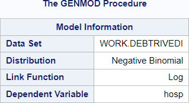
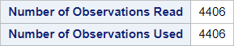
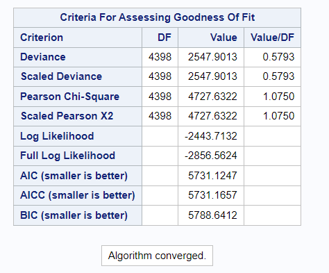
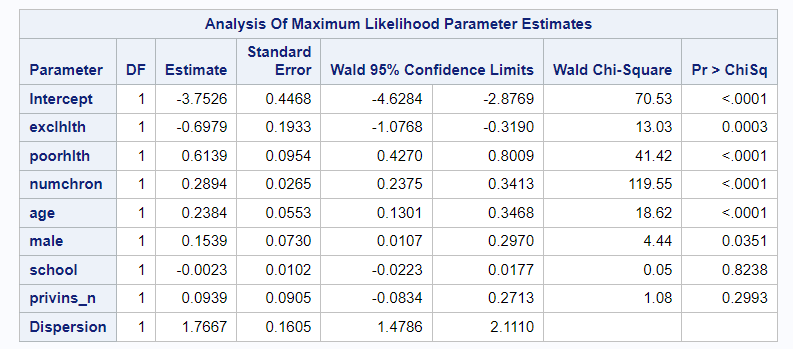
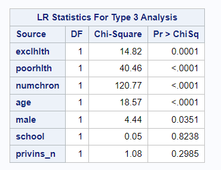
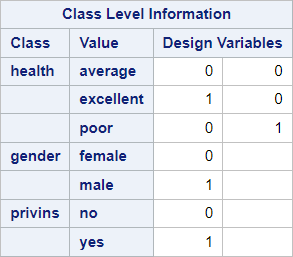
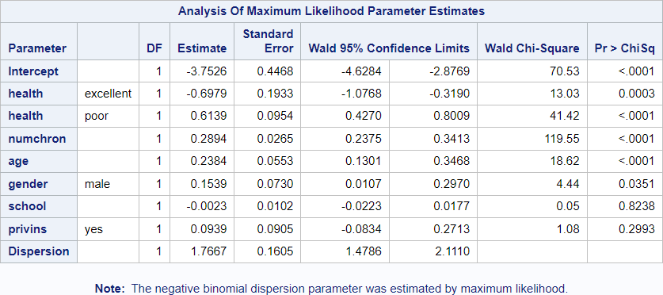
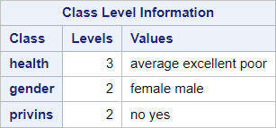
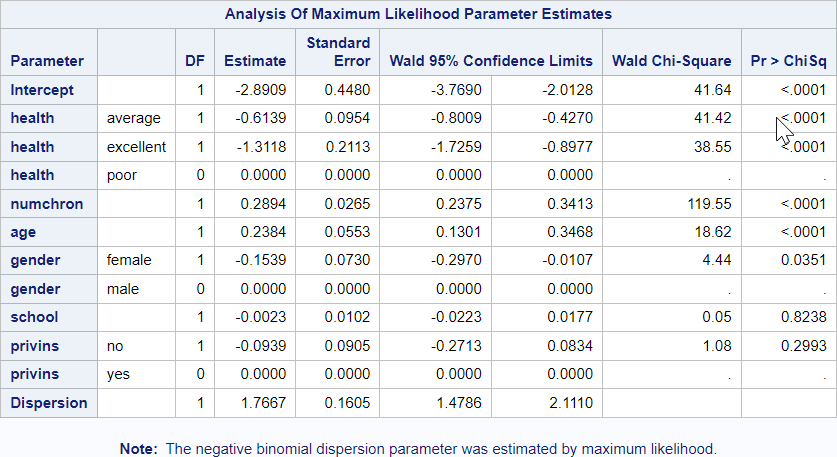

# 09 - Negative binomial regression - Manual coding of categorical variables

## Data

Source of data: DebTrivedi in R package "MixAll"

Data set debtrivedi.csv


```R
library(readr)
debtrivedi <- read_csv("data/debtrivedi.csv",
                 show_col_types = FALSE)
debtrivedi$poorhlth <- ifelse(debtrivedi$health == "poor", 1, 0)
debtrivedi$exclhlth <- ifelse(debtrivedi$health == "excellent", 1, 0)
debtrivedi$male <- ifelse(debtrivedi$gender == "male", 1, 0)
debtrivedi$privins_n <- ifelse(debtrivedi$privins == "yes", 1, 0)

head(debtrivedi)

```


<table class="dataframe">
<caption>A tibble: 6 × 23</caption>
<thead>
	<tr><th scope=col>ofp</th><th scope=col>ofnp</th><th scope=col>opp</th><th scope=col>opnp</th><th scope=col>emer</th><th scope=col>hosp</th><th scope=col>health</th><th scope=col>numchron</th><th scope=col>adldiff</th><th scope=col>region</th><th scope=col>⋯</th><th scope=col>married</th><th scope=col>school</th><th scope=col>faminc</th><th scope=col>employed</th><th scope=col>privins</th><th scope=col>medicaid</th><th scope=col>poorhlth</th><th scope=col>exclhlth</th><th scope=col>male</th><th scope=col>privins_n</th></tr>
	<tr><th scope=col>&lt;dbl&gt;</th><th scope=col>&lt;dbl&gt;</th><th scope=col>&lt;dbl&gt;</th><th scope=col>&lt;dbl&gt;</th><th scope=col>&lt;dbl&gt;</th><th scope=col>&lt;dbl&gt;</th><th scope=col>&lt;chr&gt;</th><th scope=col>&lt;dbl&gt;</th><th scope=col>&lt;chr&gt;</th><th scope=col>&lt;chr&gt;</th><th scope=col>⋯</th><th scope=col>&lt;chr&gt;</th><th scope=col>&lt;dbl&gt;</th><th scope=col>&lt;dbl&gt;</th><th scope=col>&lt;chr&gt;</th><th scope=col>&lt;chr&gt;</th><th scope=col>&lt;chr&gt;</th><th scope=col>&lt;dbl&gt;</th><th scope=col>&lt;dbl&gt;</th><th scope=col>&lt;dbl&gt;</th><th scope=col>&lt;dbl&gt;</th></tr>
</thead>
<tbody>
	<tr><td> 5</td><td>0</td><td>0</td><td>0</td><td>0</td><td>1</td><td>average</td><td>2</td><td>no </td><td>other</td><td>⋯</td><td>yes</td><td> 6</td><td>2.8810</td><td>yes</td><td>yes</td><td>no </td><td>0</td><td>0</td><td>1</td><td>1</td></tr>
	<tr><td> 1</td><td>0</td><td>2</td><td>0</td><td>2</td><td>0</td><td>average</td><td>2</td><td>no </td><td>other</td><td>⋯</td><td>yes</td><td>10</td><td>2.7478</td><td>no </td><td>yes</td><td>no </td><td>0</td><td>0</td><td>0</td><td>1</td></tr>
	<tr><td>13</td><td>0</td><td>0</td><td>0</td><td>3</td><td>3</td><td>poor   </td><td>4</td><td>yes</td><td>other</td><td>⋯</td><td>no </td><td>10</td><td>0.6532</td><td>no </td><td>no </td><td>yes</td><td>1</td><td>0</td><td>0</td><td>0</td></tr>
	<tr><td>16</td><td>0</td><td>5</td><td>0</td><td>1</td><td>1</td><td>poor   </td><td>2</td><td>yes</td><td>other</td><td>⋯</td><td>yes</td><td> 3</td><td>0.6588</td><td>no </td><td>yes</td><td>no </td><td>1</td><td>0</td><td>1</td><td>1</td></tr>
	<tr><td> 3</td><td>0</td><td>0</td><td>0</td><td>0</td><td>0</td><td>average</td><td>2</td><td>yes</td><td>other</td><td>⋯</td><td>yes</td><td> 6</td><td>0.6588</td><td>no </td><td>yes</td><td>no </td><td>0</td><td>0</td><td>0</td><td>1</td></tr>
	<tr><td>17</td><td>0</td><td>0</td><td>0</td><td>0</td><td>0</td><td>poor   </td><td>5</td><td>yes</td><td>other</td><td>⋯</td><td>no </td><td> 7</td><td>0.3301</td><td>no </td><td>no </td><td>yes</td><td>1</td><td>0</td><td>0</td><td>0</td></tr>
</tbody>
</table>


## SAS program snippet

The categorical variables in this model are coded manually.


data debtrivedi;
  set debtrivedi;
  poorhlth = 0;
  if health = "poor" then poorhlth = 1;
  exclhlth = 0;
  if health = "excellent" then exclhlth = 1;
  male = 0;
  if gender = "male" then male = 1;
  privins_n = 0;
  if privins = "yes" then privins_n = 1;
run;
  
The following SAS code will be executed.
proc genmod data = debtrivedi;
  model hosp = exclhlth poorhlth numchron age male school privins_n / type3 dist=negbin;
run;

Differences to the default encoding and the reference encoding can be found below.

## Results

The output is divided into blocks to explain it and to reproduce it afterwards in the different languages.

### Block 1



This block provides the name of the dataset, the response distribution, the link function and the reponse variable.

### Block 2


This block provides the number of observations read from the dateset and the number of observations used in the model.

### Block 3


This block displays some criteria for assessing the goodnes of fit.

### Block 4


This block contains the results from fitting a generalized linear model to the data.

### Block 5



This block contains one row for each effect in the model with the name of the effect, the likelihood ratio statistic for testing the significance of the effect, the degrees of freedom for the effect, and the p-value computed from the chi-square distribution.


==========================


### Block 6


This block provides the class level information for the refence coding of the categorical parameters.
See the following code block.
proc genmod data = debtrivedi;
  class health (param = ref ref = "average") gender (param = ref ref = "female") privins (param = ref ref = "no");
  model hosp = health numchron age gender school privins / type3 dist=negbin;
run;
### Block 7


The block above gives the results for the estimates if the reference coding is used.

==========================

### Block 8


This block provides the class level information for the refence coding of the categorical parameters. See the following code block.
proc genmod data = debtrivedi;
  class health gender privins;
  model hosp = health numchron age gender school privins / type3 dist=negbin;
run;

### Block 9


The block above gives the results for the estimates if the reference coding is used.


```R

```
