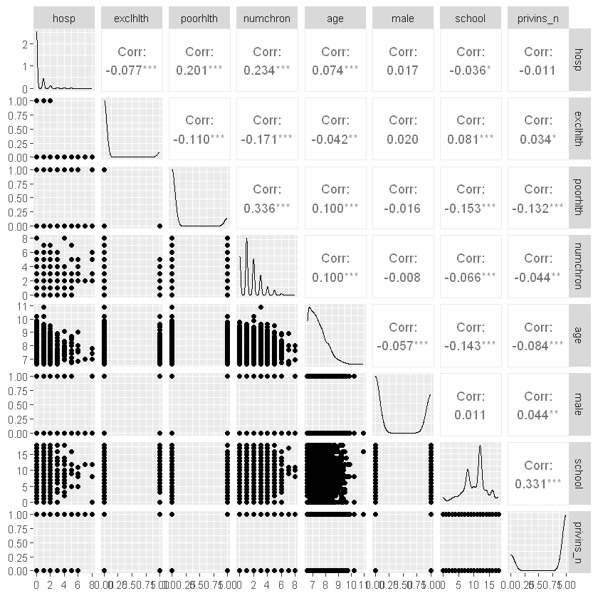

# Working sheet
## 09 - Negative binomial regression - Coding of categorical variables
V09.01.00 - 2024-02-26

## Load data
Change the path and the filename in the following box.


```R
library(readr)
df <- read_csv("data/debtrivedi.csv",
                 show_col_types = FALSE)
df$poorhlth <- ifelse(df$health == "poor", 1, 0)
df$exclhlth <- ifelse(df$health == "excellent", 1, 0)
df$male <- ifelse(df$gender == "male", 1, 0)
df$privins_n <- ifelse(df$privins == "yes", 1, 0)

```

Look at the structure and the head of the dataset.


```R
str(df)
```

    spc_tbl_ [4,406 × 23] (S3: spec_tbl_df/tbl_df/tbl/data.frame)
     $ ofp      : num [1:4406] 5 1 13 16 3 17 9 3 1 0 ...
     $ ofnp     : num [1:4406] 0 0 0 0 0 0 0 0 0 0 ...
     $ opp      : num [1:4406] 0 2 0 5 0 0 0 0 0 0 ...
     $ opnp     : num [1:4406] 0 0 0 0 0 0 0 0 0 0 ...
     $ emer     : num [1:4406] 0 2 3 1 0 0 0 0 0 0 ...
     $ hosp     : num [1:4406] 1 0 3 1 0 0 0 0 0 0 ...
     $ health   : chr [1:4406] "average" "average" "poor" "poor" ...
     $ numchron : num [1:4406] 2 2 4 2 2 5 0 0 0 0 ...
     $ adldiff  : chr [1:4406] "no" "no" "yes" "yes" ...
     $ region   : chr [1:4406] "other" "other" "other" "other" ...
     $ age      : num [1:4406] 6.9 7.4 6.6 7.6 7.9 6.6 7.5 8.7 7.3 7.8 ...
     $ black    : chr [1:4406] "yes" "no" "yes" "no" ...
     $ gender   : chr [1:4406] "male" "female" "female" "male" ...
     $ married  : chr [1:4406] "yes" "yes" "no" "yes" ...
     $ school   : num [1:4406] 6 10 10 3 6 7 8 8 8 8 ...
     $ faminc   : num [1:4406] 2.881 2.748 0.653 0.659 0.659 ...
     $ employed : chr [1:4406] "yes" "no" "no" "no" ...
     $ privins  : chr [1:4406] "yes" "yes" "no" "yes" ...
     $ medicaid : chr [1:4406] "no" "no" "yes" "no" ...
     $ poorhlth : num [1:4406] 0 0 1 1 0 1 0 0 0 0 ...
     $ exclhlth : num [1:4406] 0 0 0 0 0 0 0 0 0 0 ...
     $ male     : num [1:4406] 1 0 0 1 0 0 0 0 0 0 ...
     $ privins_n: num [1:4406] 1 1 0 1 1 0 1 1 1 1 ...
     - attr(*, "spec")=
      .. cols(
      ..   ofp = col_double(),
      ..   ofnp = col_double(),
      ..   opp = col_double(),
      ..   opnp = col_double(),
      ..   emer = col_double(),
      ..   hosp = col_double(),
      ..   health = col_character(),
      ..   numchron = col_double(),
      ..   adldiff = col_character(),
      ..   region = col_character(),
      ..   age = col_double(),
      ..   black = col_character(),
      ..   gender = col_character(),
      ..   married = col_character(),
      ..   school = col_double(),
      ..   faminc = col_double(),
      ..   employed = col_character(),
      ..   privins = col_character(),
      ..   medicaid = col_character()
      .. )
     - attr(*, "problems")=<externalptr> 
    


```R
head(df)
```


<table class="dataframe">
<caption>A tibble: 6 × 23</caption>
<thead>
	<tr><th scope=col>ofp</th><th scope=col>ofnp</th><th scope=col>opp</th><th scope=col>opnp</th><th scope=col>emer</th><th scope=col>hosp</th><th scope=col>health</th><th scope=col>numchron</th><th scope=col>adldiff</th><th scope=col>region</th><th scope=col>⋯</th><th scope=col>married</th><th scope=col>school</th><th scope=col>faminc</th><th scope=col>employed</th><th scope=col>privins</th><th scope=col>medicaid</th><th scope=col>poorhlth</th><th scope=col>exclhlth</th><th scope=col>male</th><th scope=col>privins_n</th></tr>
	<tr><th scope=col>&lt;dbl&gt;</th><th scope=col>&lt;dbl&gt;</th><th scope=col>&lt;dbl&gt;</th><th scope=col>&lt;dbl&gt;</th><th scope=col>&lt;dbl&gt;</th><th scope=col>&lt;dbl&gt;</th><th scope=col>&lt;chr&gt;</th><th scope=col>&lt;dbl&gt;</th><th scope=col>&lt;chr&gt;</th><th scope=col>&lt;chr&gt;</th><th scope=col>⋯</th><th scope=col>&lt;chr&gt;</th><th scope=col>&lt;dbl&gt;</th><th scope=col>&lt;dbl&gt;</th><th scope=col>&lt;chr&gt;</th><th scope=col>&lt;chr&gt;</th><th scope=col>&lt;chr&gt;</th><th scope=col>&lt;dbl&gt;</th><th scope=col>&lt;dbl&gt;</th><th scope=col>&lt;dbl&gt;</th><th scope=col>&lt;dbl&gt;</th></tr>
</thead>
<tbody>
	<tr><td> 5</td><td>0</td><td>0</td><td>0</td><td>0</td><td>1</td><td>average</td><td>2</td><td>no </td><td>other</td><td>⋯</td><td>yes</td><td> 6</td><td>2.8810</td><td>yes</td><td>yes</td><td>no </td><td>0</td><td>0</td><td>1</td><td>1</td></tr>
	<tr><td> 1</td><td>0</td><td>2</td><td>0</td><td>2</td><td>0</td><td>average</td><td>2</td><td>no </td><td>other</td><td>⋯</td><td>yes</td><td>10</td><td>2.7478</td><td>no </td><td>yes</td><td>no </td><td>0</td><td>0</td><td>0</td><td>1</td></tr>
	<tr><td>13</td><td>0</td><td>0</td><td>0</td><td>3</td><td>3</td><td>poor   </td><td>4</td><td>yes</td><td>other</td><td>⋯</td><td>no </td><td>10</td><td>0.6532</td><td>no </td><td>no </td><td>yes</td><td>1</td><td>0</td><td>0</td><td>0</td></tr>
	<tr><td>16</td><td>0</td><td>5</td><td>0</td><td>1</td><td>1</td><td>poor   </td><td>2</td><td>yes</td><td>other</td><td>⋯</td><td>yes</td><td> 3</td><td>0.6588</td><td>no </td><td>yes</td><td>no </td><td>1</td><td>0</td><td>1</td><td>1</td></tr>
	<tr><td> 3</td><td>0</td><td>0</td><td>0</td><td>0</td><td>0</td><td>average</td><td>2</td><td>yes</td><td>other</td><td>⋯</td><td>yes</td><td> 6</td><td>0.6588</td><td>no </td><td>yes</td><td>no </td><td>0</td><td>0</td><td>0</td><td>1</td></tr>
	<tr><td>17</td><td>0</td><td>0</td><td>0</td><td>0</td><td>0</td><td>poor   </td><td>5</td><td>yes</td><td>other</td><td>⋯</td><td>no </td><td> 7</td><td>0.3301</td><td>no </td><td>no </td><td>yes</td><td>1</td><td>0</td><td>0</td><td>0</td></tr>
</tbody>
</table>


Look at frequencies and descriptive statistics.

The summary() function is the first approach.

describe() from the Hmisc package is an alternative.

```R
summary(df)
```


          ofp              ofnp              opp                opnp         
     Min.   : 0.000   Min.   :  0.000   Min.   :  0.0000   Min.   :  0.0000  
     1st Qu.: 1.000   1st Qu.:  0.000   1st Qu.:  0.0000   1st Qu.:  0.0000  
     Median : 4.000   Median :  0.000   Median :  0.0000   Median :  0.0000  
     Mean   : 5.774   Mean   :  1.618   Mean   :  0.7508   Mean   :  0.5361  
     3rd Qu.: 8.000   3rd Qu.:  1.000   3rd Qu.:  0.0000   3rd Qu.:  0.0000  
     Max.   :89.000   Max.   :104.000   Max.   :141.0000   Max.   :155.0000  
          emer              hosp          health             numchron    
     Min.   : 0.0000   Min.   :0.000   Length:4406        Min.   :0.000  
     1st Qu.: 0.0000   1st Qu.:0.000   Class :character   1st Qu.:1.000  
     Median : 0.0000   Median :0.000   Mode  :character   Median :1.000  
     Mean   : 0.2635   Mean   :0.296                      Mean   :1.542  
     3rd Qu.: 0.0000   3rd Qu.:0.000                      3rd Qu.:2.000  
     Max.   :12.0000   Max.   :8.000                      Max.   :8.000  
       adldiff             region               age            black          
     Length:4406        Length:4406        Min.   : 6.600   Length:4406       
     Class :character   Class :character   1st Qu.: 6.900   Class :character  
     Mode  :character   Mode  :character   Median : 7.300   Mode  :character  
                                           Mean   : 7.402                     
                                           3rd Qu.: 7.800                     
                                           Max.   :10.900                     
        gender            married              school          faminc       
     Length:4406        Length:4406        Min.   : 0.00   Min.   :-1.0125  
     Class :character   Class :character   1st Qu.: 8.00   1st Qu.: 0.9122  
     Mode  :character   Mode  :character   Median :11.00   Median : 1.6982  
                                           Mean   :10.29   Mean   : 2.5271  
                                           3rd Qu.:12.00   3rd Qu.: 3.1728  
                                           Max.   :18.00   Max.   :54.8351  
       employed           privins            medicaid            poorhlth     
     Length:4406        Length:4406        Length:4406        Min.   :0.0000  
     Class :character   Class :character   Class :character   1st Qu.:0.0000  
     Mode  :character   Mode  :character   Mode  :character   Median :0.0000  
                                                              Mean   :0.1257  
                                                              3rd Qu.:0.0000  
                                                              Max.   :1.0000  
        exclhlth            male          privins_n     
     Min.   :0.00000   Min.   :0.0000   Min.   :0.0000  
     1st Qu.:0.00000   1st Qu.:0.0000   1st Qu.:1.0000  
     Median :0.00000   Median :0.0000   Median :1.0000  
     Mean   :0.07785   Mean   :0.4035   Mean   :0.7764  
     3rd Qu.:0.00000   3rd Qu.:1.0000   3rd Qu.:1.0000  
     Max.   :1.00000   Max.   :1.0000   Max.   :1.0000  


```R
library(Hmisc)
describe(df)
```


    df 
    
     23  Variables      4406  Observations
    --------------------------------------------------------------------------------
    ofp 
           n  missing distinct     Info     Mean      Gmd      .05      .10 
        4406        0       60    0.992    5.774    6.227        0        0 
         .25      .50      .75      .90      .95 
           1        4        8       13       17 
    
    lowest :  0  1  2  3  4, highest: 63 65 66 68 89
    --------------------------------------------------------------------------------
    ofnp 
           n  missing distinct     Info     Mean      Gmd      .05      .10 
        4406        0       51    0.681    1.618    2.829        0        0 
         .25      .50      .75      .90      .95 
           0        0        1        4        8 
    
    lowest :   0   1   2   3   4, highest:  66  71  77  78 104
    --------------------------------------------------------------------------------
    opp 
           n  missing distinct     Info     Mean      Gmd      .05      .10 
        4406        0       37     0.54   0.7508    1.353        0        0 
         .25      .50      .75      .90      .95 
           0        0        0        2        3 
    
    lowest :   0   1   2   3   4, highest:  40  55  61  71 141
    --------------------------------------------------------------------------------
    opnp 
           n  missing distinct     Info     Mean      Gmd      .05      .10 
        4406        0       35     0.41   0.5361    1.005        0        0 
         .25      .50      .75      .90      .95 
           0        0        0        1        2 
    
    lowest :   0   1   2   3   4, highest:  49  51  53 113 155
    --------------------------------------------------------------------------------
    emer 
           n  missing distinct     Info     Mean      Gmd      .05      .10 
        4406        0       11    0.451   0.2635    0.455        0        0 
         .25      .50      .75      .90      .95 
           0        0        0        1        1 
                                                                                
    Value          0     1     2     3     4     5     6     7     8    11    12
    Frequency   3602   588   137    54    11     7     2     1     2     1     1
    Proportion 0.818 0.133 0.031 0.012 0.002 0.002 0.000 0.000 0.000 0.000 0.000
    
    For the frequency table, variable is rounded to the nearest 0
    --------------------------------------------------------------------------------
    hosp 
           n  missing distinct     Info     Mean      Gmd 
        4406        0        9    0.478    0.296   0.5066 
                                                                    
    Value          0     1     2     3     4     5     6     7     8
    Frequency   3541   599   176    48    20    12     5     1     4
    Proportion 0.804 0.136 0.040 0.011 0.005 0.003 0.001 0.000 0.001
    
    For the frequency table, variable is rounded to the nearest 0
    --------------------------------------------------------------------------------
    health 
           n  missing distinct 
        4406        0        3 
                                            
    Value        average excellent      poor
    Frequency       3509       343       554
    Proportion     0.796     0.078     0.126
    --------------------------------------------------------------------------------
    numchron 
           n  missing distinct     Info     Mean      Gmd 
        4406        0        9    0.936    1.542    1.436 
                                                                    
    Value          0     1     2     3     4     5     6     7     8
    Frequency   1025  1498   968   525   220   127    34     6     3
    Proportion 0.233 0.340 0.220 0.119 0.050 0.029 0.008 0.001 0.001
    
    For the frequency table, variable is rounded to the nearest 0
    --------------------------------------------------------------------------------
    adldiff 
           n  missing distinct 
        4406        0        2 
                          
    Value         no   yes
    Frequency   3507   899
    Proportion 0.796 0.204
    --------------------------------------------------------------------------------
    region 
           n  missing distinct 
        4406        0        4 
                                              
    Value      midwest noreast   other    west
    Frequency     1157     837    1614     798
    Proportion   0.263   0.190   0.366   0.181
    --------------------------------------------------------------------------------
    age 
           n  missing distinct     Info     Mean      Gmd      .05      .10 
        4406        0       36    0.997    7.402   0.6995      6.6      6.7 
         .25      .50      .75      .90      .95 
         6.9      7.3      7.8      8.3      8.6 
    
    lowest : 6.6  6.7  6.8  6.9  7   , highest: 9.7  9.8  9.9  10.2 10.9
    --------------------------------------------------------------------------------
    black 
           n  missing distinct 
        4406        0        2 
                          
    Value         no   yes
    Frequency   3890   516
    Proportion 0.883 0.117
    --------------------------------------------------------------------------------
    gender 
           n  missing distinct 
        4406        0        2 
                            
    Value      female   male
    Frequency    2628   1778
    Proportion  0.596  0.404
    --------------------------------------------------------------------------------
    married 
           n  missing distinct 
        4406        0        2 
                          
    Value         no   yes
    Frequency   2000  2406
    Proportion 0.454 0.546
    --------------------------------------------------------------------------------
    school 
           n  missing distinct     Info     Mean      Gmd      .05      .10 
        4406        0       19    0.972    10.29    4.114        3        6 
         .25      .50      .75      .90      .95 
           8       11       12       15       16 
                                                                                
    Value          0     1     2     3     4     5     6     7     8     9    10
    Frequency    103    13    38    71   100   103   173   221   684   234   289
    Proportion 0.023 0.003 0.009 0.016 0.023 0.023 0.039 0.050 0.155 0.053 0.066
                                                              
    Value         11    12    13    14    15    16    17    18
    Frequency    227  1252   172   238    86   250    46   106
    Proportion 0.052 0.284 0.039 0.054 0.020 0.057 0.010 0.024
    
    For the frequency table, variable is rounded to the nearest 0
    --------------------------------------------------------------------------------
    faminc 
           n  missing distinct     Info     Mean      Gmd      .05      .10 
        4406        0     3015        1    2.527    2.389   0.4320   0.5422 
         .25      .50      .75      .90      .95 
      0.9122   1.6982   3.1728   5.2851   7.0345 
    
    lowest : -1.0125 -0.818  0       0.0014  0.0072 
    highest: 23.0272 24.2161 36.0024 41.7596 54.8351
    --------------------------------------------------------------------------------
    employed 
           n  missing distinct 
        4406        0        2 
                          
    Value         no   yes
    Frequency   3951   455
    Proportion 0.897 0.103
    --------------------------------------------------------------------------------
    privins 
           n  missing distinct 
        4406        0        2 
                          
    Value         no   yes
    Frequency    985  3421
    Proportion 0.224 0.776
    --------------------------------------------------------------------------------
    medicaid 
           n  missing distinct 
        4406        0        2 
                          
    Value         no   yes
    Frequency   4004   402
    Proportion 0.909 0.091
    --------------------------------------------------------------------------------
    poorhlth 
           n  missing distinct     Info      Sum     Mean      Gmd 
        4406        0        2     0.33      554   0.1257   0.2199 
    
    --------------------------------------------------------------------------------
    exclhlth 
           n  missing distinct     Info      Sum     Mean      Gmd 
        4406        0        2    0.215      343  0.07785   0.1436 
    
    --------------------------------------------------------------------------------
    male 
           n  missing distinct     Info      Sum     Mean      Gmd 
        4406        0        2    0.722     1778   0.4035   0.4815 
    
    --------------------------------------------------------------------------------
    privins_n 
           n  missing distinct     Info      Sum     Mean      Gmd 
        4406        0        2    0.521     3421   0.7764   0.3472 
    
    --------------------------------------------------------------------------------


Plot the variables of interest with a scatter plot matrix from package GGally.


```R
library(GGally)
library(tidyverse)
df1 <- df %>% dplyr::select(hosp, exclhlth, poorhlth, numchron, age, male, school, privins_n)
ggpairs(df1)

```


    

    


## Assumptions of negative binomial regression

- Linearity in model parameters
- Independence of individual observations
- Multiplicative effects of independence variables
- Conditional variance of the outcome variable might be greater than its conditional mean 
- Underdispersion is not handled by the model (conditional variance is smaller than the conditional mean).


TODO: Check completeness of the assumptions and add example code for the checks.

## Coding of categorical variables

- health
- gender
- privins

If using character variables, the first level of the alphabetic sort order will be regardes as reference level.

For some functions the character variable has to be converted to a factor, e.g., for the contrasts() fucntion


```R
table(df$health)
table(df$gender)
table(df$privins)
```


    
      average excellent      poor 
         3509       343       554 


    
    female   male 
      2628   1778 


    
      no  yes 
     985 3421 


```R
contrasts(as.factor(df$health))
contrasts(as.factor(df$gender))
contrasts(as.factor(df$privins))
```


<table class="dataframe">
<caption>A matrix: 3 × 2 of type dbl</caption>
<thead>
	<tr><th></th><th scope=col>excellent</th><th scope=col>poor</th></tr>
</thead>
<tbody>
	<tr><th scope=row>average</th><td>0</td><td>0</td></tr>
	<tr><th scope=row>excellent</th><td>1</td><td>0</td></tr>
	<tr><th scope=row>poor</th><td>0</td><td>1</td></tr>
</tbody>
</table>


<table class="dataframe">
<caption>A matrix: 2 × 1 of type dbl</caption>
<thead>
	<tr><th></th><th scope=col>male</th></tr>
</thead>
<tbody>
	<tr><th scope=row>female</th><td>0</td></tr>
	<tr><th scope=row>male</th><td>1</td></tr>
</tbody>
</table>


<table class="dataframe">
<caption>A matrix: 2 × 1 of type dbl</caption>
<thead>
	<tr><th></th><th scope=col>yes</th></tr>
</thead>
<tbody>
	<tr><th scope=row>no</th><td>0</td></tr>
	<tr><th scope=row>yes</th><td>1</td></tr>
</tbody>
</table>


Dummy coding is the default coding.

## Fit the model


```R
library(MASS)
library(broom)
my_glm <- glm.nb(hosp ~ health + numchron + age + gender + school + privins, data = df)
```

## Summary of the model


```R
summary(my_glm)
```


    
    Call:
    glm.nb(formula = hosp ~ health + numchron + age + gender + school + 
        privins, data = df, init.theta = 0.5660185253, link = log)
    
    Coefficients:
                     Estimate Std. Error z value Pr(>|z|)    
    (Intercept)     -3.752640   0.441908  -8.492  < 2e-16 ***
    healthexcellent -0.697875   0.193151  -3.613 0.000303 ***
    healthpoor       0.613926   0.095217   6.448 1.14e-10 ***
    numchron         0.289418   0.025414  11.388  < 2e-16 ***
    age              0.238444   0.054835   4.348 1.37e-05 ***
    gendermale       0.153862   0.072648   2.118 0.034181 *  
    school          -0.002271   0.010192  -0.223 0.823643    
    privinsyes       0.093922   0.090425   1.039 0.298957    
    ---
    Signif. codes:  0 '***' 0.001 '**' 0.01 '*' 0.05 '.' 0.1 ' ' 1
    
    (Dispersion parameter for Negative Binomial(0.566) family taken to be 1)
    
        Null deviance: 2879.7  on 4405  degrees of freedom
    Residual deviance: 2547.9  on 4398  degrees of freedom
    AIC: 5731.1
    
    Number of Fisher Scoring iterations: 1
    
    
                  Theta:  0.5660 
              Std. Err.:  0.0513 
    
     2 x log-likelihood:  -5713.1250 


## Estimates


```R
tidy(my_glm)
```


<table class="dataframe">
<caption>A tibble: 8 × 5</caption>
<thead>
	<tr><th scope=col>term</th><th scope=col>estimate</th><th scope=col>std.error</th><th scope=col>statistic</th><th scope=col>p.value</th></tr>
	<tr><th scope=col>&lt;chr&gt;</th><th scope=col>&lt;dbl&gt;</th><th scope=col>&lt;dbl&gt;</th><th scope=col>&lt;dbl&gt;</th><th scope=col>&lt;dbl&gt;</th></tr>
</thead>
<tbody>
	<tr><td>(Intercept)    </td><td>-3.752639734</td><td>0.44190797</td><td>-8.4919032</td><td>2.032803e-17</td></tr>
	<tr><td>healthexcellent</td><td>-0.697874635</td><td>0.19315090</td><td>-3.6131058</td><td>3.025512e-04</td></tr>
	<tr><td>healthpoor     </td><td> 0.613926301</td><td>0.09521661</td><td> 6.4476805</td><td>1.135749e-10</td></tr>
	<tr><td>numchron       </td><td> 0.289418299</td><td>0.02541425</td><td>11.3880328</td><td>4.796974e-30</td></tr>
	<tr><td>age            </td><td> 0.238444463</td><td>0.05483476</td><td> 4.3484178</td><td>1.371232e-05</td></tr>
	<tr><td>gendermale     </td><td> 0.153862333</td><td>0.07264766</td><td> 2.1179256</td><td>3.418137e-02</td></tr>
	<tr><td>school         </td><td>-0.002271456</td><td>0.01019223</td><td>-0.2228615</td><td>8.236433e-01</td></tr>
	<tr><td>privinsyes     </td><td> 0.093922247</td><td>0.09042523</td><td> 1.0386730</td><td>2.989568e-01</td></tr>
</tbody>
</table>


## Model


```R
glance(my_glm)
```


<table class="dataframe">
<caption>A tibble: 1 × 8</caption>
<thead>
	<tr><th scope=col>null.deviance</th><th scope=col>df.null</th><th scope=col>logLik</th><th scope=col>AIC</th><th scope=col>BIC</th><th scope=col>deviance</th><th scope=col>df.residual</th><th scope=col>nobs</th></tr>
	<tr><th scope=col>&lt;dbl&gt;</th><th scope=col>&lt;int&gt;</th><th scope=col>&lt;logLik&gt;</th><th scope=col>&lt;dbl&gt;</th><th scope=col>&lt;dbl&gt;</th><th scope=col>&lt;dbl&gt;</th><th scope=col>&lt;int&gt;</th><th scope=col>&lt;int&gt;</th></tr>
</thead>
<tbody>
	<tr><td>2879.693</td><td>4405</td><td>-2856.562</td><td>5731.125</td><td>5788.641</td><td>2547.901</td><td>4398</td><td>4406</td></tr>
</tbody>
</table>


## Residuals

Handle with care because the negative binomial regression is not yet handled by the augment() function.


```R
augment(my_glm) %>% head()
```


<table class="dataframe">
<caption>A tibble: 6 × 13</caption>
<thead>
	<tr><th scope=col>hosp</th><th scope=col>health</th><th scope=col>numchron</th><th scope=col>age</th><th scope=col>gender</th><th scope=col>school</th><th scope=col>privins</th><th scope=col>.fitted</th><th scope=col>.resid</th><th scope=col>.hat</th><th scope=col>.sigma</th><th scope=col>.cooksd</th><th scope=col>.std.resid</th></tr>
	<tr><th scope=col>&lt;dbl&gt;</th><th scope=col>&lt;chr&gt;</th><th scope=col>&lt;dbl&gt;</th><th scope=col>&lt;dbl&gt;</th><th scope=col>&lt;chr&gt;</th><th scope=col>&lt;dbl&gt;</th><th scope=col>&lt;chr&gt;</th><th scope=col>&lt;dbl&gt;</th><th scope=col>&lt;dbl&gt;</th><th scope=col>&lt;dbl&gt;</th><th scope=col>&lt;dbl&gt;</th><th scope=col>&lt;dbl&gt;</th><th scope=col>&lt;dbl&gt;</th></tr>
</thead>
<tbody>
	<tr><td>1</td><td>average</td><td>2</td><td>6.9</td><td>male  </td><td> 6</td><td>yes</td><td>-1.2943805</td><td> 0.7988543</td><td>0.0013302064</td><td>0.7611296</td><td>2.159866e-04</td><td> 0.7993861</td></tr>
	<tr><td>0</td><td>average</td><td>2</td><td>7.4</td><td>female</td><td>10</td><td>yes</td><td>-1.3381064</td><td>-0.6565853</td><td>0.0005691332</td><td>0.7611606</td><td>1.276725e-05</td><td>-0.6567722</td></tr>
	<tr><td>3</td><td>poor   </td><td>4</td><td>6.6</td><td>female</td><td>10</td><td>no </td><td>-0.4300213</td><td> 1.2253887</td><td>0.0044343560</td><td>0.7609997</td><td>2.208121e-03</td><td> 1.2281146</td></tr>
	<tr><td>1</td><td>poor   </td><td>2</td><td>7.6</td><td>male  </td><td> 3</td><td>yes</td><td>-0.5067287</td><td> 0.3103212</td><td>0.0040982203</td><td>0.7612106</td><td>6.563042e-05</td><td> 0.3109590</td></tr>
	<tr><td>0</td><td>average</td><td>2</td><td>7.9</td><td>female</td><td> 6</td><td>yes</td><td>-1.2097984</td><td>-0.6922080</td><td>0.0011475285</td><td>0.7611534</td><td>2.808279e-05</td><td>-0.6926056</td></tr>
	<tr><td>0</td><td>poor   </td><td>5</td><td>6.6</td><td>female</td><td> 7</td><td>no </td><td>-0.1337887</td><td>-1.0284394</td><td>0.0055505315</td><td>0.7610661</td><td>2.411040e-04</td><td>-1.0313055</td></tr>
</tbody>
</table>


Only the first rows are displayed.
