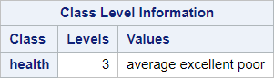
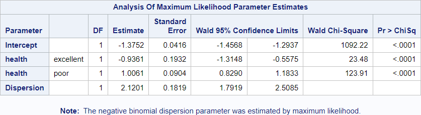
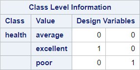
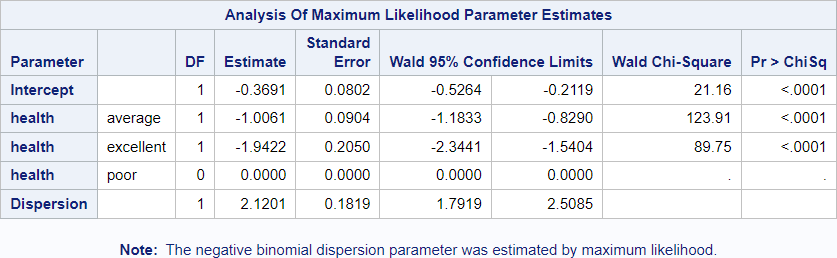
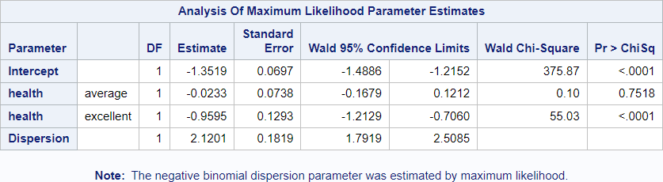
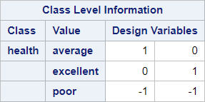

# Concepts: Coding of categorical variables

## Data

Source of data: DebTrivedi in R package "MixAll"

Data set debtrivedi.csv


```R
library(readr)
debtrivedi <- read_csv("data/debtrivedi.csv",
                 show_col_types = FALSE)

table(debtrivedi$health)

```


    
      average excellent      poor 
         3509       343       554 


## Coding schemes

### Dummy coding/treatment coding

This coding scheme compares each level of a categorical variable to a reference level.

The function contrasts() can only applied to factors.


```R
debtrivedi$health_fct <- factor(debtrivedi$health, levels = c("average", "excellent", "poor"))
contrasts(debtrivedi$health_fct)
```


<table class="dataframe">
<caption>A matrix: 3 × 2 of type dbl</caption>
<thead>
	<tr><th></th><th scope=col>excellent</th><th scope=col>poor</th></tr>
</thead>
<tbody>
	<tr><th scope=row>average</th><td>0</td><td>0</td></tr>
	<tr><th scope=row>excellent</th><td>1</td><td>0</td></tr>
	<tr><th scope=row>poor</th><td>0</td><td>1</td></tr>
</tbody>
</table>


```R
contr.treatment(3)
```


<table class="dataframe">
<caption>A matrix: 3 × 2 of type dbl</caption>
<thead>
	<tr><th></th><th scope=col>2</th><th scope=col>3</th></tr>
</thead>
<tbody>
	<tr><th scope=row>1</th><td>0</td><td>0</td></tr>
	<tr><th scope=row>2</th><td>1</td><td>0</td></tr>
	<tr><th scope=row>3</th><td>0</td><td>1</td></tr>
</tbody>
</table>


```R
# Manual dummy coding, can applied also to character variables
debtrivedi$poorhlth <- ifelse(debtrivedi$health == "poor", 1, 0)
debtrivedi$exclhlth <- ifelse(debtrivedi$health == "excellent", 1, 0)

table(debtrivedi$health, debtrivedi$poorhlth)
table(debtrivedi$health, debtrivedi$exclhlth)
```


               
                   0    1
      average   3509    0
      excellent  343    0
      poor         0  554


               
                   0    1
      average   3509    0
      excellent    0  343
      poor       554    0


### Sum coding


```R
contrasts(debtrivedi$health_fct) = contr.sum(3)
```


```R
contrasts(debtrivedi$health_fct)
```


<table class="dataframe">
<caption>A matrix: 3 × 2 of type dbl</caption>
<tbody>
	<tr><th scope=row>average</th><td> 1</td><td> 0</td></tr>
	<tr><th scope=row>excellent</th><td> 0</td><td> 1</td></tr>
	<tr><th scope=row>poor</th><td>-1</td><td>-1</td></tr>
</tbody>
</table>


### SAS coding


```R
contrasts(debtrivedi$health_fct) = contr.SAS(3)
contrasts(debtrivedi$health_fct)
```


<table class="dataframe">
<caption>A matrix: 3 × 2 of type dbl</caption>
<thead>
	<tr><th></th><th scope=col>1</th><th scope=col>2</th></tr>
</thead>
<tbody>
	<tr><th scope=row>average</th><td>1</td><td>0</td></tr>
	<tr><th scope=row>excellent</th><td>0</td><td>1</td></tr>
	<tr><th scope=row>poor</th><td>0</td><td>0</td></tr>
</tbody>
</table>


## Comparison default coding

Default refers to SAS default

### SAS program default coding

The following SAS code will be executed.
proc genmod data = debtrivedi;
  class health;
  model hosp = health / type3 dist=negbin;
run;

Differences to the default encoding and the reference encoding can be found below.

### Block 1




### R chunk default coding


```R
library(MASS)
library(broom)
library(tidyverse)
contrasts(debtrivedi$health_fct) = contr.SAS(3)
contrasts(debtrivedi$health_fct)
my_glm <- glm.nb(hosp ~ health_fct, data = debtrivedi)
tidy(my_glm)
debtrivedi %>% select(health_fct) %>% purrr::map(levels)

```


<table class="dataframe">
<caption>A matrix: 3 × 2 of type dbl</caption>
<thead>
	<tr><th></th><th scope=col>1</th><th scope=col>2</th></tr>
</thead>
<tbody>
	<tr><th scope=row>average</th><td>1</td><td>0</td></tr>
	<tr><th scope=row>excellent</th><td>0</td><td>1</td></tr>
	<tr><th scope=row>poor</th><td>0</td><td>0</td></tr>
</tbody>
</table>


<table class="dataframe">
<caption>A tibble: 3 × 5</caption>
<thead>
	<tr><th scope=col>term</th><th scope=col>estimate</th><th scope=col>std.error</th><th scope=col>statistic</th><th scope=col>p.value</th></tr>
	<tr><th scope=col>&lt;chr&gt;</th><th scope=col>&lt;dbl&gt;</th><th scope=col>&lt;dbl&gt;</th><th scope=col>&lt;dbl&gt;</th><th scope=col>&lt;dbl&gt;</th></tr>
</thead>
<tbody>
	<tr><td>(Intercept)</td><td>-0.3691297</td><td>0.08023679</td><td> -4.600504</td><td>4.214694e-06</td></tr>
	<tr><td>health_fct1</td><td>-1.0061117</td><td>0.09038551</td><td>-11.131338</td><td>8.829957e-29</td></tr>
	<tr><td>health_fct2</td><td>-1.9422402</td><td>0.20501436</td><td> -9.473679</td><td>2.701574e-21</td></tr>
</tbody>
</table>


<strong>$health_fct</strong> = <style>
.list-inline {list-style: none; margin:0; padding: 0}
.list-inline>li {display: inline-block}
.list-inline>li:not(:last-child)::after {content: "\00b7"; padding: 0 .5ex}
</style>
<ol class=list-inline><li>'average'</li><li>'excellent'</li><li>'poor'</li></ol>


## Comparison reference coding with specified base

### SAS reference coding with base 'average'
proc genmod data = debtrivedi;
  class health (param = ref ref = "average");
  model hosp = health / type3 dist=negbin;
run;

### Block 2




### R chunk reference coding with base 'average'


```R
contrasts(debtrivedi$health_fct) = contr.treatment(3)
contrasts(debtrivedi$health_fct)
my_glm <- glm.nb(hosp ~ health_fct, data = debtrivedi)
tidy(my_glm)
debtrivedi %>% select(health_fct) %>% purrr::map(levels)
```


<table class="dataframe">
<caption>A matrix: 3 × 2 of type dbl</caption>
<thead>
	<tr><th></th><th scope=col>2</th><th scope=col>3</th></tr>
</thead>
<tbody>
	<tr><th scope=row>average</th><td>0</td><td>0</td></tr>
	<tr><th scope=row>excellent</th><td>1</td><td>0</td></tr>
	<tr><th scope=row>poor</th><td>0</td><td>1</td></tr>
</tbody>
</table>


<table class="dataframe">
<caption>A tibble: 3 × 5</caption>
<thead>
	<tr><th scope=col>term</th><th scope=col>estimate</th><th scope=col>std.error</th><th scope=col>statistic</th><th scope=col>p.value</th></tr>
	<tr><th scope=col>&lt;chr&gt;</th><th scope=col>&lt;dbl&gt;</th><th scope=col>&lt;dbl&gt;</th><th scope=col>&lt;dbl&gt;</th><th scope=col>&lt;dbl&gt;</th></tr>
</thead>
<tbody>
	<tr><td>(Intercept)</td><td>-1.3752414</td><td>0.04161247</td><td>-33.048780</td><td>1.619679e-239</td></tr>
	<tr><td>health_fct2</td><td>-0.9361285</td><td>0.19319561</td><td> -4.845496</td><td> 1.262958e-06</td></tr>
	<tr><td>health_fct3</td><td> 1.0061117</td><td>0.09038551</td><td> 11.131338</td><td> 8.829957e-29</td></tr>
</tbody>
</table>


<strong>$health_fct</strong> = <style>
.list-inline {list-style: none; margin:0; padding: 0}
.list-inline>li {display: inline-block}
.list-inline>li:not(:last-child)::after {content: "\00b7"; padding: 0 .5ex}
</style>
<ol class=list-inline><li>'average'</li><li>'excellent'</li><li>'poor'</li></ol>


## Comparision default coding with specified base

### SAS default coding with specified base
proc genmod data = debtrivedi;
  class health (ref = "poor");
  model hosp = health / type3 dist=negbin;
run;

### Block 3



### R chunk default coding with specified base


```R
contrasts(debtrivedi$health_fct) = contr.treatment(3, base = 3)
contrasts(debtrivedi$health_fct)
my_glm <- glm.nb(hosp ~ health_fct, data = debtrivedi)
tidy(my_glm)
debtrivedi %>% select(health_fct) %>% purrr::map(levels)
```


<table class="dataframe">
<caption>A matrix: 3 × 2 of type dbl</caption>
<thead>
	<tr><th></th><th scope=col>1</th><th scope=col>2</th></tr>
</thead>
<tbody>
	<tr><th scope=row>average</th><td>1</td><td>0</td></tr>
	<tr><th scope=row>excellent</th><td>0</td><td>1</td></tr>
	<tr><th scope=row>poor</th><td>0</td><td>0</td></tr>
</tbody>
</table>


<table class="dataframe">
<caption>A tibble: 3 × 5</caption>
<thead>
	<tr><th scope=col>term</th><th scope=col>estimate</th><th scope=col>std.error</th><th scope=col>statistic</th><th scope=col>p.value</th></tr>
	<tr><th scope=col>&lt;chr&gt;</th><th scope=col>&lt;dbl&gt;</th><th scope=col>&lt;dbl&gt;</th><th scope=col>&lt;dbl&gt;</th><th scope=col>&lt;dbl&gt;</th></tr>
</thead>
<tbody>
	<tr><td>(Intercept)</td><td>-0.3691297</td><td>0.08023679</td><td> -4.600504</td><td>4.214694e-06</td></tr>
	<tr><td>health_fct1</td><td>-1.0061117</td><td>0.09038551</td><td>-11.131338</td><td>8.829957e-29</td></tr>
	<tr><td>health_fct2</td><td>-1.9422402</td><td>0.20501436</td><td> -9.473679</td><td>2.701574e-21</td></tr>
</tbody>
</table>


<strong>$health_fct</strong> = <style>
.list-inline {list-style: none; margin:0; padding: 0}
.list-inline>li {display: inline-block}
.list-inline>li:not(:last-child)::after {content: "\00b7"; padding: 0 .5ex}
</style>
<ol class=list-inline><li>'average'</li><li>'excellent'</li><li>'poor'</li></ol>


## Comparison effect coding

### SAS effect coding
proc genmod data = debtrivedi;
  class health (param = Effect);
  model hosp = health / type3 dist=negbin;
run;
### Block 4





### R chunk effect coding


```R
contrasts(debtrivedi$health_fct) = contr.sum(3)
contrasts(debtrivedi$health_fct)
my_glm <- glm.nb(hosp ~ health_fct, data = debtrivedi)
tidy(my_glm)
debtrivedi %>% select(health_fct) %>% purrr::map(levels)
```


<table class="dataframe">
<caption>A matrix: 3 × 2 of type dbl</caption>
<tbody>
	<tr><th scope=row>average</th><td> 1</td><td> 0</td></tr>
	<tr><th scope=row>excellent</th><td> 0</td><td> 1</td></tr>
	<tr><th scope=row>poor</th><td>-1</td><td>-1</td></tr>
</tbody>
</table>


<table class="dataframe">
<caption>A tibble: 3 × 5</caption>
<thead>
	<tr><th scope=col>term</th><th scope=col>estimate</th><th scope=col>std.error</th><th scope=col>statistic</th><th scope=col>p.value</th></tr>
	<tr><th scope=col>&lt;chr&gt;</th><th scope=col>&lt;dbl&gt;</th><th scope=col>&lt;dbl&gt;</th><th scope=col>&lt;dbl&gt;</th><th scope=col>&lt;dbl&gt;</th></tr>
</thead>
<tbody>
	<tr><td>(Intercept)</td><td>-1.35191367</td><td>0.06973162</td><td>-19.3873845</td><td>9.862619e-84</td></tr>
	<tr><td>health_fct1</td><td>-0.02332772</td><td>0.07375431</td><td> -0.3162896</td><td>7.517827e-01</td></tr>
	<tr><td>health_fct2</td><td>-0.95945625</td><td>0.12933218</td><td> -7.4185422</td><td>1.184165e-13</td></tr>
</tbody>
</table>


<strong>$health_fct</strong> = <style>
.list-inline {list-style: none; margin:0; padding: 0}
.list-inline>li {display: inline-block}
.list-inline>li:not(:last-child)::after {content: "\00b7"; padding: 0 .5ex}
</style>
<ol class=list-inline><li>'average'</li><li>'excellent'</li><li>'poor'</li></ol>


```R

```
